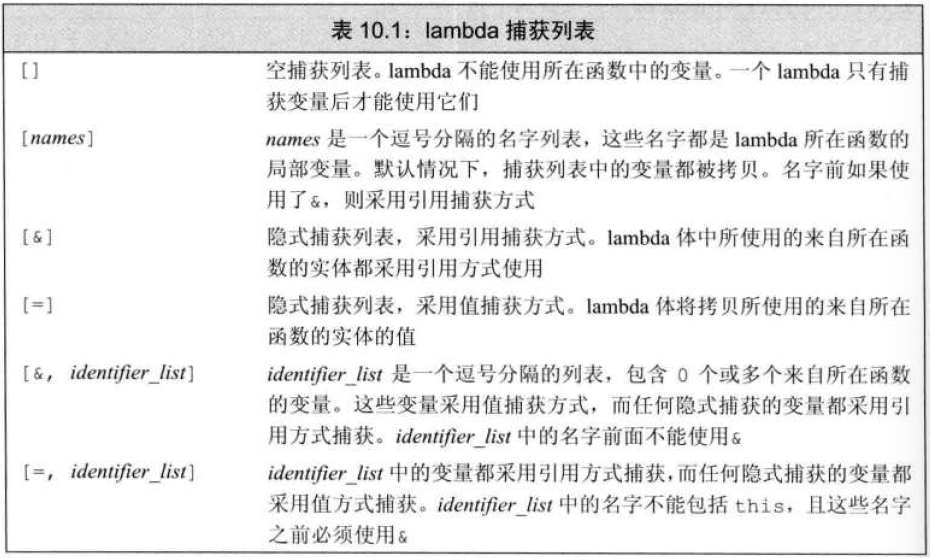

# 可调用对象
- 可以出现在调用运算符左边的对象：函数指针、lambda、重载了函数调用运算符的类的对象

# 谓词
> 返回可以转换为 bool 类型值的函数。</br>
> 分为一元（接受一个参数）和二元（接受两个参数）谓词
```c++
bool testPredicate(const string &s1, const string &s2)
{
    return s1.size() < s2.size();
}
sort(words.begin(), words.end(), testPredicate)
```

# lambda 表达式
> 可调用的代码单元。类似于未命名的内联函数
```c++
//lambda 形式
[捕获列表] (参数列表) -> 返回类型 {函数体}
```
- 参数列表和返回类型可忽略，<mark>捕获列表与函数体不可忽略</mark>
- 捕获列表(capture list)：所在函数中定义的局部变量列表
- 返回类型：必须使用[尾置返回](../6.函数/6.2.返回类型、函数重载.md/#使用尾置返回类型c11)
  - 如果忽略，则根据代码推断返回类型
  - 只有一条 return 语句，则根据返回的表达式判断类型
  - 如果未指定类型，且还有除 return 外的语句，则返回 void
- ### find_if
  - 查找第一个满足条件的元素，并返回该元素迭代器
    ```c++
    find_id( 范围迭代器, 范围迭代器, 可调用对象)
    //成功：返回找到元素的迭代器
    //失败：返回 end() 
    ```
- ### for_each
  - 接受一个可调用对象，并对范围内的元素调用此对象
    ```c++
    for_each(范围迭代器, 范围迭代器, 可调用对象)
    ```

# lambda 捕获
- ### 值捕获
  - 与传值参数类似，前提是变量可拷贝
  - 被捕获的变量在 lambda 创建时拷贝
```c++
void fcn1()
{
  size_t v1=42;
  auto f = [v1]{ return v1; };
  v1=0;
  auto j = f();   // j = 42 ; f保存了创建时 v1 的拷贝
}
```
- ### 引用捕获
  - <mark>必须保证引用的对象在 lambda 执行时是存在的</mark>
  ```c++
  void fcn2()
  {
    size v1 = 42;
    auto f2= [&v1]{ return v1; };
    v1= 0;
    auto j = f2();   // j = 0; f2 保存 v1 的引用
  }
  ```
- ### 隐式捕获
  - 
- ### 可变 lambda
  - 如果要改变被捕获变量的值，必须在参数列表后加关键字 mutable
  - 可变lambda可省略参数列表
```c++
void fcn3()
{
  size_t v1 = 42;
  auto f = [v1]() mutable { return ++v1; };
  v1 = 0;
  auto j = f();   // j = 43
}
```

# 参数绑定(bind)
- bind 定义在 <mark>functional 头文件</mark>中
- 接受一个可调用对象，生成一个新的可调用对象“适应”原对象的参数列表
  ```c++
  auto newCallable = bind(callable, arg_list);
  ```
  - newCallable : 生成的新可调用对象
  - arg_list : 逗号分隔的参数列表，对应给定的 callable 参数
    - 可能包含 _n 的名字，为“占位符”，表示 newCallable 中参数的位置
    - _1  为 newCallable 的第一个参数，_2 为第二个参数，以此类推
```c++
void testCall(const string & s1, string::size_type sz)
{
  return s.size() >= sz;
}
// newCall只有一个参数 _1，此参数对应 testCall 的第一个参数
// 调用 newCall 必须传递一个 string 参数， newCall 再将此参数传给 testCall
auto newCall = bind(testCall, _1, 6);
```