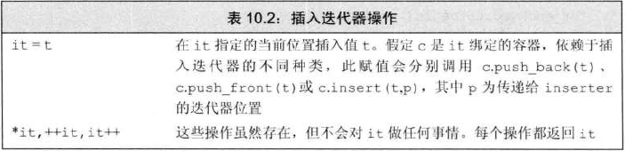
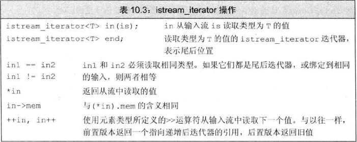
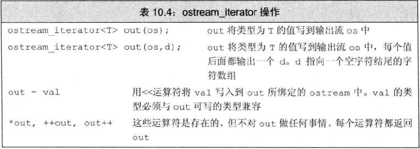
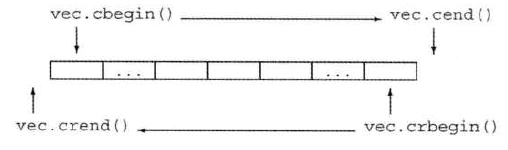

# 插入迭代器
> 接收一个容器，生成一个迭代器，实现向给定容器添加元素
- 
- ### 插入迭代器的类型
  - `back_inserter`：创建使用 `push_back` 的迭代器
  - `front_inserter`：创建使用 `push_front` 的迭代器
  - `inserter`：创建使用 `insert` 的迭代器。此函数接收第二个参数，指向要插入位置的迭代器，元素将插入到给定迭代器的元素之前
```c++
list<int> lst1 = {1,2,3,4};
list<int> lst2,lst3;
//拷贝完后，ls2 = 4 3 2 1
copy(lst.cbegin(), lst.cend(), front_inserter(lst2));
//拷贝完后，ls3 = 1 2 3 4
copy(lst.cbegin(), lst.cend(), inserter(lst3,lst3.begin()));
```

# iostream(流)迭代器
> 将流当作特定类型的元素序列处理，使用泛型算法从流读取数据及写入数据
- ### istream_iterator 操作
  - 
    ```c++
    istream_iterator<int> int_iter(cin);  //从cin读取int
    istream_iterator<int> eof;            //尾后迭代器
    while(in_iter != eof)                 //有数据时，读取当前值 
      vec.push_back(*in_iter++);
    
    //简化重写
    istream_iterator<int> in_iter(cin), eof;
    vector<int> vec(in_iter, eof);
    ```
  - 读取的类型必须定义了输入运算符(>>) 
  - istream_iterator绑定到流时，并不保证立即读取，推迟到使用迭代器才读取
    - 标准库保证在第一次解引用前读取完成
- ### ostream_iterator 操作
  - 
    ```c++
    ostream_iterator<int> out_iter(cout, " ");  //每个元素后添加空格
    for(auto &e : vec)
      *out_iter++ = e;
    cout << endl;

    //简化重写
    copy(vec.begin(), vec.end(), out_iter);
    cout << endl;
    ```
  - 运算符 `*` 和 `++` 可以忽略，但为了与 `istream_iterator` 保持一致，推荐保留

# 反向迭代器
- 
- 除了 `forward_list` 外，都支持反向迭代器
- 通过调用 `rbegin`、`rend`、`crbegin`、`crend` 获得反向迭代器
- `++` 移动到前一个元素，`--` 移动到后一个元素
```c++
vector<int> vec = {1,2,3,4,5};
for (auto i=vec.crbegin(); i!=vec.crend(); ++i)
  cout << *i << endl;
//打印结果为：5，4，3，2，1
```
- 使用 `base` 成员函数转换为普通迭代器