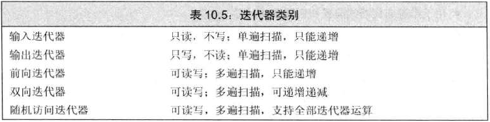
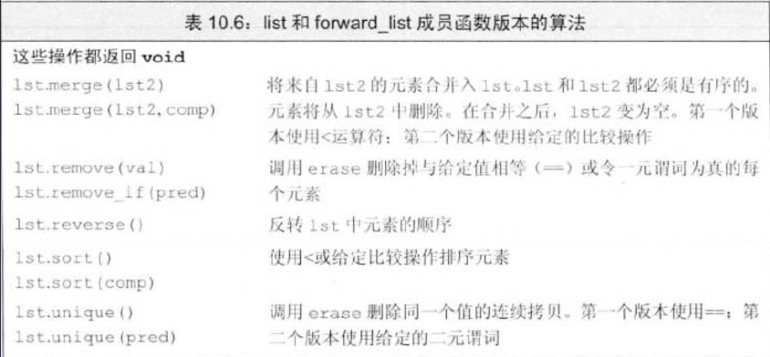
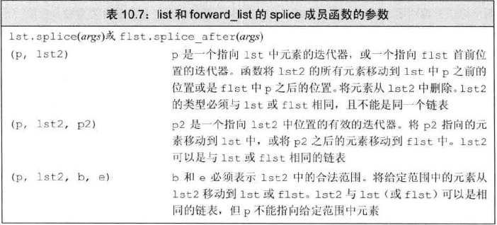

# 5类迭代器

- ### 输入迭代器
  - 可以读取序列中的元素,只用于顺序访问。必须支持：
    - 比较两个迭代器 `==` 或 `!=`
    - 推进迭代器的前置或后置 `++` 递增运算
    - 读取元素的解引用运算符 `*`，只能出现在运算符右侧
    - 箭头运算符 `->`
  - 只能单遍扫描
- ### 输出迭代器
  - 只写不读元素。必须支持：
    - 推进迭代器的前置或后置 `++` 递增运算
    - 写元素的解引用运算符 `*`，只能出现在运算符左侧
  - 只能单遍扫描
- ### 前向迭代器
  - 可以读写元素，只能在序列中沿一个方向移动
  - 支持所有输入和输出迭代器操作
  - 可多遍扫描
- ### 双向迭代器
  - 可正向/反向读写序列元素
  - 支持前向迭代器操作
  - 支持前置和后置 `--` 递减操作
  - 除 `forward_list` 外，其余都支持
- ### 随机访问迭代器
  - 提供在常量时间内访问任意元素的能力
  - 支持双向迭代器的所有用能，还额外支持：
    - 用于两个迭代器的比较关系运算符 `<  <=  >  >=`
    - 迭代器和整数值的加减运算 `+  +=  -  -=`
    - 两个迭代器相减
    - 下标运算符

# 算法形参模式
```c++
alg(beg, end, other argas);
alg(beg, end, dest, other args);
alg(beg, end, beg2, other args);
alg(beg, end, beg2, end2, other args);
```
- `alg` 为算法名称，`beg` 和 `end` 为算法所操作的输入范围
- `dest` 可以写入的目的位置的迭代器
- `beg2` 和 `end2` 表示第二个输入范围
  
  # 特定容器算法
  - 链表类型 `list` 和 `forward_list` 有自己的成员函数算法
  - 链表版与通用版的区别是，会改变底层的容器
  - 
  - 