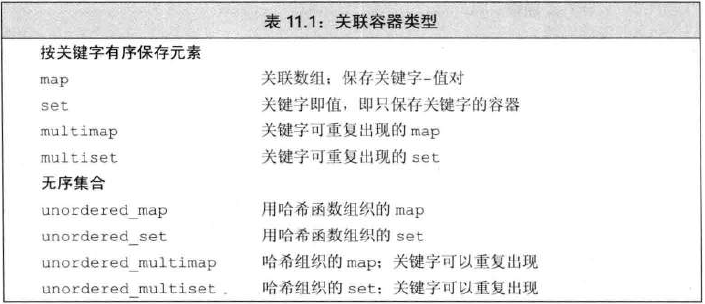
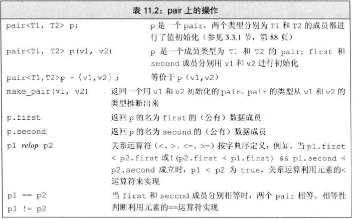

# 关联容器类型
- 
- `map` 和 `multimap` 定义在头文件 `map` 中
- `set` 和 `multiset` 定义在头文件 `set` 中
- 无序容器定义在头文件 `unordered_map` 和 `unordered_set` 中

# 定义关联容器
- 在新标准，可以进行关联容器的值初始化
- map的初始化格式为：`{key, value}`
```c++
map<string,  size_t> testMap;    //空容器
set<string> testSet={"1", "2", "3", "4", "5"};
map<string,  size_t> testMap2 = { {"test1","1"},
                                  {"test2","2"},
                                  {"test3","3"},
                                  {"test4","4"} };
```
- `map` 和 `set` 会忽略重复的关键字，`multimap` 和 `multiset` 不会

# 有序容器的关键字类型要求
- <mark>关键字的类型必须定义元素的比较方法</mark>，标准库默认使用 `<` 运算符
- 元素关键字的类型必须定义了**严格弱序**
  - 两个关键字不能同时“小于等于”对方
  - 如果 A “小于等于” B，且 B “小于等于” C ，则 A 必须“小于等于” C
  - 如果两个关键字互不“小于等于”对方，则为等价，以相等处理
- 自定义的比较方法，紧跟在尖括号的元素类型后,且为函数指针类型
```c++
set<Sales_data, decltype(compare*)> test;
//也可以使用另一种函数指针的用法
typedef (*pf) bool compare(const Sales_data &, const Sales_data &);
set<Sales_data, pf> test;
```

# pair 类型
- `pair` 为 `map` 元素的类型
- 定义在头文件 `utility` 中
- 