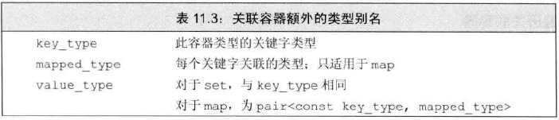
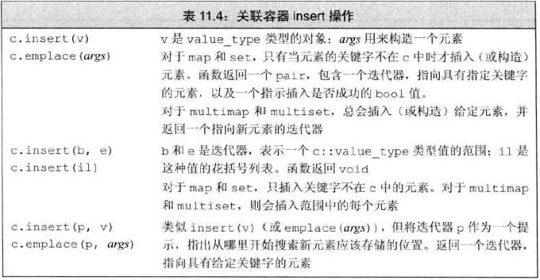
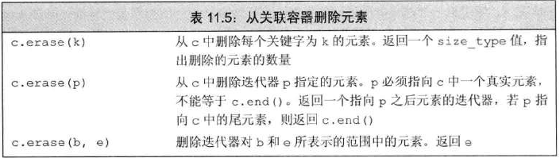
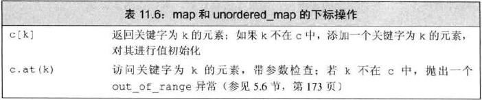
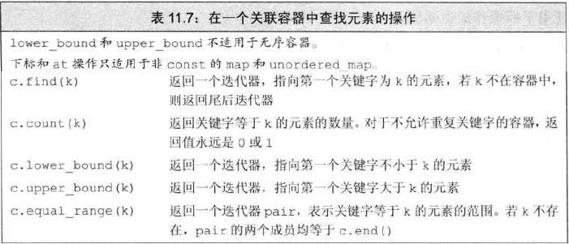

# 关联容器额外类别名
- 
- 因为<mark>不能改变元素的关键字</mark>，所以 `pair` 的关键字为 `const`
    ```c++
    set<string>::value_type         v1;     //v1 是 string
    set<string>::key_value          v2;     //v2 是 string
    map<string, int>::value_type    v3;     //v3 是 pair<const string, int>
    map<string, int>::key_value     v4;     //v4 是 string
    map<string, int>::mapped_type   v5;     //v5 是 int
    ```

# 关联容器迭代器
- 解引用关联容器的迭代器，会得到 `value_type`
- `set` 的迭代器为 `const`
- 通常不对关联容器使用泛型算法

# 添加元素
- 
    ```c++
        //set添加元素
        vector<int> vec = {1,2,3, 1,2,3};
        set<int> set1;
        set1.insert(vec.begin(), vec.end());    //忽略重复，插入了3个元素
        set1.insert({4,5,6,7,8});               //无重复，插入5个元素

        //map添加元素
        map<string, int> map1;
        map1.insert({"test", 1});
        map1.insert(make_pair("test", 1));
        map1.insert(pair<string, int>("test", 1));
        map1.insert(map<string, int>::value_type("test", 1));
    ```

# 删除元素
- 

# 下标操作
- `map` 和 `unordered_map` 提供了下标运算符和 at 函数
- 
- 对 `map` 进行下标操作，得到的是 `mapped_type` 对象，为左值，可读可写

# 访问元素
- 
- 只想知道关键词是否在map中，而不想改变map，就使用`find`
  - 使用下标会造成：如果没有该关键词，则插入该关键字