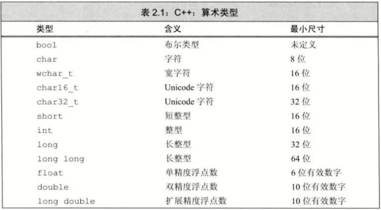
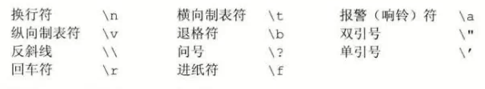
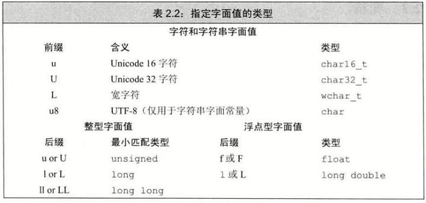

# 算术类型
---
## 整型
- 整型为：整数、字符、布尔
- wchar_t：用于扩展字符集，如汉字和日语
- 带符号(signed)和无符号(unsigned)
  - unsigned 默认为 int unsigned 
  - signed 一般第一位为符号位

## 浮点型（同C）
## 类型转换（同C）
- 越界的处理方法为**求模**
  - 赋值数 % 类型大小
    ```c++
        unsigned char x=336;  //范围0-255，类型大小为256
        // x的赋值结果为 336%255=80
    ```
- 算术中既有有符号又有无符号，有符号转为**无符号**
```c++
unsigned u=10;
int i=-42;
std::cout << u + i << std::endl   //如果int32位，输出4294967264
```
# 字面值常量
### 1. 整型字面值
  - 规则
    - 十进制：20
    - 八进制：024
    - 十六进制：0x14
  - 整型字面常量默认为int、long
    - 使用 L 表示为 long 类型，如 100L
    - 使用 U 表示为 unsigned 类型，如 100UL
### 2. 浮点字面值
  - 默认浮点字面常量为 double
    - 使用 F 表示 float
    - 使用 L 表示 double
### 3. 布尔字面值与字符字面值
  - 单引号为字符型字面值，'A'
  - 用 L 代表 wchar_t ，L'A'
### 4. 非打印字符与转义序列
  - 
  - \000 为八进制
  - \x000 为十六进制
### 5. 字符串字面值
  - 双引号表示，"Hello"
  - 为兼容 C ，末尾添加空字符
### 指定的字面值类型
- 