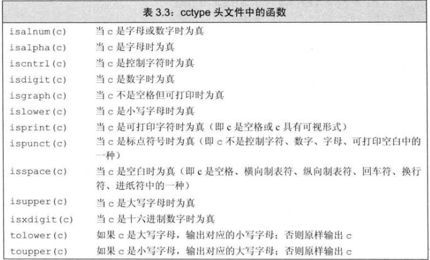

# string声明
```c++
#include<string>
using std::string;
```
# 定义或初始化string对象

# string对象上的操作

- ## getline
  - 使用 cin 读入 string 时，遇到空格会结束，可选择getline整行读入（换行结束）
    - 如输入“Hello world！”，输出“Hello”
- ## string::size_type类型
  - size 函数的返回类型，为无符号类型的值
  - 可以使用 auto 或 decltype 获得其类型的变量
  - 使用size（）时不要使用 int，避免有符号与无符号的混乱
- ## 字面值与string对象相加
  - 字面值不是 string 类，至少保持  + 号两侧至少有一个对象为 string
```c++
string s1= "hello" + "world"        //错误，两个对象都不是string
//错误，实际处理为 s2= ("hello" + "world") +s1
string s2= "hello" + "world" + s1   
```
# 处理string对象中的字符
- 使用 **cctype标准库**，同C
  - 
- 可使用 **下标运算符 [ ]** 进行单个字符访问
  - 返回值为该位置字符的引用