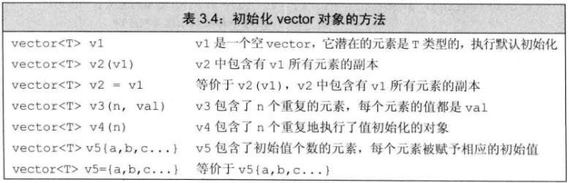
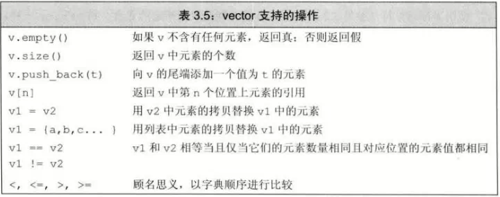

# vector基础
- ## vector声明
  ```c++
  #include <vector>
  using std::vector;
  ```
- ## 类模板
  - vector 为**类模板(class template)**，生成的类型必须包含元素的类型，如 vector\<int>
    - 编译器根据模板创建类或函数的过程为**实例化(instantiation)**
    - 使用模板时，需要指出编译器应把类或函数实例化成哪种类型
# 定义和初始化vector对象

- ## 值初始化
  - 库会给 vector 创建一个**值初始化**(value-initialized)的元素初值，并赋给容器中的所有元素
    - 初值由vector对象中的元素决定
    - 如 对象的元素为 int 则初始值自动为 0，string 是类默认初始化
  - 有些类型不提供默认初始化，必须提供初始的元素值
  - 只提供元素的数量而没有初始值，只能使用**直接初始化**
    ```c++
    vector<int> ivec(10);   //10个元素，每个都初始化为0
    vector<int> svec(10);   //10个元素，每个都是string默认初始化
    vector<int> val = 10;   //错误
    ```
- ## 列表初始值与元素数量
  - 圆括号提供的值用来**构造(construct)**vector对象
  - 花括号为**列表初始化(list initialize)**
    ```c++
    vector<int> v1();         //有十个元素，都为0
    vector<int> v2{10};       //有一个元素，为0
    vector<int> v3(10,1);     //有十个元素，都为1
    vector<int> v4{10,1};     //有两个元素，分别为10和1
    ```
  - 初始化时使用了花括号，但提供的值不能列表初始化，编译器就会**构造**vector对象
    ```c++
    vector<string> v1("hi");          //错误，不能使用字符串字面值构建vector对象
    vector<string> v2{10};            //有10个默认初始化元素
    vector<string> v3{10,"hi"};       //有10个值为"hi"的元素
    ```
  - 
# 向vector对象添加元素
- **push_back**把值当成vector对象的尾元素push到尾端（back）
  ```c++
  vector<int> v;
  for(int i=0; i!=100; i++)
    v.push_back(i);
  ```

# 其他vector操作

- ## vector<int>::size_type
  - vector 使用 size_type时，必须先指定是哪种类型
    ```c++
    vector<int>::size_type    //正确
    vector:size_type          //错误
    ```
- ## 下标
  - vector也可以使用**下标**
    - 但不能使用下标**添加元素**