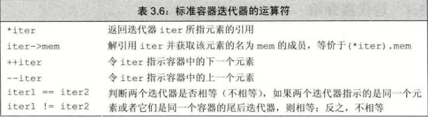
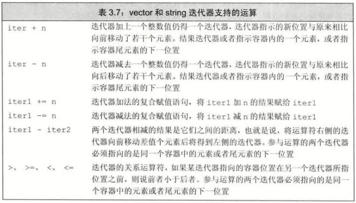

# 迭代器(iterator)
- 迭代器通常用于对**容器元素**的访问，指向某个元素
- ## begin 和 end
  - .begin()：返回指向第一个元素的迭代器
  - .end()：返回尾元素的下一个位置(one past the end)——**尾后(off the end)**
    - 返回的成员称为尾后迭代器(off-the-end iterator)
- ## 迭代器运算
  - 
- ## 迭代器类型
  - **iterator** 和 **const_iterator**
    - iterator，能读能写
    - const-iterator，能读取但不能修改元素值
  - begin 和 end 常量与非常量都能返回，由对象是否是常量决定
  - cbegin 和 cend 返回 const_iterator常量
  - 如果对象只需读不用写，最好用常量类型(const_iterator)
  ```c++
  vector<int>::iterator it;           //能读写vector<int>元素
  string::iterator it2;               //能读写string对象中的字符
  vector<int>::const_iterator it3;    //只读元素
  string<int>::const_iterator it4;    //只读字符
  ```
# 迭代器运算

- 迭代器相减可得到距离，其类型为 **difference_type**的符号整数