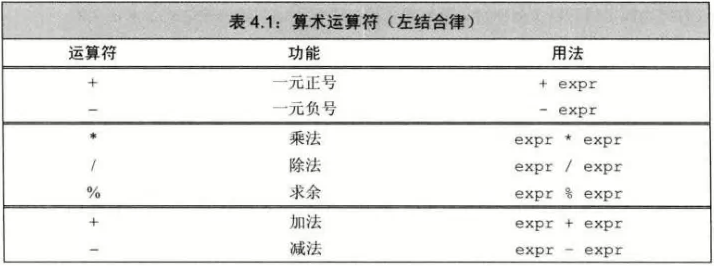
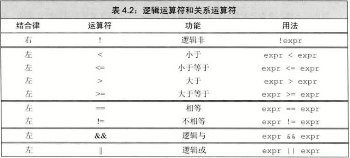
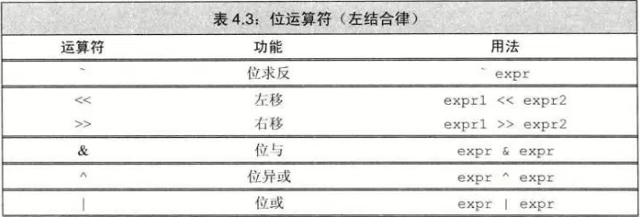
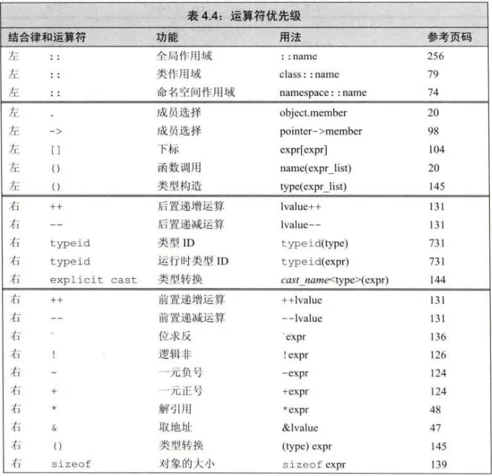
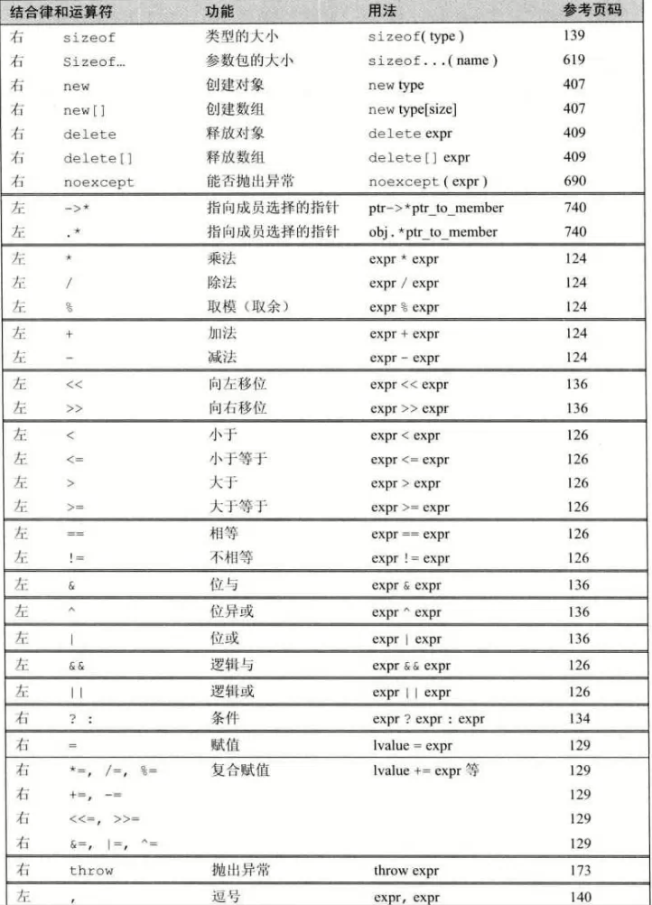

# 基础
- ## 重载运算符
  - 运算符作用与类类型的运算对象时，为其赋予另外一种含义，为**重载运算符**
    - 如IO库的 >> 和 << ，string对象和vector的运算符
  - 重载运算符时，运算对象的类型和返回值的类型，由该运算符定义
  - 但是运算对象的个数、运算符优先级和结合律**无法改变**
- ## 左值和右值
  - 左值(lvalue)：求值结果为**对象**或**函数**的表达式
    - 对象被当做左值，用的是对象的身份（内存位置）
  - 右值(rvalue)：一种表达式，其结果是值而非值的位置
    - 对象被当做右值，用的是对象的值（内容）
- ## 优先级与结合律（同C）
- ## 求值顺序（同C）
  - 大多数情况，不会明确指定求值的顺序
    ```c++
    int i=f1()*f2();        //无法知道f1()与f2()的调用顺序
    cout << i << " " << ++i << endl;    //未定义，无法知道先 i 还是 ++i
    ```
- ## 运算对象转换
  - 小整数类型（如bool,char，short）通常会被提升成较大的整数类型，主要为int
# 运算符
- ## 算术运算符(同C)

  - 满足**左结合律**
  - 运算对象和求值结果都为**右值**
- ## 逻辑和关系运算符(同C)

  - 满足**左结合律**与**短路原则**
  - 运算对象和求值结果都为**右值**
- ## 赋值运算符
  - 满足**右结合律**
  - 左侧对象必须为可修改的**左值**
  - 结果为左侧运算对象，且为**左值**
  - 右侧运算对象的类型转换为左侧运算对象的类型
- ## 递增和递减运算符
  - 前置将**对象本身**作为**左值**返回
  - 后置将对象原始值的**副本**作为**右值**返回
  - 除非必须，**不用**后置版本
- ## 成员访问运算符（同C）
  - 箭头运算符：作用于指针类型的运算对象，结果为**左值**
  - 点运算符：成员所属对象为*，*左值**，结果为**左值**
    - 成员所属对象为**右值**，结果为**右值**
- ## 条件运算符(同C)
  - 两个表达式都为**左值**或者能转换成**同一种左值类型**时，结果为**左值**
  - 否则为**右值**
- ## 位运算符

  - 如果运算对象是“小整型”，则值会被提升为较大的整数类型
- ## sizeof运算符
  - 返回一条表达式或者一个类型名字所占的**字节数**
  - 满足**右结合律**，所得值为**size_t**
    ```c++
    //sizeof的两种形式
    sizeof (type)
    sizeof expr
    ```
  - 对 char 或者类型为char的表达式执行，结果为1
  - 对引用类型执行，为引用对象所占空间的大小
  - 对指针执行，为指针本身所占空间的大小
  - 对解引用指针执行，为指针所指的对象所占空间的大小，指针不需要有效
  - 对数组执行，为数组所占空间的大小
    - sizeof不会把数组转成指针处理
  - 对 string 对象或 vector 对象执行，得类型固定部分的大小
    - 不会计算元素占了多少空间
- ## 逗号运算符
  - 求值顺序为**从左向右**
  - 逗号运算符的结果为**右侧表达式**
  - 右侧运算对象为**左值**，结果为**左值**

# 运算符优先级表

