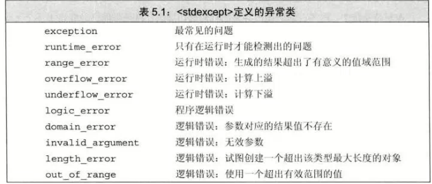

# throw 表达式（异常引发）
- ## 格式
    ```c++
    throw exceptionType
    ```
  - throw后的为抛出**异常类型**的表达式
- ## 例子
    ```c++
    throw runtime_error("请输入相同的类型")
    ```
# try语句块（异常处理）
- ## 格式
```c++
try
{
    program-statements
}catch (exception-declaration)
{
    handler-statements
}catch (exception-declaration)
{
    handler-statements
}
```
- exception-declarationw为**异常声明**
- 如果没能找到匹配的 catch ，则转到 **terminate **标准库函数，并退出程序

# 标准异常
- ## exception 头文件
  - 定义了最通用的异常类 exception
  - 只报告异常的发生，不提供任何额外信息
- ## stdexcept
  - 
  - exception、bad_alloc、bad_cast对象，只能默认初始化，不允许提供初值
  - 其他异常类型使用 string对象或者C风格字符串初始化，不允许使用默认初始化
    - 必须提供初值，初值含有错误信息