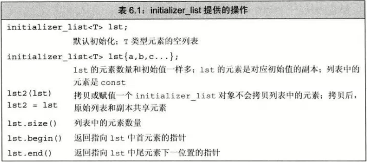

# 函数基础(同C)
- ## 自动对象
  - 值存在于块执行期间的对象为**自动对象**（automatic object）
    - 形参为自动对象
- ## 局部静态对象(static)
  - 直到程序终止才被销毁的对象
- ## 函数声明(同C)
- ## 分离式编译

# 参数传递
- ## 传值参数（同C）
  - 初始化一个非引用变量时，初始值会拷贝给变量
- ## 传引用参数
  - 使用引用可以**避免拷贝**
  - 可以返回额外信息
- ## const形参和实参
  - 形参的顶层const会被**忽略**
  - 当形参有顶层const时，传给常量和非常量都行
  - ### 指针或引用形参参与const
    - 同变量的初始化一样
    - 尽量使用常量引用
      - 因为不能把const对象、字面值或需要类型转换的传给普通引用
- ## 数组形参（同C）
  - 数组被作为指针传递
    ```c++
    //三种方法等价
    void print(const int*);
    void print(const int[]);
    void print(const int[10]);  //维度表示期望数组有多少元素，实际不一定
    ```   
  - 函数不知道数组确切尺寸，应提供长度，管理指针形参的三种技术
    - 使用标记指定数组长度（结束标记，如C风格字符串）
    - 使用标准库规范
      ```c++
      void print(const int *beg,const int *end)
      {
        while(beg != end)
          cout << *beg++ << endl;
      }
      ```
    - 显示传递一个表示数组大小的形参
  - ### 数组引用const
    ```c++
    void printf(int (&arr)[10])
    ```
  - ### 传递多维数组（同C）
- ## main：处理命令行选项
  - 可以通过命令行向main传递参数
    ```c++
    int main(int argc,char *argv[]){...}
    int main(int argc,char **argv[]){...}
    ```
    ```c++
    //假设在test执行文件中
    int main(int argc,char **argv)
    {
        cout << argc << endl;
        for(int i=0 ; i< argc ; ++i)
                cout << argv[i] << endl;
        return 0;
    }

    //输出
    yxj@yxj-computer:~/桌面$ ./test test1 test2 test3
    4
    ./test
    test1
    test2
    test3 
    ```
    - argc为数组长度，argv[0]保存程序的名字
- ## 含有可变形参的函数
  - ### initializer_list形参
    - 
    - 实参类型必须相同
    - 向initializer_list传递一个值的序列，必须放进花括号
      ```c++
      error_msg({1,2,3});
      ```
- ## 省略符形参
  - 便于C++程序访问某些特殊的C代码而设置的，有两种形式
    ```c++
    void foo(parm_list,...);
    void foo(...);
    ```
  - 省略符对应的实参无需检查类型
