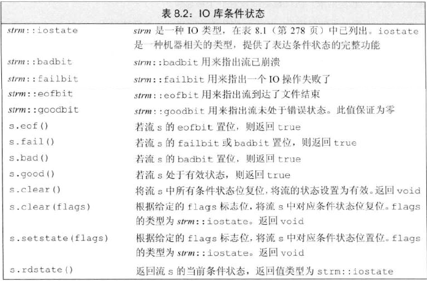

# IO库类型和头文件

- 宽字符版本（wchar_t）以 w 开头

# IO对象无拷贝或赋值
- 不能拷贝IO对象，也不能将形参或返回类型设置为流类型
- 通常IO操作以引用方式传递和返回，不能是const
```c++
ofstream out1,out2;
out1=out2;                  //不能对流对象赋值
ofstream print(ofstream);   //错误：不能初始化ofstream参数
out2=print(out2);           //错误，不能拷贝流对象
```

# 条件状态

- iostate类型，类似0001，0010的位集合
  - 可以使用位运算符，一次性监测或设置多个标志位
- badbit 被置位，流无法使用
- failbit 被置位，通常可以修正，流还可以继续使用
- 到文件结束位置，eofbit和failbit都会被置位
- goodbit为0，流未发生错误
- badbit、failbit、eofbit任一个被置位，则监测流状态的条件失败
```c++
strm::iostate old_state=cin.rdstate();  //记住cin当前的状态
cin.clear();                            //复位，使cin有效
process_input(cin);                     //使用cin
cin.setstate(old_state);                //将cin置为原有状态
//复位failbit和badbit，其他标志位不变
cin.clear(cin.rdstate() & ~cin.failbit & ~cin.badbit);
```

# 管理输出缓冲
- 每个输出流都管理一个缓冲区，保存读写数据
- 本文串可以立即打印，也有可能被操作系统保存在缓存区中，随后在打印
- 程序异常终止，输出缓冲区时不会被刷新
- ## 导致缓冲刷新的原因
  - 程序正常结束，作为main函数的return操作的一部分，缓冲刷新被执行
  - 缓冲区满时，需要刷新缓冲，而后新的数据才能继续写入
  - 使用操作符endl显示刷新缓冲区
  - 在每次输出操作后，用 unitbuf 设置流的内部操作，来清空操作
  - 当读写被关联的流时，关联到的流的缓冲区会被刷新
- ## flush和ends刷新操作符
  - **flus**h：刷新缓冲区，但不输出任何额外字符
  - **ends**： 向缓冲区插入一个空字符，然后刷新
    ```c++
    cout << "hi!" << endl;  //输出hi和一个换行符，然后刷新缓冲区
    cout << "hi!" << flush; //输出hi，然后刷新缓冲区，不附加任何额外字符
    cout << "hi!" << ends;  //输出hi和一个空字符，任何刷新缓冲区
    ```
- ## unitbuf和nounitbuf操作符
  - **unitbuf**：告诉流接下来的每次写操作后都进行一次flush操作
  - **nounitbut**：恢复正常的缓冲区刷新机制
    ```c++
    cout << unitbuf;    //所有输出操作后立即刷新
    cout << nounitbuf;  //回到正常的缓冲方式
    ```
- ## 关联输入和输出流
  - 标准库将cout和cin关联在一起，因此使用cin导致cout被刷新
  - ### tie()
    - 不带参数：返回指向输出流的指针，如果本对象关联了一个输出流，则返回这个输出流的指针，否则返回空指针
    - 接收ostream指针：将自己关联到此ostream
      - 既可以将istream对象关联ostream，也可以ostream关联ostream
```c++
cin.tie(cout);                      //关联cout
ostream *old_tie=cin.tie(nullptr);  //cin不与其他流关联
cin.tie(&cerr);                     //关联cerr
cin.tie(old_tie);                   //重建cin和cout的正常关联
```