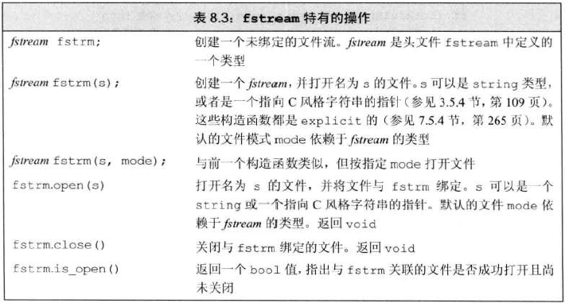
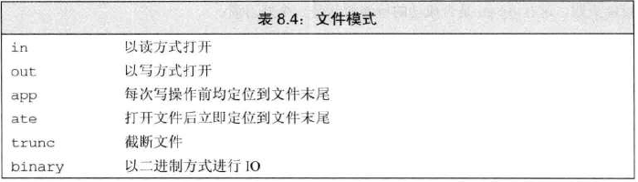

# fstream头文件
- ifstream：从给定文件读取数据
- ofstream：向一个给定文件写入数据
- fstream：读写给定文件，继承自iostream
- ## fstream、ifstream和ofstream操作
  - 

# 使用文件流对象
- 创建对象时，如果提供了文件名，则open会自动调用
```c++
ifstream in(ifile);     //构造一个ifstream并打开给定文件
ofstream out;          //输出文件流未关联任何文件
```
- 可以使用fstream代替iostream&
- ## 成员函数open与close
  - 如果调用open失败，failbit会被置位，因此要进行open是否成功的检测
  ```c++
  ifstream in;
  in.open(ifile);
  if(in)  //检查open是否成功
      //open成功，则可以使用文件
  ```
  - 对一个已经打开的文件调用open会失败，并导致failbit置位，随后使用文件流的操作都会失败
  - 为了将文件流关联到另一个文件，必须首先关闭已经关联的文件
    ```c++
    in.close();        //关闭文件
    in.open(ifile+"2"); //打开另一个文件
    ```
  - 如果open成功，则会设置流的状态，使good（）未true
  - 当一个fstream对昂被销毁时，close会自动被调用

# 文件模式（file mode）

- 只能对ofstream或fstream对象设定out模式
- 只能对ifstream或fstream对象设定in模式
- 只有当out也被设定时，才能设定trunc模式
- 只要trunc没被设定，就可以设定app模式
  - 在app模式下，即使没有显示指定out模式，文件也以输出方式被打开
- 默认情况下，即使没有指定trunc，以out模式打开的文件也会被截断
- ate和binary模式可用于任何类型的文件流对象，且可以与其他任何文件模式组合使用
- ## 以out模式打开文件会丢弃已有数据
  - 默认情况下，打开ofstream时，文件内容会被丢弃
  - 阻止ofstream清空的方法为：同时指定app模式
    ```c++
    ofstream out("finle1");     //隐式以out模式打开文件并截断
    ofstream out2("finle1", ofstream::out);     //隐式地截断文件
    ofstream out3("finle1", ofstream::out | ofstream::trunc);   //显式地截断文件
    ofstream app("file2", ofstream::app);  //隐式地out app模式
    ofstream app2("file2", ofstream::out | ofstream::app);  //显示
    ```
- 每次调用open时，都会确定文件模式