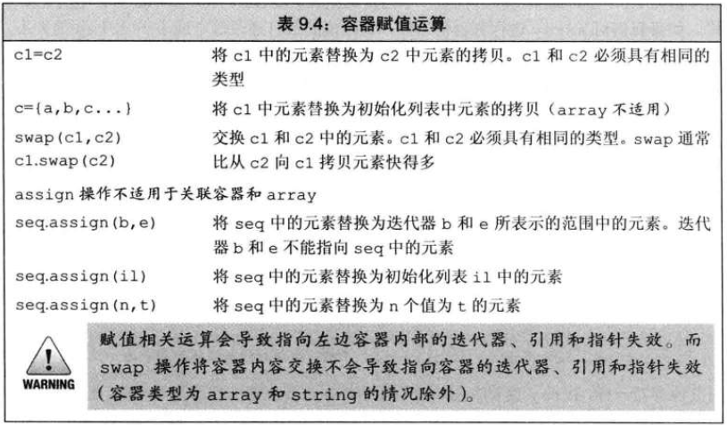

# 迭代器范围
- 由一对迭代器表示，分别指向第一个元素(begin)和最后一个元素之后的位置(end)
- 为**左闭合区间**：[ begin，end )
- 

# 顺序容器类型


# 顺序容器的选择
- 除非有更好的容器选择，否则使用vector
- 如果程序有很多的小元素，且空间的额外开销很重要，则不要使用list或forward_list
- 如果程序要求随机访问元素，应使用vector或deque
- 如果要在容器中间插入或删除元素，应使用list或forward_list
- 如果需要在头尾插入或删除元素，但不会在中间进行插入或删除，则使用deque
- 在读取输入需要在容器中间位置插入元素，随后需要随机访问元素
  - 确定是否真的需要在容器中间添加元素。可以使用vector追加数据，再通过sort()函数排序元素，避免在中间添加
  - 如果必须在中间插入，考虑在输入阶段时用list，输入完成后，将list内容拷贝到vector中

# 容器的定义和初始化
- 
- ## 容器的初始化为另一个容器的拷贝
  - 1.直接拷贝整个容器
    - 类型必须相同
  - 2.拷贝由一个迭代器指定的元素范围（array除外）
    - 类型可以不同，但必须能转换
  ```c++
  list<string> list1={"1","2","3"};
  vector<const char*> vec1={"a","an","the"};
  list<string> list2(list);                   //正确，类型匹配
  deque<string> deq1(list);                   //错误，容器类型不匹配
  vector<string> vec2(vec1);                  //错误，容器类型不匹配
  //正确，使用迭代器可以类型转换
  forward_list<string> test(vec1.begin(),vec1.end()); 
  ```

# 赋值和swap
## 赋值
- 
- 赋值运算符左右两边对象类型必须相同
- array类型允许赋值，内置数组不行
    ```c++
    array<int,5> a1={0,1,2,3,4,5};
    array<int,5> a2={0};  // 所有元素为0
    a1=a2;                // 替换a1中的元素
    a2={0};               // 错误，不能将花括号列表赋值数组
    ```
- ### assign
  - 允许不同但相容的类型赋值
    ```c++
    list<string> list1;
    vector<const char*> vec1;
    list1 = vec1;   //错误，容器类型不匹配
    list1.assign(vec1.cbegin(),vec1.cend());
    ```
## swap
- 交换两个相同类型容器的内容
  ```c++
  vector<string> vec1(10);
  vector<string> vec2(24);
  swap(vec1,vec2);
  ```
- 除array外，交换容器的内部数据结构，元素本身并未交换，操作很快
- 除string外，指向容器的迭代器、引用和指针在swap操作后不会失效

# 容器大小操作
- size：返回容器中元素数目
  - forward_list不能用size
- empty：size为0返回ture，否则false
- max_size：返回该容器能容纳的最大元素数

# 容器关系运算符
- 符号左右两边容器类型必须相同，且保存相同类型的元素
- 比较过程：
  - 两个容器大小相同且元素相同，则相等，否则不能
  - 两个容器大小不同，小容器每个元素等于大容器的元素，则 小容器 < 大容器
  - 两个容器都不是另一个容器的前缀子序列，则结果为的一个不相等元素的比较结果
```c++
vector<int> v1={1,3,5,7,9,12};
vector<int> v2={1,3,9};
vector<int> v3={1,3,5,7};
vector<int> v4={1,3,5,7,9,12};

v1 < v2;  //true；第一个不等元素[2],v1小于v2
v1 < v3;  //flase; 所有元素相等，但v3的元素数更少
v1 == v4; //ture; 元素数与元素全部相等
v2 == v4; //false; v2元素数小于v4
```