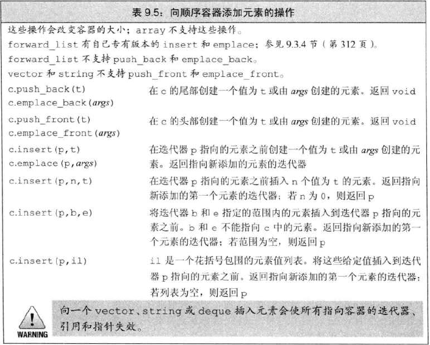
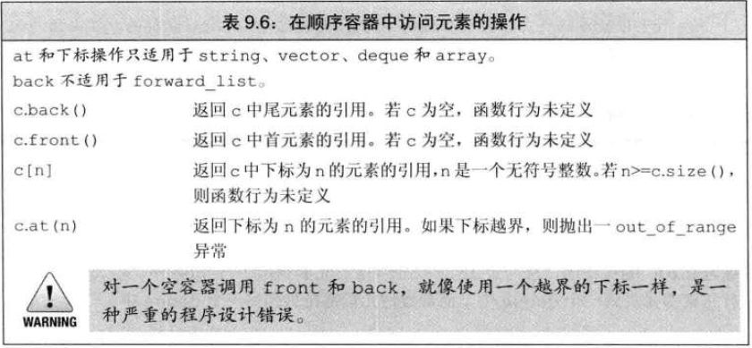
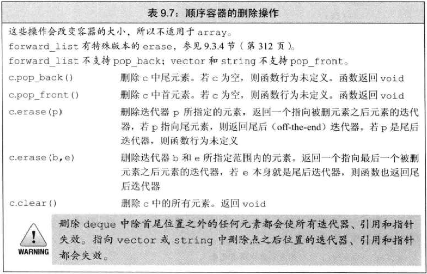
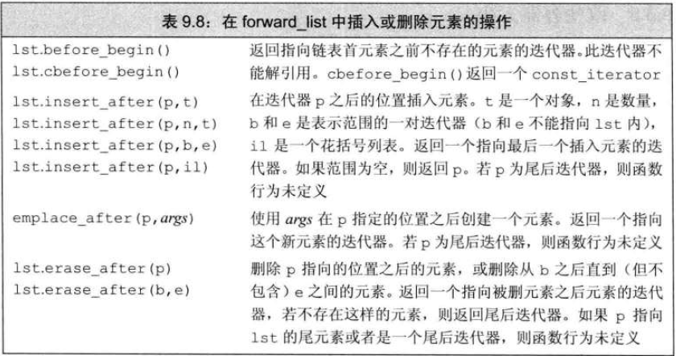
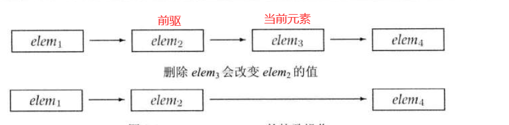
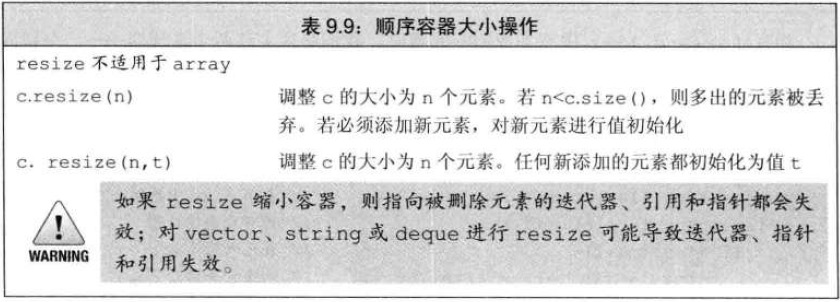
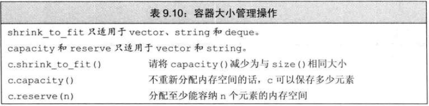
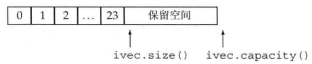

# 添加元素

- ### 容器元素是拷贝
  - 初始化容器、插入对象到容器时，为对象值的拷贝，不是对象本身
- ### emplace
  - emplace 构造元素，调用时将参数传递给元素类型的构造函数
    ```c++
    //在 c 的末尾构造一个有三个参数的 Sales_data 对象
    c.emplace_back("xxxx-xxx", 25, 50);
    //错误，没用接受三个参数的 push_back
    c.push_back("xxxx-xxx", 25, 50);
    //正确，创建一个临时的对象传递给push_back
    c.push_back(Salse_data("xxxx-xxx", 25, 50));
    ```
    - emplace 的参数根据元素类型变化，必须跟元素类型的构造函数匹配
    ```c++
    c.emplace_back();   //使用Sales_data默认构造函数
    c.emplace(iter, "xxxx-xxx");    //使用Sales_data(string)
    c.emplace_front("xxxx-xxx", 25, 50);
    ```

# 访问元素

- 返回的为引用，如果容器为 const 对象，则返回 const 引用

# 删除元素


# forward_list 操作
- forward_list **不支持递减(--)运算**

- forward_list 为单向链表，通过前一个元素(前驱)删除添加当前元素
  - 

# 改变容器大小


# 迭代器失效
- ## 失效原理
  - **容器添加元素**
    - 如果是 vector 或 string，且存储空间被重新分配，则指向容器的迭代器、指针和引用都会失效; 如果存储空间未重新分配，指向插入位置之前的元素迭代器、指针、引用有效，之后元素的迭代器、指针和引用失效
    - deque 插入到首尾位置之外的任何位置，迭代器、指针和引用都会失效；在首尾添加元素，迭代器会失效，但指针和引用不会失效
    - list 和 forward_list 不受影响
  - **容器删除元素**
    - list 和 forward_list 不受影响
    - deque，首尾外位置删除，迭代器、引用、指针失效；删除尾元素，尾后迭代器失效，其他不受影响；删除首元素同理
    - vector 和 string，被删元素前的迭代器、引用、指针不受影响
    - 删除元素时，尾后迭代器总会失效
  - 必须保证每次改变容器操作后都要重新定位迭代器
    - 因此循环中不要保存 end 迭代器

# vector 大小管理

- vector 为连续存储，如果没有空间容纳元素，则将所有元素移动到新空间中，并释放旧空间
- vector 通常会分配比需求更大的空间，以减少重新分配次数
- 
- 每次分配新空间时，容量翻倍
- **只有当迫不得已时，才分配新的存储空间**