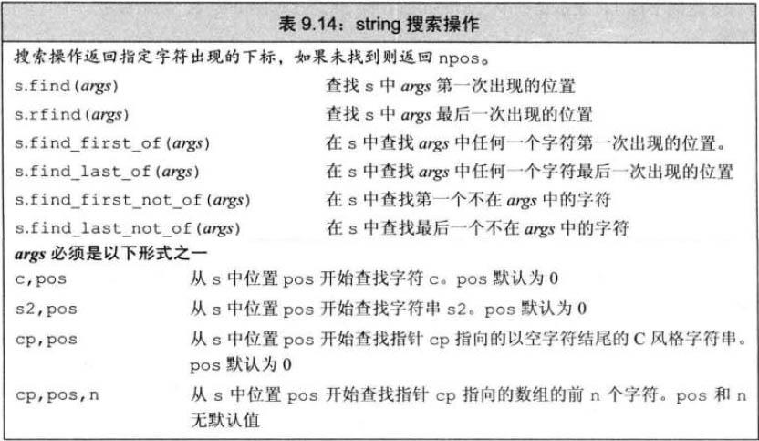

# string 其他构造方法

- 从 const char* 创建 string 时，数组必须以空字符结尾，拷贝到空字符时停止
  - 如果传递了计数值，则数组不必以空字符结尾
  - 如果为传递计数值且数组未以空字符结尾，或计数值大于数组大小，则未定义
- 从 string 拷贝字符时，可以提供开始位置或计数值
```c++
const char *cp = "Hello World!!!";  //以空字符结束的数组
char noNull[] = {'H','i'};          //没有空字符结尾
string s1(cp);
string s2(noNull, 2);               // == "Hi"
string s3(noNull);                  // 未定义，无空字符结尾
string s4(cp+6, 5);                 //从cp[6]开始拷贝5个字符；=="World"
string s5(s1, 6, 5);                //从cp[6]开始拷贝5个字符；=="World"
string s6(s1, 6);                   //从cp[6]开始拷贝到结尾；=="World"
string s7(s1, 6, 20);               //从cp[6]开始拷贝到结尾；=="World"
string s8(s1, 16);                  //错误，下标越界
```     
- ### substr 操作
  - 

# 修改 string 操作

- pos 为下标数，也就是表格中的“位置”

# string 搜索操作

- 搜索成功返回`string::size_type`
- 失败返回`string::npos`的 static 成员，类型为`const string::size_type`，值为 `-1`

# compare 函数

- 与 C 的 strcmp 类似

# 数值转换
