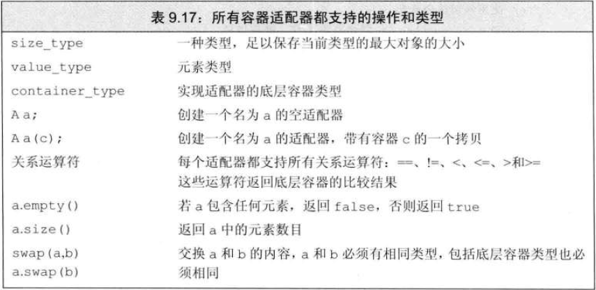
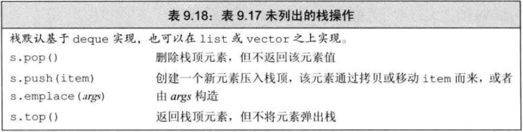
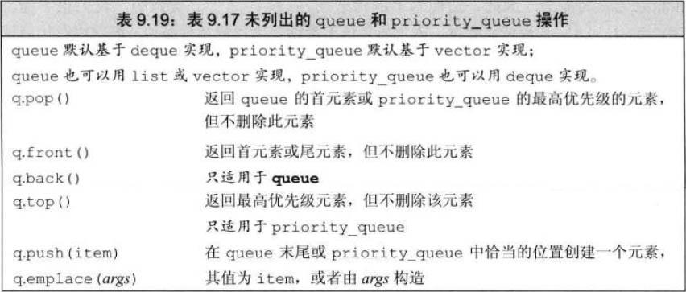

# 概念
> 容器适配器是一种将现有的容器类型适配为不同接口的容器的工具。C++标准库提供了三种主要的容器适配器：栈（stack）、队列（queue）和优先队列（priority_queue）。都是基于现有容器实现，但提供了不同的接口和能力
- 

# 定义适配器
- 每个适配器都定义了两个构造函数
  - 默认构造函数创建一个空对象
  - 接受一个容器的构造函数拷贝该容器来初始化适配器
    ```c++
    stack<int> stk(deq);    //从deq拷贝元素到stk
    ```
- 将容器作为第二个类型参数，可重载默认容器类型
```c++
//stack 基于deque 容器实现，重载为vector实现
stack<string, vector<string>> str_stk;
```

# 栈适配器

> 栈 (stack) 是一种后进先出（LIFO）的数据结构，它只允许在栈顶进行插入和删除操作
- 栈适配器(stack)定义在 **stack 头文件** 中

# 队列适配器

> 队列（queue）：是一种先进先出（FIFO）的数据结构，它允许在队列的前端进行删除操作，在队列的后端进行插入操作<br>
> 优先队列（priority_queue）：是一种特殊的队列，它根据元素的优先级进行排序
- 两种队列适配器都定义在 **queue 头文件**