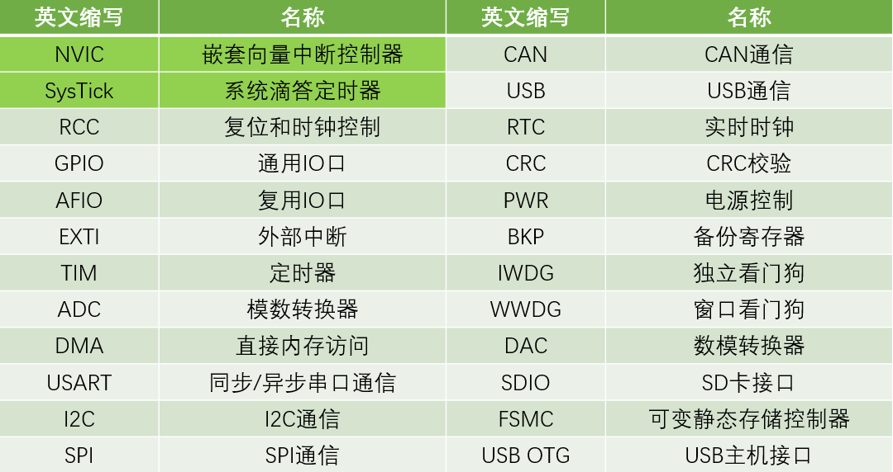
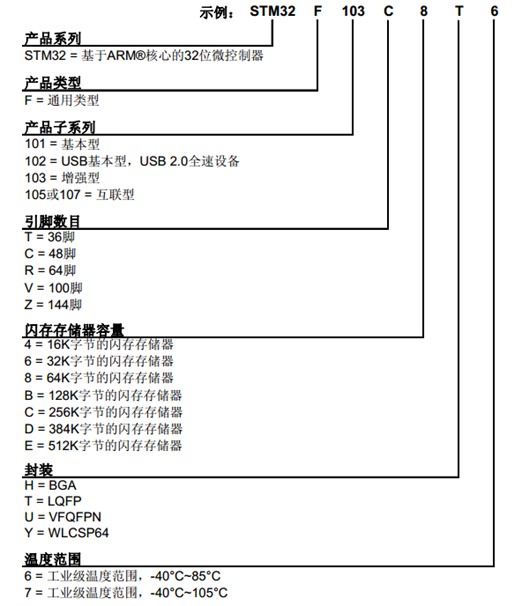
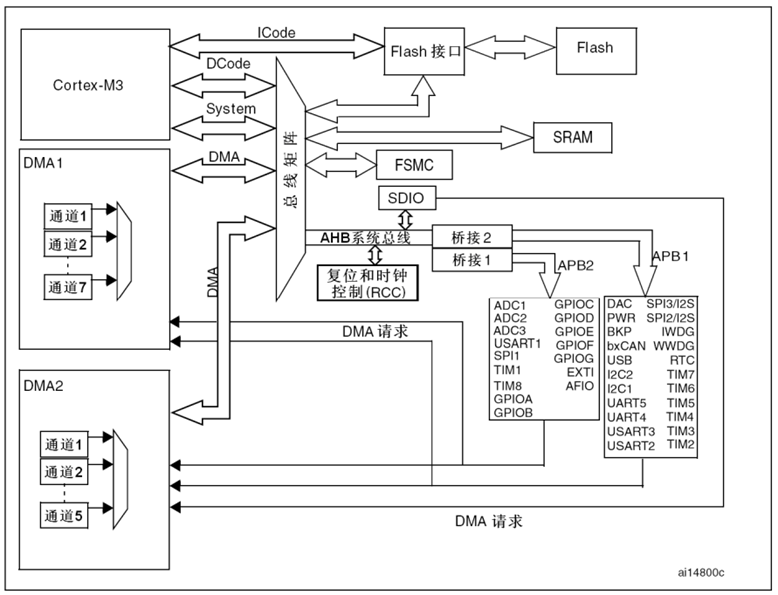
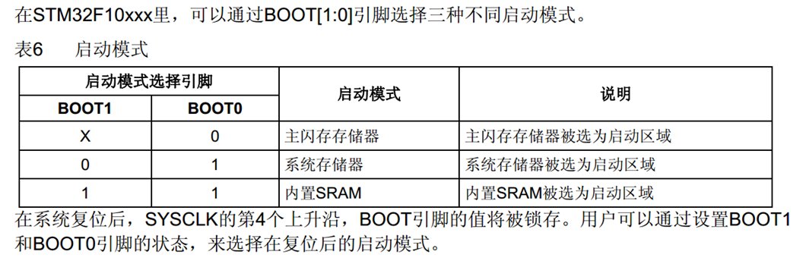
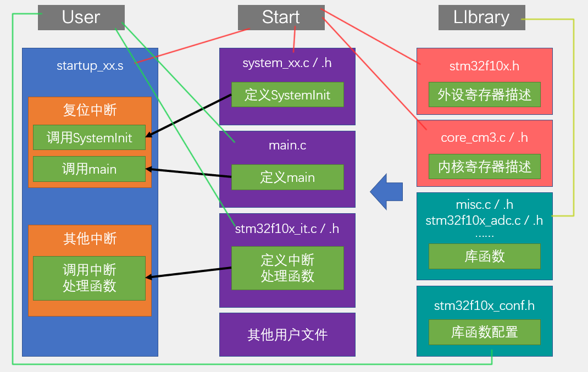
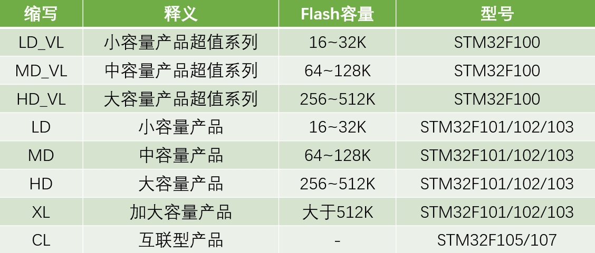

# 规格
  - 系列：主流系列STM32F1
  - 内核：ARM Cortex-M3
  - 主频：72MHz
  - RAM：20K（SRAM）
  - ROM：64K（Flash）
  - 供电：2.0~3.6V（标准3.3V）
  - 封装：LQFP48
# 片上资源/外设
- 
# STM32命名规则
- 
# 系统结构
- 
# 引脚定义
- 
# 启动配置
- 
# 工程架构
- 
  - ## startup_xx 的选择
  - 