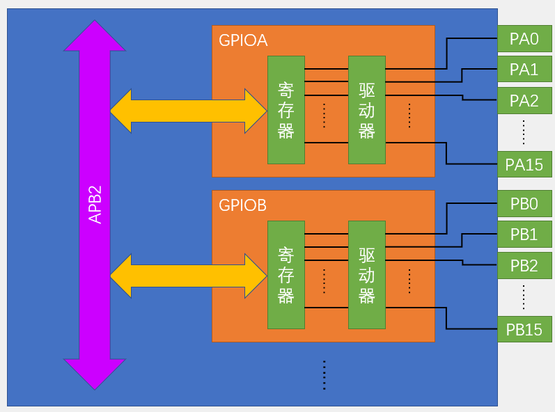
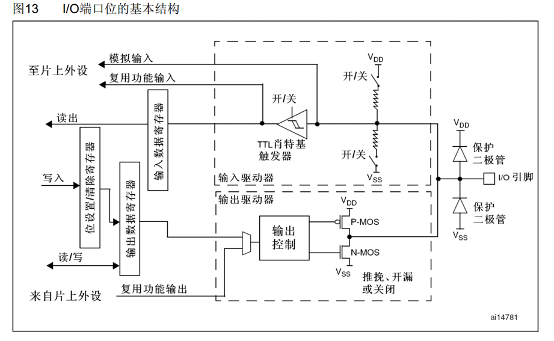
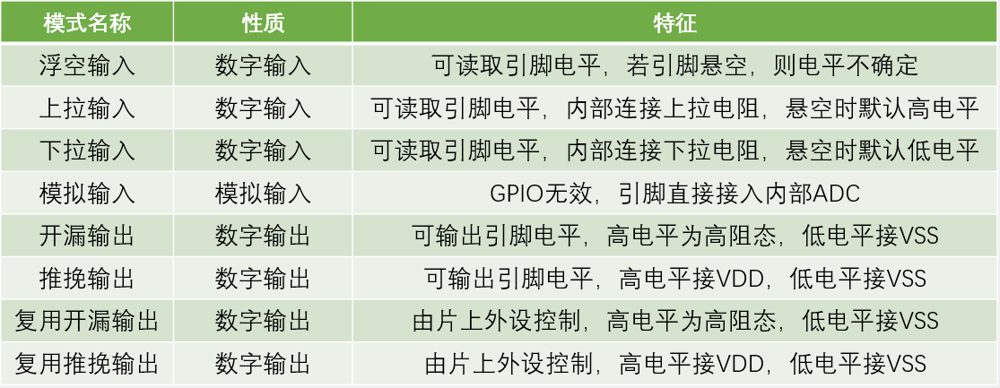

# GPIO简介
- GPIO（General Purpose Input Output）通用输入输出口
- 可配置为8种输入输出模式
- 引脚电平：0V~3.3V，部分引脚可容忍5V
- 输出模式下可控制端口输出高低电平
- 输入模式下可读取端口的高低电平或电压
# GPIO基本结构
- 
- 
# GPIO模式
- 
# GPIO函数（写常用，具体看固件手册）
```c
void GPIO_DeInit(GPIO_TypeDef* GPIOx)
```
- 将外设GPIOx寄存器重设为复位/省缺值/默认
```c
void GPIO_AFIODeInit(void)
```
- 将复用功能（重映射事件控制和EXTI设置）重设为复位/省缺值/默认
```c
void GPIO_Init(GPIO_TypeDef* GPIOx, GPIO_InitTypeDef* GPIO_InitStruct)
```
- GPIO寄存器初始化
```c
void GPIO_StructInit(GPIO_InitTypeDef* GPIO_InitStruct)
```
- GPIO_InitStruct结构体赋默认值
```c
u8 GPIO_ReadInputDataBit(GPIO_TypeDef* GPIOx, u16 GPIO_Pin)
```
- 读取输入数据寄存器某个端口的输入值，也就是读取指定引脚输入电平
```c
u16 GPIO_ReadInputData(GPIO_TypeDef* GPIOx)
```
- 读取整个输入数据寄存器，也就是读取整个GPIO端口的输入
```c
u8 GPIO_ReadOutputDataBit(GPIO_TypeDef* GPIOx, u16 GPIO_Pin)
```
- 读取输出数据寄存器的某一位，也就是读取引脚输出
```c
u16 GPIO_ReadOutputData(GPIO_TypeDef* GPIOx)
```
- 读取整个输出数据寄存器，也就是读取整个GPIO端口的输出
```c
void GPIO_SetBits(GPIO_TypeDef* GPIOx, u16 GPIO_Pin)
```
- 指定端口设为高电平
```c
void GPIO_ResetBits(GPIO_TypeDef* GPIOx, u16 GPIO_Pin)
```
- 指定端口设为低电平
```c
void GPIO_WriteBit(GPIO_TypeDef* GPIOx, u16 GPIO_Pin, BitAction BitVal)
```
- 根据给定的值，设置端口
```c
void GPIO_Write(GPIO_TypeDef* GPIOx, u16 PortVal)
```
- 根据给定的值，设置全部（16个）端口
# GPIO编程步骤
1. 开启GPIO时钟
   - [APH总线的选择与包含功能](./1.STM32简介.md/#系统结构)。
    ```c
    RCC_APB2PeriphClockCmd(RCC_APB2Periph_GPIOA,ENABLE);
    ```
2. GPIO初始化
    ```c
    GPIO_InitTypeDef GPIO_InitStructure;                //定义结构体变量
    GPIO_InitStructure.GPIO_Mode = GPIO_Mode_IPU;       //选择GPIO模式
    /*  GPIO_Mode_AIN     模拟输入(Analog In)         GPIO_Mode_IN_FLOATING   浮空输入
        GPIO_Mode_IPD     下拉输入(In Pull Down)      GPIO_Mode_IPU           上拉输入(In Pull Up)     
        GPIO_Mode_Out_OD  开漏输出(Out Open Drain)    GPIO_Mode_Out_PP        推挽输出(Out Push Pull)
        GPIO_Mode_AF_OD   复用开漏(Atl Open Drain)    GPIO_Mode_AF_PP         复用推挽(Atl Push Pull)  */                                                                                                           
	GPIO_InitStructure.GPIO_Pin=GPIO_Pin_0;             //引脚选择
	GPIO_InitStructure.GPIO_Speed=GPIO_Speed_50MHz;     //GPIO速度，分2MHz、10MHz、50MHz，一般为50MHz
    GPIO_Init(GPIOA, &GPIO_InitStructure);              //传递结构体地址，进行GPIO初始化
    ```