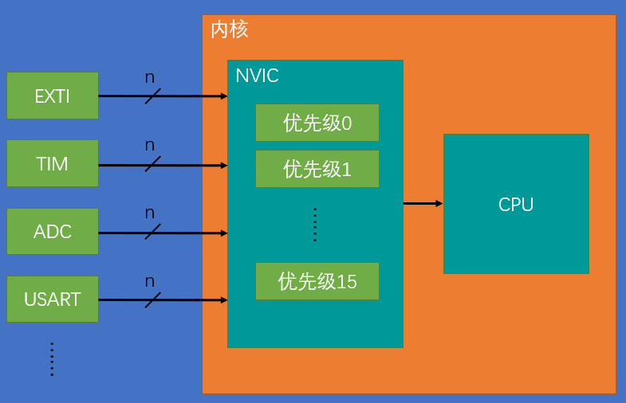
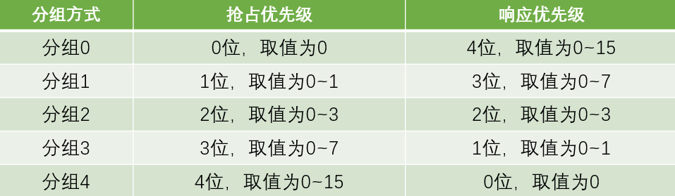
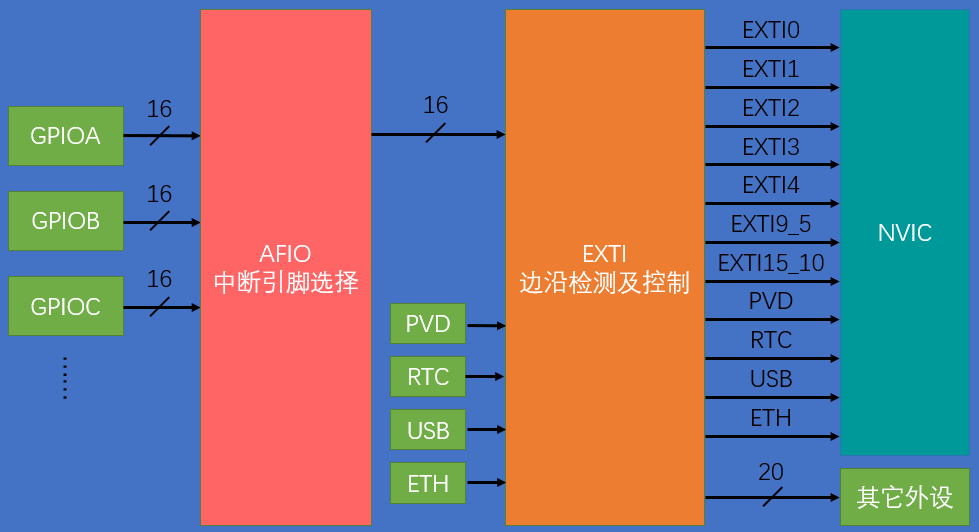
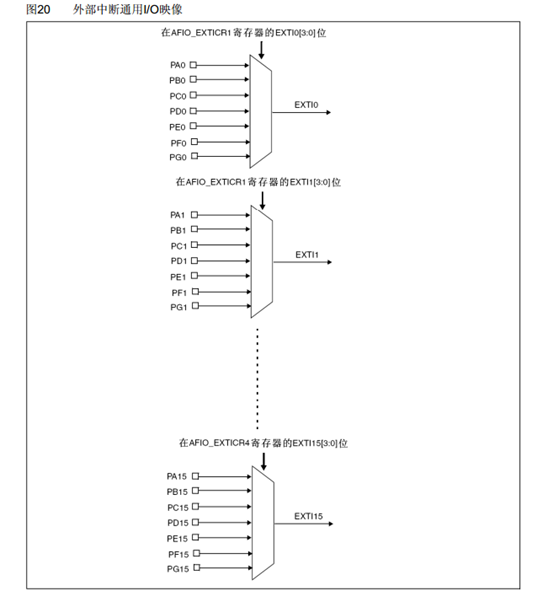

# STM32中断
- 68个可屏蔽中断通道(不包含16个Cortex™-M3的中断线)
- 由NVIC统一管理，16个可编程的优先等级，分为抢占优先级与相应优先级
---
# NVIC
## 基本结构
- 
## 优先级分组
- 由优先级寄存器的4位（0~15）决定
- 高n位的抢占优先级和低4-n位的响应优先级
- 
- 抢占高可以中断嵌套（插队），相应高可以优先排队
---
# EXTI
## 简介
- EXTI（Extern Interrupt）外部中断，监测指定GPIO口的电平信号，当电平发生变化，向NVIC中断申请
- 支持的触发方式：上升沿/下降沿/双边沿/软件触发
- 支持的GPIO口：所有GPIO口，但相同的Pin不能同时触发中断
- 通道数：16个GPIO_Pin，外加PVD输出、RTC闹钟、USB唤醒、以太网唤醒
- 触发响应方式：中断响应/事件响应（触发其他外设）
## 基本结构
- 
## AFIO
- 在32中的主要功能为：复用功能引脚重映射、中断引脚选择（相同Pin不能同时触发中断的原因）
- 
---
# EXIT编程步骤
1. 开启GPIO与AFIO时钟
    ```c
    RCC_APB2PeriphClockCmd(RCC_APB2Periph_GPIOB, ENABLE);		//开启GPIOB时钟
	RCC_APB2PeriphClockCmd(RCC_APB2Periph_AFIO,ENABLE);         //开启AFIO时钟
    ```
2. [GPIO初始化](./2.GPIO.md/#gpio编程步骤)
3. AFIO外部中断引脚选择
    ```c
        GPIO_EXTILineConfig(GPIO_PortSourceGPIOB,GPIO_PinSource1);
    ```
4. EXIT初始化
    ```c
    EXTI_InitTypeDef EXIT_InitStructure;                    //定义EXIT结构体
	EXIT_InitStructure.EXTI_Line=EXTI_Line1;                //配置外部中断线
	EXIT_InitStructure.EXTI_LineCmd=ENABLE;                 //外部中断线使能
	EXIT_InitStructure.EXTI_Mode=EXTI_Mode_Interrupt;       //选择外部中断的中断模式
    /*  EXTI_Mode_Interrupt             中断模式        EXTI_Mode_Event         事件模式    */
   	EXIT_InitStructure.EXTI_Trigger=EXTI_Trigger_Falling;   //选择外部中断的触发方式
    /*  EXTI_Trigger_Rising             上升沿触发      EXTI_Trigger_Falling    下降沿触发
        EXTI_Trigger_Rising_Falling     双边沿触发    */
	EXTI_Init(&EXIT_InitStructure);
    ```
5. NVIC配置
    ```c
    NVIC_PriorityGroupConfig(NVIC_PriorityGroup_2);         //NVIC中断分组，设置抢占中断的位数

	NVIC_InitTypeDef NVIC_InitStructure;                    //定义NVIC结构体
	NVIC_InitStructure.NVIC_IRQChannel=EXTI1_IRQn;          //选择要开启的中断通道
	NVIC_InitStructure.NVIC_IRQChannelCmd=ENABLE;           //开启中断通道
	NVIC_InitStructure.NVIC_IRQChannelPreemptionPriority=1; //抢占中断优先级
	NVIC_InitStructure.NVIC_IRQChannelSubPriority=1;        //响应中断优先级
	NVIC_Init(&NVIC_InitStructure);                         //NVIC初始化
    ```