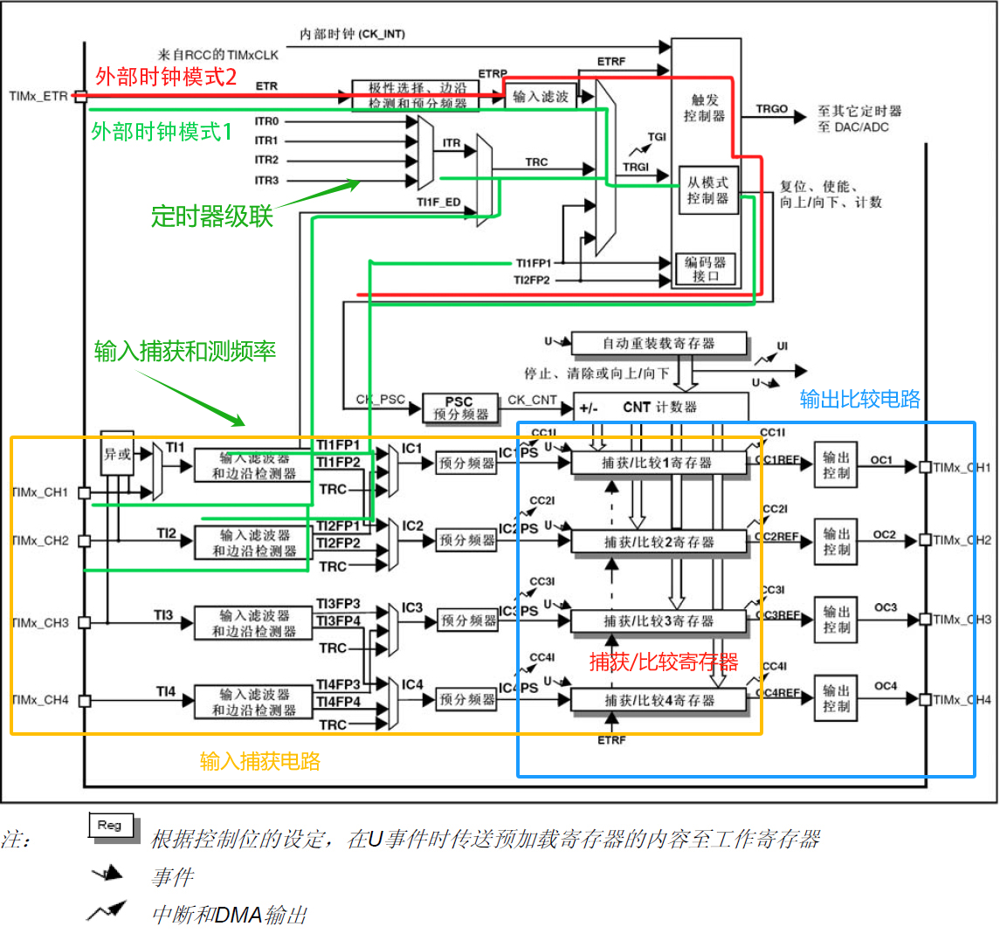
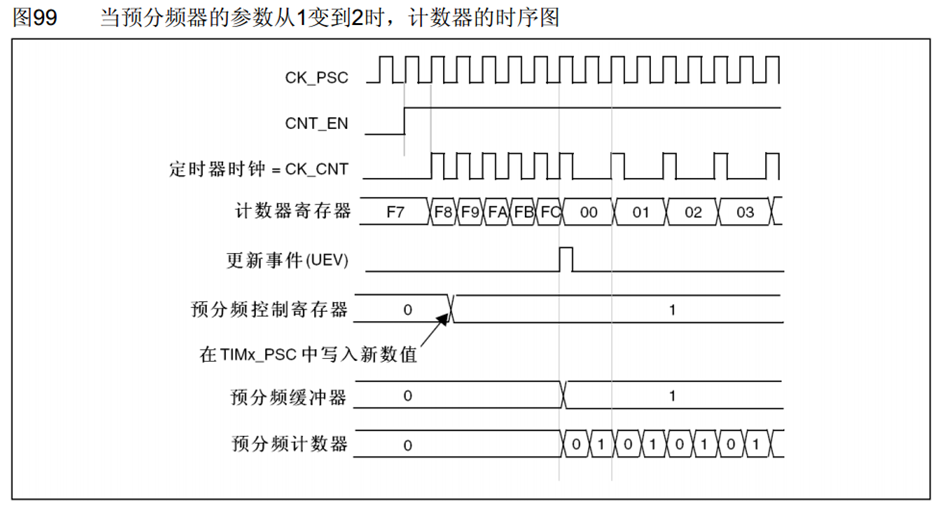

# TIM(Timer)定时器简介
- 定时器可以对输入的时钟进行计数，并在计数值达到设定值时触发中断
- 16位计数器、预分频器、自动重装寄存器组成的的时基单元，在72MHz计数时钟下可以实现最大59.65s的定时
- 不仅具备基本的定时中断功能，而且还包含内外时钟源选择、输入捕获、输出比较、编码器接口、主从触发模式等多种功能
- 分为了高级定时器、通用定时器、基本定时器三种类型
- <mark>**STM32F103C8T6定时器资源：TIM1、TIM2、TIM3、TIM4，没有基本定时器**</mark>
# 定时器类型

- ## 基本定时器
  - 
    - PSC预分频器（16位）：对计数时钟进行分频
      - 0为1分频（不分频），1为2分频（也就是一半），最大可写65535，也就是65536分频
    - CNT计数器（16位）：对分频后的计数时钟进行计数
      - 基本定时器仅支持向上计数
    - ARR自动重装载寄存器（16位）：存储计数目标。当计时器计数到计数目标时，产生中断信号，清零计数器并自动开始下一次计数
- ## 通用定时器
  - 
- ## 高级定时器
  - 
  - 
# 定时器中断
- 

# 定时器时序
## 预分频时序
- 
  - 预分频缓冲寄存器：保证计数完成后，再使用分频后的计数值
  - 计数器计数频率：CK_CNT = CK_PSC / (PSC + 1)
    - CK_CNT：定时器时钟，CK_PSC：定时器时钟源
## 计数器时序
- 
  - 计数器溢出频率：CK_CNT_OV = CK_CNT / (ARR + 1)
## 计数器有预装与无预装时序
  - 
  - 
    - 计数完成后，才会使用分配后的计数值

# RCC时钟树
- 

# 常用函数
- 重设为缺省配置
  ```c
  void TIM_DeInit(TIM_TypeDef* TIMx);
  ```
- 时基单元初始化
  ```c
  void TIM_TimeBaseInit(TIM_TypeDef* TIMx, TIM_TimeBaseInitTypeDef* TIM_TimeBaseInitStruct);
  //结构体参数
  typedef struct
  {
    uint16_t TIM_Prescaler;           //时钟分频
    //1分频：TIM_CKD_DIV1   2分频：TIM_CKD_DIV2   4分频：TIM_CKD_DIV4
    uint16_t TIM_CounterMode;         //计数模式
    /*向上计数：TIM_CounterMode_Up    向下计数：TIM_CounterMode_Down
      中央对齐：TIM_CounterMode_CenterAligned1
                TIM_CounterMode_CenterAligned2
                TIM_CounterMode_CenterAligned3 */
    uint16_t TIM_Period;              //ARR值，计数周期
    uint16_t TIM_ClockDivision;       //PSC值，预分频
    uint8_t TIM_RepetitionCounter;    //重复计数器值，高级定时器才有
  } TIM_TimeBaseInitTypeDef; 
  ```
- 使能计数器
  ```c
  void TIM_Cmd(TIM_TypeDef* TIMx, FunctionalState NewState);
  ```
- 使能定时器中断输出信号
  ```c
  void TIM_ITConfig(TIM_TypeDef* TIMx, uint16_t TIM_IT, FunctionalState NewState);
  ```
- 设置内部时钟
  ```c
  void TIM_InternalClockConfig(TIM_TypeDef* TIMx);
  ```
- 设置ITRx其他定时器作为外部时钟源（外部时钟1）
  ```c
  void TIM_ITRxExternalClockConfig(TIM_TypeDef* TIMx, uint16_t TIM_InputTriggerSource);
  ```
- 设置TIx捕获通道的时钟（外部时钟1）
  ```c
  void TIM_TIxExternalClockConfig(TIM_TypeDef* TIMx, 
                                  uint16_t TIM_TIxExternalCLKSource,
                                  uint16_t TIM_ICPolarity, //极性
                                  uint16_t ICFilter);      //滤波器
  ```
- 设置ETR通过外部时钟模式1输入时钟
  ```c
  void TIM_ETRClockMode1Config( TIM_TypeDef* TIMx, 
                                uint16_t TIM_ExtTRGPrescaler, //外部触发预分频器
                                uint16_t TIM_ExtTRGPolarity,
                                uint16_t ExtTRGFilter);
  ```
- 设置ETR通过外部时钟模式2输入时钟
  ```c
  void TIM_ETRClockMode2Config( TIM_TypeDef* TIMx, 
                                uint16_t TIM_ExtTRGPrescaler, //外部触发预分频器
                                uint16_t TIM_ExtTRGPolarity,
                                uint16_t ExtTRGFilter);
  ```
- 设置ETR参数
  ```c
  void TIM_ETRConfig(TIM_TypeDef* TIMx, 
                     uint16_t TIM_ExtTRGPrescaler,  //外部触发预分频器
                     uint16_t TIM_ExtTRGPolarity,   //极性
                     uint16_t ExtTRGFilter);        //滤波器
  ```
- 设置PSC预分频
  ```c
  void TIM_PrescalerConfig(TIM_TypeDef* TIMx, 
                           uint16_t Prescaler,          //分频值 
                           uint16_t TIM_PSCReloadMode); 
  /*预分频值在更新事件生效：TIM_PSCReloadMode_Update
    手动产生更新事件，立即生效：TIM_PSCReloadMode_Immediate */ 
  ```
- 设置计数器模式
  ```c
  void TIM_CounterModeConfig(TIM_TypeDef* TIMx, uint16_t TIM_CounterMode);  
  ```
- 设置计数值
  ```c
  void TIM_SetCounter(TIM_TypeDef* TIMx, uint16_t Counter);
  ```
- 获取计数值
  ```c
  uint16_t TIM_GetCounter(TIM_TypeDef* TIMx);
  ```
- 设置ARR的预装载
  ```c
  void TIM_ARRPreloadConfig(TIM_TypeDef* TIMx, FunctionalState NewState); 
  ```
- 设置ARR自动重装值
  ```c
  void TIM_SetAutoreload(TIM_TypeDef* TIMx, uint16_t Autoreload);
  ```
- 获取ARR自动重装值
  ```c
  uint16_t TIM_GetPrescaler(TIM_TypeDef* TIMx);
  ```