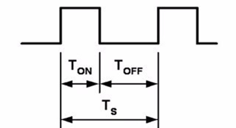
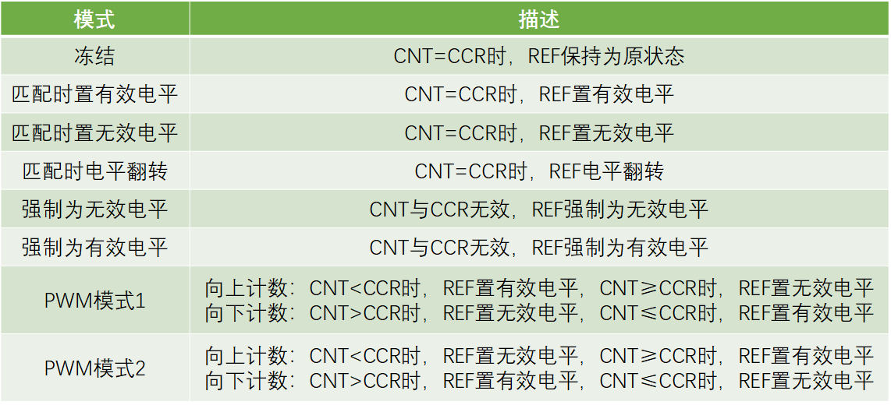
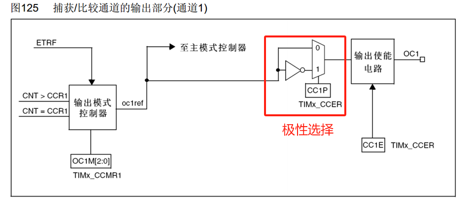
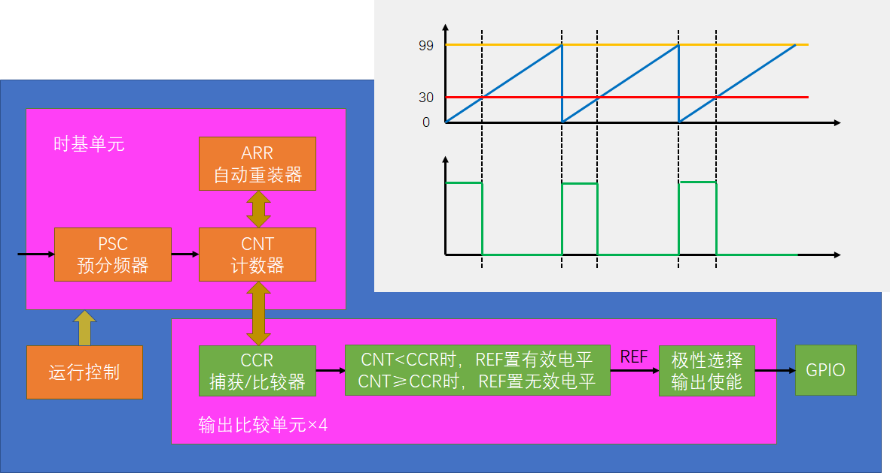

# 概念
> OC（Output Compare）输出比较通过比较CNT与CCR寄存器值的关系，来对输出电平进行置1、置0或翻转的操作，用于输出一定频率和占空比的PWM波形
- 高级定时器和通用定时器有4个输出比较通道
- 高级定时器的前3个通道额外拥有死区生成和互补输出的功能

# PWM概念
> PWM（Pulse Width Modulation）脉冲宽度调制，可以通过对一系列脉冲的宽度进行调制，来等效地获得所需要的模拟参量，常应用于电机控速等领域
- 频率 = 1 / TS  &nbsp;&nbsp;&nbsp;&nbsp;  占空比(高电平占比) = TON / TS  &nbsp;&nbsp;&nbsp;&nbsp;  分辨率 = 占空比变化步距
- 

# 结构
- ## 输出比较模式
  - 
- ## 通用定时器输出比较结构
  - 
- ## 高级定时器输出比较结构
  - 
- ## PWM基本结构
  - 

# PWM参数计算
- PWM频率：	Freq = CK_PSC / (PSC + 1) / (ARR + 1)
- PWM占空比：	Duty = CCR / (ARR + 1)
- WM分辨率：	Reso = 1 / (ARR + 1)

# 常用函数
- 设置（初始化）输出比较模块
    ```c
    void TIM_OC1Init(TIM_TypeDef* TIMx, TIM_OCInitTypeDef* TIM_OCInitStruct);
    void TIM_OC2Init(TIM_TypeDef* TIMx, TIM_OCInitTypeDef* TIM_OCInitStruct);
    void TIM_OC3Init(TIM_TypeDef* TIMx, TIM_OCInitTypeDef* TIM_OCInitStruct);
    void TIM_OC4Init(TIM_TypeDef* TIMx, TIM_OCInitTypeDef* TIM_OCInitStruct);
    ```
- 设置输出比较结构体为缺省
    ```c
    void TIM_OCStructInit(TIM_OCInitTypeDef* TIM_OCInitStruct);
    ```
- 设置强制输出模式，可在运行中强制输出高或低电平
    ```c
    void TIM_ForcedOC1Config(TIM_TypeDef* TIMx, uint16_t TIM_ForcedAction);
    void TIM_ForcedOC2Config(TIM_TypeDef* TIMx, uint16_t TIM_ForcedAction);
    void TIM_ForcedOC3Config(TIM_TypeDef* TIMx, uint16_t TIM_ForcedAction);
    void TIM_ForcedOC4Config(TIM_TypeDef* TIMx, uint16_t TIM_ForcedAction);
    ```
- 设置CCR寄存器预装功能（缓存）
    ```c
    void TIM_OC1PreloadConfig(TIM_TypeDef* TIMx, uint16_t TIM_OCPreload);
    void TIM_OC2PreloadConfig(TIM_TypeDef* TIMx, uint16_t TIM_OCPreload);
    void TIM_OC3PreloadConfig(TIM_TypeDef* TIMx, uint16_t TIM_OCPreload);
    void TIM_OC4PreloadConfig(TIM_TypeDef* TIMx, uint16_t TIM_OCPreload);
    ```
- 设置输出比较极性，带 N 为高级定时器的互补通道配置
    ```c
    void TIM_OC1PolarityConfig(TIM_TypeDef* TIMx, uint16_t TIM_OCPolarity);
    void TIM_OC1NPolarityConfig(TIM_TypeDef* TIMx, uint16_t TIM_OCNPolarity);
    void TIM_OC2PolarityConfig(TIM_TypeDef* TIMx, uint16_t TIM_OCPolarity);
    void TIM_OC2NPolarityConfig(TIM_TypeDef* TIMx, uint16_t TIM_OCNPolarity);
    void TIM_OC3PolarityConfig(TIM_TypeDef* TIMx, uint16_t TIM_OCPolarity);
    void TIM_OC3NPolarityConfig(TIM_TypeDef* TIMx, uint16_t TIM_OCNPolarity);
    void TIM_OC4PolarityConfig(TIM_TypeDef* TIMx, uint16_t TIM_OCPolarity);
    ```
- 设置输出比较使能
    ```c
    void TIM_CCxCmd(TIM_TypeDef* TIMx, uint16_t TIM_Channel, uint16_t TIM_CCx);
    void TIM_CCxNCmd(TIM_TypeDef* TIMx, uint16_t TIM_Channel, uint16_t TIM_CCxN);
    ```
- 设置输出比较模式
    ```c
    void TIM_SelectOCxM(TIM_TypeDef* TIMx, uint16_t TIM_Channel, uint16_t TIM_OCMode);
    ```
- 设置CCR寄存器数值
    ```c
    void TIM_SetCompare1(TIM_TypeDef* TIMx, uint16_t Compare1);
    void TIM_SetCompare2(TIM_TypeDef* TIMx, uint16_t Compare2);
    void TIM_SetCompare3(TIM_TypeDef* TIMx, uint16_t Compare3);
    void TIM_SetCompare4(TIM_TypeDef* TIMx, uint16_t Compare4);
    ```