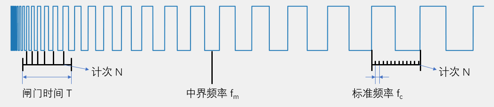

# 概念
> IC（Input Capture）输入捕获，当通道输入引脚出现指定电平跳变时，当前CNT的值将被锁存到CCR中，可用于测量PWM波形的频率、占空比、脉冲间隔、电平持续时间等参数
- 高级定时器和通用定时器有4个输入捕获通道
- 可配置为PWMI模式，同时测量频率和占空比
- 可配合主从触发模式，实现硬件全自动测量

# 测量方法

- 测频法（测高频）：在闸门时间T内，对上升沿计次，得到N，则频率
  - 𝑓𝑥=𝑁 / 𝑇
- 测周法（测低频）：两个上升沿内，以标准频率fc计次，得到N ，则频率
  - 𝑓𝑥=𝑓𝑐  / 𝑁
- 中界频率：测频法与测周法误差相等的频率点
  - 𝑓𝑚=根号(𝑓𝑐  / 𝑇)

# 输入捕获通道


# 主模式、从模式、触发源选择

- 主模式：将定时器内部信号映射到TRGO引脚，用于触发其他外设
- 从模式：接收其他或自设外设的信号，从而控制自身定时器的运行
- 触发源选择：选择从模式的触发信号源
- 主从触发模式可以实现硬件自动触发，减少使用软件资源

# 输入捕获与PWMI结构

  - CCR1 等于测周法中的 N

  - CCR2 等于高电平时间

# 常用函数
- 设置输入捕获结构体
    ```c
    void TIM_ICInit(TIM_TypeDef* TIMx, TIM_ICInitTypeDef* TIM_ICInitStruct);
    ```
- 快速设置 PWMI 结构体
    ```c
    void TIM_PWMIConfig(TIM_TypeDef* TIMx, TIM_ICInitTypeDef* TIM_ICInitStruct);
    ```
- 设置输入捕获结构体为默认值
    ```c
    void TIM_ICStructInit(TIM_ICInitTypeDef* TIM_ICInitStruct);
    ```
- 设置 TRGI 的触发源（从模式触发源选择）
    ```c
    void TIM_SelectInputTrigger(TIM_TypeDef* TIMx, uint16_t TIM_InputTriggerSource);
    ```
- 设置 TRGO 的输出触发源（主模式触发源）
    ```C
    void TIM_SelectOutputTrigger(TIM_TypeDef* TIMx, uint16_t TIM_TRGOSource);
    ```
- 设置定时器的主/从模式
    ```C
    void TIM_SelectSlaveMode(TIM_TypeDef* TIMx, uint16_t TIM_SlaveMode);
    ```
- 设置输出捕获的分频器
    ```c
    void TIM_SetIC1Prescaler(TIM_TypeDef* TIMx, uint16_t TIM_ICPSC);
    void TIM_SetIC2Prescaler(TIM_TypeDef* TIMx, uint16_t TIM_ICPSC);
    void TIM_SetIC3Prescaler(TIM_TypeDef* TIMx, uint16_t TIM_ICPSC);
    void TIM_SetIC4Prescaler(TIM_TypeDef* TIMx, uint16_t TIM_ICPSC);
    ```
- 读取 CCR 数值
    ```c
    uint16_t TIM_GetCapture1(TIM_TypeDef* TIMx);
    uint16_t TIM_GetCapture2(TIM_TypeDef* TIMx);
    uint16_t TIM_GetCapture3(TIM_TypeDef* TIMx);
    uint16_t TIM_GetCapture4(TIM_TypeDef* TIMx)
    ```