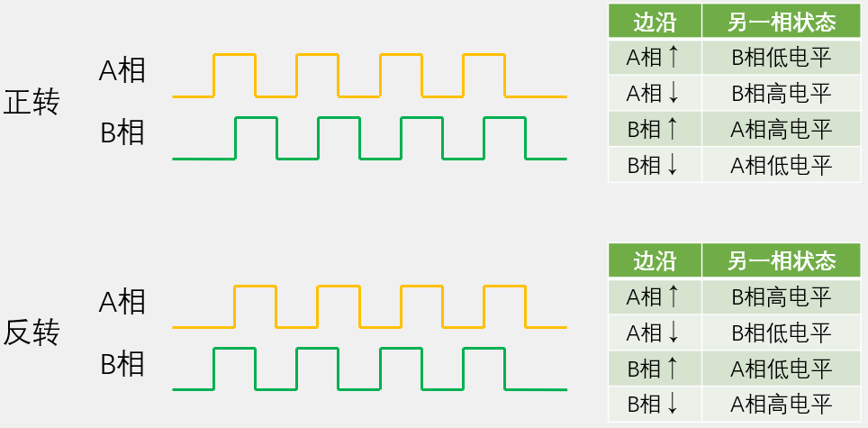
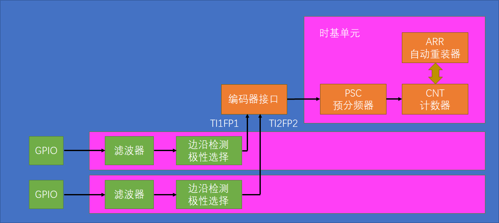
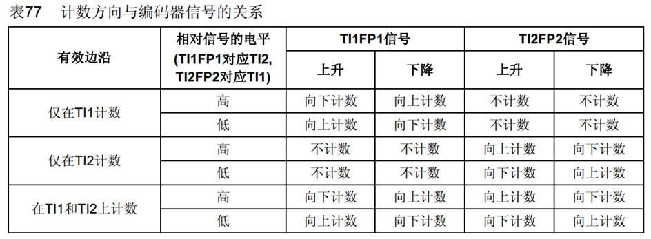

# 概念 
> Encoder Interface 编码器接口，接收增量（正交）编码器的信号，根据编码器旋转产生的正交信号脉冲，自动控制CNT自增或自减，从而指示编码器的位置、旋转方向和旋转速度
- 高级定时器和通用定时器有1个编码器接口
- 两个输入引脚借用了输入捕获的通道1和通道2

# 正交编码器


# 结构

- 计数时钟和计数方向受编码器接口托管

# 工作模式

- 一般使用 TL1TL2 方式（A相和B相都计数），精度更高

# 常用函数
- 编码器接口设置
```c
void TIM_EncoderInterfaceConfig(TIM_TypeDef* TIMx, 
                                uint16_t TIM_EncoderMode,
                                uint16_t TIM_IC1Polarity,
                                uint16_t TIM_IC2Polarity)
```