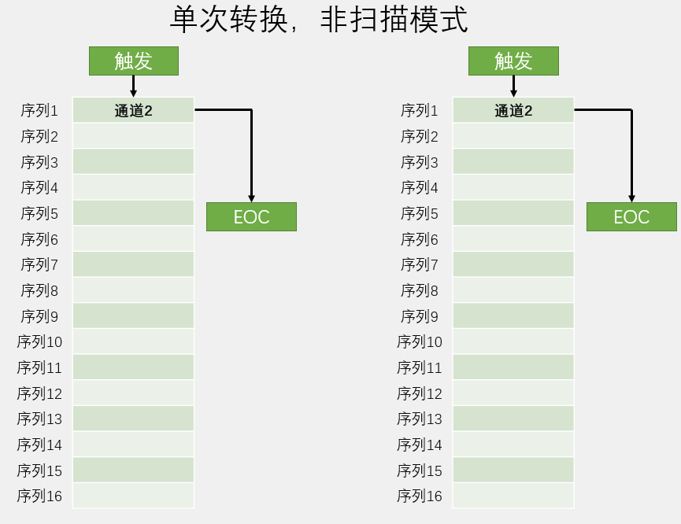

# 概念
> ADC（Analog-Digital Converter）模拟-数字转换器，可以将引脚上连续变化的模拟电压转换为内存中存储的数字变量，建立模拟电路到数字电路的桥梁
- 12位逐次逼近型ADC，1us转换时间
- 输入电压范围：0~3.3V，转换结果范围：0~4095
- 18个输入通道，可测量16个外部和2个内部信号源
- 规则组和注入组两个转换单元
- 模拟看门狗自动监测输入电压范围
- STM32F103C8T6 ADC资源：ADC1、ADC2，10个外部输入通道

# 结构
- 
- 
  - 规则通道：最多16个通道
  - 注入通道：最多4个通道
    - 执行规则通道组扫描转换时，如有例外处理则可启用注入通道组的转换

# 输入通道


# 转换模式

- 单次转换：触发后，只进行一次ADC转换

- 连续转换：触发后，不停的进行ADC转换，后续不需要再触发，有覆盖数据风险

- 扫描模式：可选择多个通道进行转换，所有通道转换完后才产生EOC，有覆盖数据风险，需DMA配合使用


# 触发控制


# 转换时间
- AD转换的步骤：采样，保持，量化，编码
- STM32 ADC的总转换时间为：
  - $T_{CONV}$= 采样时间 + 12.5个ADC周期
- 例：当ADCCLK=14MHz，采样时间为1.5个ADC周期
  - $T_{CONV}$ = 1.5 + 12.5 = 14个ADC周期 = 1μs

# 校准
- ADC有一个内置自校准模式。校准可大幅减小因内部电容器组的变化而造成的准精度误差
- 建议在每次上电后执行一次校准
- 启动校准前， ADC必须处于关电状态超过至少两个ADC时钟周期

# 常用函数
- ADC初始化
    ```c
    void ADC_Init(ADC_TypeDef* ADCx, ADC_InitTypeDef* ADC_InitStruct);
    ```
- 结构体默认值
    ```c
    void ADC_StructInit(ADC_InitTypeDef* ADC_InitStruct);
    ```
- ADC使能
    ```c
    void ADC_Cmd(ADC_TypeDef* ADCx, FunctionalState NewState);
    ```
- ADC中断输出控制
    ```c
    void ADC_ITConfig(ADC_TypeDef* ADCx, uint16_t ADC_IT, FunctionalState NewState);
    ```
- 复位校准与获取复位校准状态
    ```c
    void ADC_ResetCalibration(ADC_TypeDef* ADCx);
    FlagStatus ADC_GetResetCalibrationStatus(ADC_TypeDef* ADCx);
    ```
- 开始校准与获取开始校准状态
    ```c
    void ADC_StartCalibration(ADC_TypeDef* ADCx);
    FlagStatus ADC_GetCalibrationStatus(ADC_TypeDef* ADCx);
    ```
- 开启软件触发
    ```c
    void ADC_SoftwareStartConvCmd(ADC_TypeDef* ADCx, FunctionalState NewState);
    ```
- 规则通道配置
    ```c
    void ADC_RegularChannelConfig(  ADC_TypeDef* ADCx, 
                                    uint8_t ADC_Channel,
                                    uint8_t Rank, 
                                    uint8_t ADC_SampleTime);
    ```
- 外部触发控制
    ```c
    void ADC_ExternalTrigConvCmd(ADC_TypeDef* ADCx, FunctionalState NewState);
    ```
- **获取转换数值**
    ```c
    uint16_t ADC_GetConversionValue(ADC_TypeDef* ADCx);
    //双ADC模式获取数值
    uint32_t ADC_GetDualModeConversionValue(void);
    ```
- 看门狗设置
    ```c
    //看门狗使能
    void ADC_AnalogWatchdogCmd(ADC_TypeDef* ADCx, uint32_t ADC_AnalogWatchdog);
    //阈值设置
    void ADC_AnalogWatchdogThresholdsConfig(ADC_TypeDef* ADCx, uint16_t HighThreshold, uint16_t LowThreshold);
    //通道配置
    void ADC_AnalogWatchdogSingleChannelConfig(ADC_TypeDef* ADCx, uint8_t ADC_Channel);
    ```
- ADC温度传感器、内部参考电压控制
    ```c
    void ADC_TempSensorVrefintCmd(FunctionalState NewState);
    ```