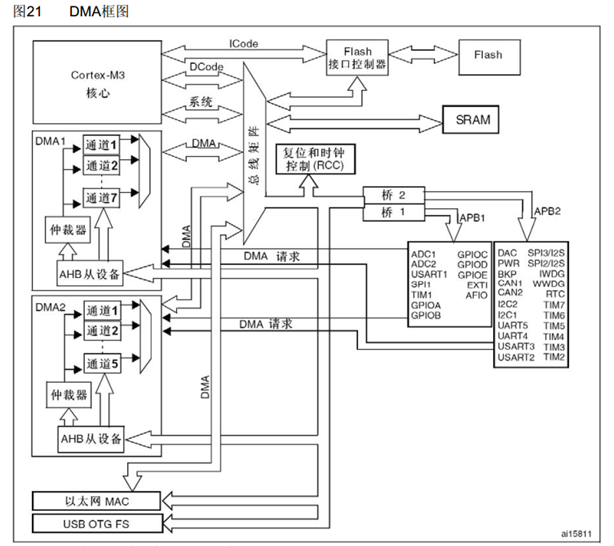

# 概念
> DMA（Direct Memory Access）直接存储器存取，可以提供外设和存储器或者存储器和存储器之间的高速数据传输，无须CPU干预，节省了CPU的资源
- 12个独立可配置的通道： DMA1（7个通道）， DMA2（5个通道）
- 每个通道都支持软件触发和特定的硬件触发
- STM32F103C8T6 DMA资源：DMA1（7个通道）

# STM32存储器映像
- 
- 详细可看数据手册

# 结构
- 
- 
  - 传输计数器：DMA转运次数，每转运一次减一
    - 写传输计数器时，必须先关闭DMA，再进行写入
  - 自动重装器：开启循环模式，传输计数器为0时重置为初始值
  - M2M(Memory to Memory，存储器到存储器)：为1软件触发，为0硬件触发
  - 软件触发：以最快的速度，连续不断地触发DMA，以尽快把传输计数器清零
    - 不可和循环模式同时使用，否则DMA不会停止
  - 硬件触发：其他外设（ADC，定时器等）发送DMA请求信号，以触发DMA转运

# <mark>DMA转运条件</mark>
1. 开关控制`DMA_Cmd()`必须使能
2. 传输计数器必须大于0
3. 必须有触发信号

# 数据宽度与对齐

- 小数据转大空间，高位补零
- 大数据转小空间，高位舍弃

# 实例
- ### 数据转运+DMA
  - 
  - 方向为外设转移到存储器
  - 外设地址为`DataA`，存储器地址为`DataB`
  - 数据宽度都为1字节(8位)
  - 两边地址都自增
  - 传输计数器为7，不重装
  - 使用软件触发
- ### ADC扫描模式+DMA
  - 
  - 方向：外设到存储器
  - 外设地址为`ADC_DR寄存器`地址，存储器为数组`ADValue`地址
  - 外设地址不自增，存储器地址自增
  - 数据宽度16位，半字
  - 传输计数器为7，重装
  - 使用ADC硬件触发
    - 虽然单个通道转换后，不会有任何标志位与中断，但是产生DMA请求

# 常用函数
- 写传输计数器数据
    ```c
    void DMA_SetCurrDataCounter(DMA_Channel_TypeDef* DMAy_Channelx, uint16_t DataNumber);
    ```
- 获取传输计数器数值
    ```c
    uint16_t DMA_GetCurrDataCounter(DMA_Channel_TypeDef* DMAy_Channelx);
    ```