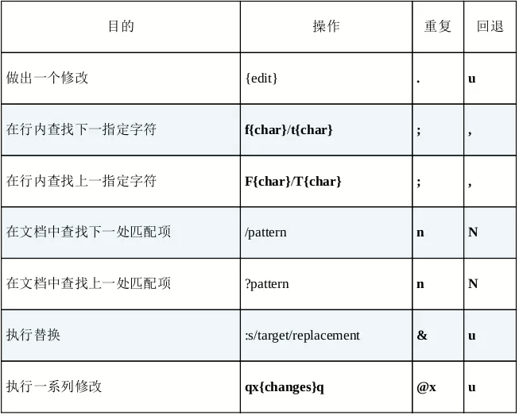

## 认识 . 命令
- . 命令：重复上次修改
  - 普通模式的命令，进入插入模式到退出为止，都为一次修改
- \>G命令：从当前行到文档末尾处的缩进层级
## 不要自我重复
- 使用 A; 来添加末尾的 ; 符号
- 再使用 j. 移动到下一行并重复上一次修改（A;操作）
- 一键移动，另一键操作
## 以退为进
- 使用f找到内容，修改，再用 ; 重复
```
s 命令：删除光标下的字符，并进入插入模式
S 命令：删除行，并进入插入模式
; 命令：重复上次查找(f/F/t/T)
```
## 执行、重复、回退
- 
## 查找并手动替换
- 先用 / 查找 ,命令修改，n 命令查找下一项，再使用 . 重复修改
```
/ 命令：从光标到文档结尾查找字符串
f 命令：向后行内查找第一个字符
F 命令：向前查找第一个字符字符
* 命令：向下搜索光标所在单词
# 命令：同上，为向上
t 命令：向后搜索到第一个 字符前
cw 命令：删除从光标到单词结尾字符，并进入插入模式
```