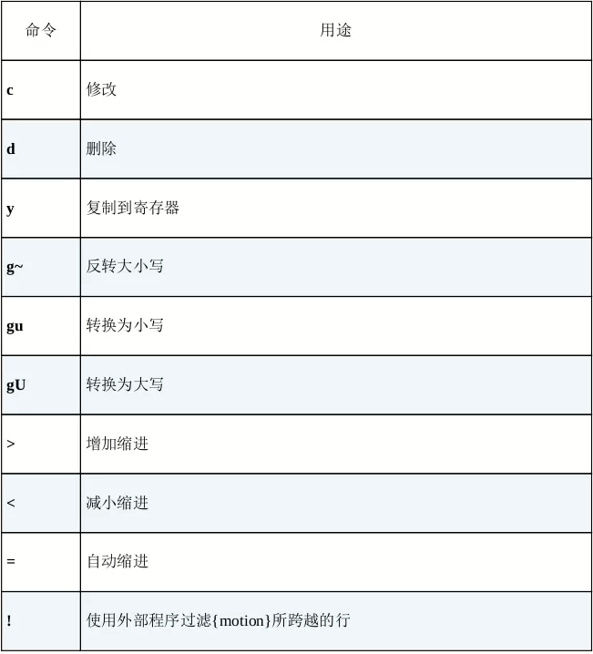

## 多使用普通模式
## 把撤销单元切成块
- 插入模式中移动光标会重置修改状态
## 构造可重复的修改
- aw 命令：整个单词，包括分隔符
## 用次数做简单的算术运算
```
<C-a> ：数字加
<C-x> ：数字减
#如果光标不在数字上，则向正向查找第一个数字，并执行操作
```
- 007为八进制
## 能够重复，就别用次数
- 删除7个单词 ，别用 d7w ，用dw......
  - 因为计数较为麻烦，且用重复可只撤销一个，计数则全部撤销
- 只在必要时使用次数
## 操作符 + 动作命令 = 操作
- 一个操作由一个操作符，后面跟一个动作命令组成（如dw，d为操作符，w为动作命令）
- 当一个操作符命令被连续调用两次时，它会作用于当前行（如dd,为删除当前行）
- 
