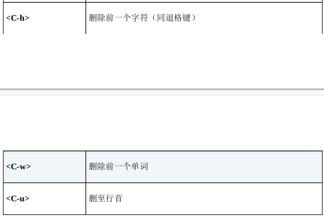
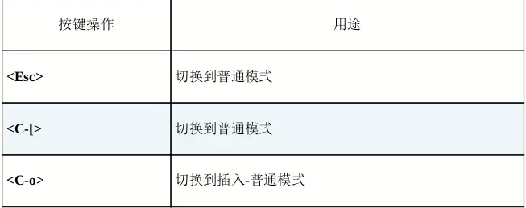
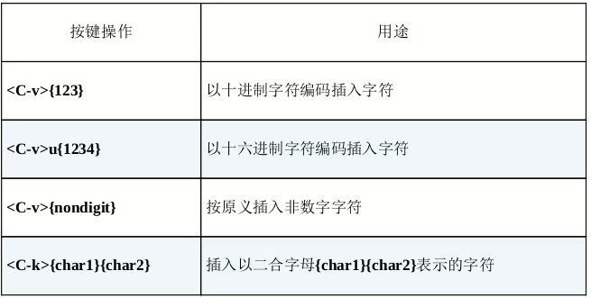

## 在插入模式中可即时更正错误
- 
## 返回普通模式
- 
- ### 插入-普通模式
  - C^o 执行一次普通模式命令，如何返回插入模式
## 不离开插入模式，粘贴寄存器中的文本
- C^r{register}：{register}为寄存器名
  - 使用 C^r0 粘贴刚复制的文本
## 随时随地做运算
- 在插入模式中，使用 C^r= 可访问表达式寄存器，可进行运算
## 用字符编码插入非常用字符
  - C^v{code}:根据字符编码插入字符，{code}为要插入的字符编码
  - 
## 虚拟替换模式替换制表符
- gR触发，将 tab 当成一组空格处理
  - 如 tab 占8字符，输入前7个字符时，每个字符都会被插入制表符之前
  - 当输入第8个字符时，该字符将会替换制表符