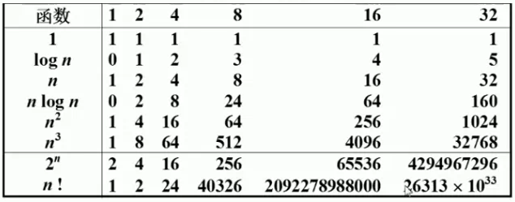
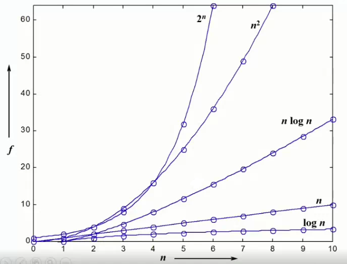

# 什么是数据结构
## 定义
- 数据对象在计算机中的组织方式
  - 逻辑结构（如线性结构、树结构、图结构等等）
  - 物理存储结构
- 数据对象必须与一系列加在其上的操作相关联
- 完成这些操作所用的方法就是算法
## 抽象数据类型（Abstract Data Type）
- ### 数据类型
  - 数据对象集
  - 数据集合相关联的操作集（如各种函数）
- ### 抽象
  - 描述数据类型的方法不依赖于具体实现
    - 与存放数据的机器无关
    - 与数据存储的物理结构无关
- 只描述数据对象集和相关操作集“是什么”，并不涉及“如何做到”的问题
---
# 什么是算法（Algorithm）
## 定义
- 一个有限指令集
- 接受一些输入（有些情况不需要）
- 产生输出
- 一定在有限步骤之后终止 
- 每一条指令必须 
  - 由充分明确的目标，不可以有歧义
  - 计算机能处理的范围之内
  - 描述因不依赖于任何一种计算机语言以及具体的实现手段
## 算法复杂度
- 空间复杂度 $S(n)$：占用存储单元的长度
- 时间复杂度 $T(n)$：耗费时间的长度
- ### 常用复杂度
- 最坏情况复杂度 $T_{worst}(n)$ （最常用）
- 平均复杂度 $T_{avg}(n)$
- $T_{avg}(n)$ <= $T_{worst}(n)$  
## 复杂度的渐进表示
- $T(n)$ 上界
  - $T(n)=O(f(n))$ 表示存在常数 $C>0,n_{0}>0$ 使得当 $n>=n_{0}$ 时有 $T(n)<=C*f(n)$
- $T(n)$ 下界
  - $T(n)=Ω(f(n))$ 表示存在常数 $C>0,n_{0}>0$ 使得当 $n>=n_{0}$ 时有 $T(n)>=C*f(n)$
- $T(n)$ 即是下界也是下界
  - $T(n)=θ(f(n))$ 表示同时有$T(n)=O(h(n))$ 和 $T(n)= Ω(h(n))$
- 
- 
- 尽可能的把 $n^2$ 算法降成 $nlogn$算法
## 复杂度分析技巧
- 若有两段算法复杂度 $T_{1}(n)=O(f_{1}(n))$ 和 $T_{2}(n)=O(f_{2}(n))$,则
  - $T_{1}(n)+T_{2}(n) =max(O(f_{1}(n)),O(f_{2}(n)))$
  - $T_{1}(n) * T_{2}(n) =  O(f_{1}(n)*f_{2}(n))$
- 若$T(n)$是关于n的k阶多项式，那么
  - $T(n)=θ(n^k)$
- for循环时间复杂度等于循环次数乘以循环体代码的复杂度
- if-else 结构的复杂度取决于分支中复杂度最大者