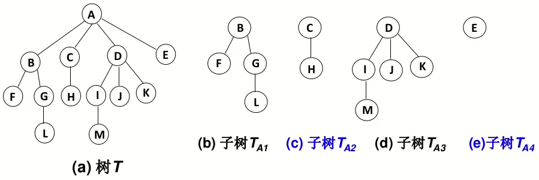

# 树的定义
- 树(Tree)：n（n>=0）结点构成的有限集合
- 当n=0时，称为**空树**
- 对于任一棵**非空树**（n> 0），它具备以下性质
  - 树中有一个称为“根（Root）”的特殊结点，用 r 表示
  - 余结点可分为m(m>0)个互不相交的有限集T1，T2，... ，Tm，其中每个集合本身又是一棵树，称为原来树的“子树（SubTree）
  - 
# 树的判定
- 子树是**不相交**的
- 除了根结点外，**每个结点有且仅有一个父结点**
- 一棵N个结点的树有**N-1条边**
# 树的基本术语
1. 结点的度（Degree）：结点的子树个数
2. 树的度：树的所有结点中最大的度数
3. 叶结点（Leaf）：度为0的结点
4. 父结点（Parent）：有子树的结点是其子树
5. 的根结点的父结点
6. 子结点（Child）：若A结点是B结点的父结点，则称B结点是A结点的子结点；子结点也称孩子结点。
7. 兄弟结点（Sibling）：具有同一父结点的各结点彼此是兄弟结点。
8. 路径和路径长度：从结点n1到nk的路径为一个结点序列n1 , n2 ,… , nk , ni是 ni+1的父结点。路径所包含边的个数为路径的长度。
9. 祖先结点(Ancestor)：沿树根到某一结点路径上的所有结点都是这个结点的祖先结点。
10. 子孙结点(Descendant)：某一结点的子树中的所有结点是这个结点的子孙。
11. 结点的层次（Level）：规定根结点在1层，其它任一结点的层数是其父结点的层数加1。
12. 树的深度（Depth）：树中所有结点中的最大层次是这棵树的深度。