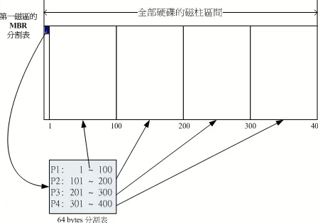
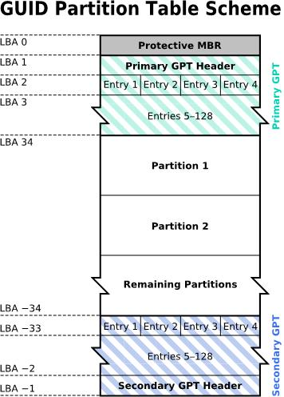

## MSDOS(MBR)分区表格与限制
开机管理程序记录与分区表放在磁盘额的第一个扇区,512B大小
- 主开机记录区(Master Boot Record,MBR):安装开机管理程序（Boot loader）的地方，446B
- 分区表（partition table）:记录硬盘分区状态，64B,最多四组记录区
	- 四组信息分为主要（Primary）和延伸（Extended）分区，延伸分区只能有一个
	- 逻辑分区（logical partition）：延伸分区切割出来的分区，依系统而不同，SATA可突破63个以上

---
## GUDI partition table,GPT磁盘分区表
GPT将磁盘所有区块以LBA（默认为512B）来规划，第一个LBA为LBA0，用34个记录记录分区信息，磁盘最后的33个LBA用来备份
- LBA0(MBR相容区块)：跟MBR一样，有两个部分
  - 主开机记录区，446B，存储开机管理程序
  - 第二部分，放入特殊标志，表明此硬盘为GPT格式
- LBA1（GPT表头记录）
  - 记录分区本身位置与大小
  - 记录备份用的GPT分区
  - 放置了分区表的验证码（CRC32）
    - 系统可通过检验判断GPT是否正确，若有错误，通过这个记录区取得备份的GPT恢复运行
- LBA2-33（实际记录分区信息处）
  - 每个LBA有512B，每个LBA可记录4笔分区
  - 可有128笔分区,每笔用128Bytes，其中64bits用来记录开始/结束的扇区号码

