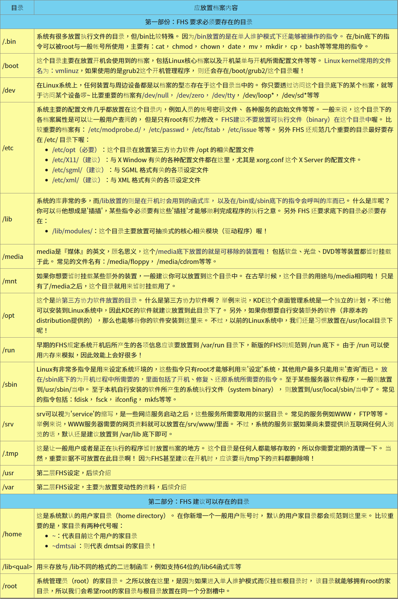
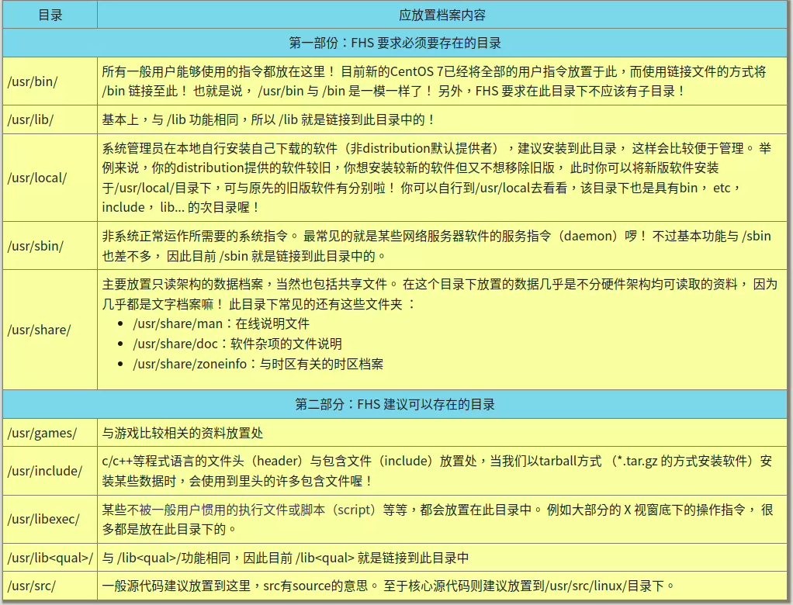
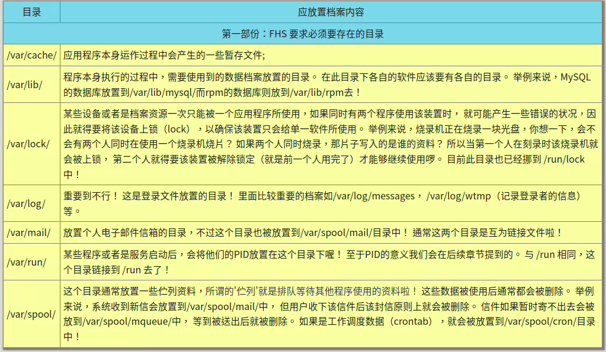
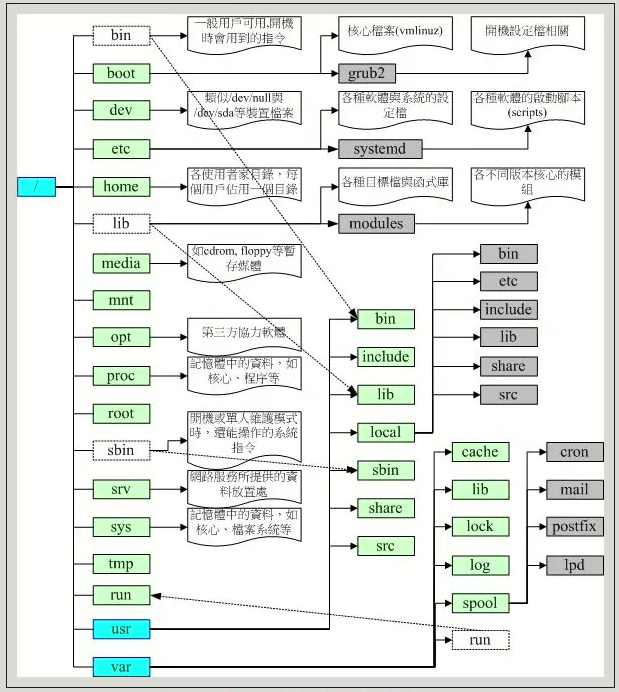

## FHS(Filesystem Hierachy Standard)标准
- ### 目录的交互形态

    
- ### FHS目录树定义
  - / （root,根目录）：与开机系统有关
  - /usr（unix software resource）：与软件安装/执行有关
  - /var（variable）：与系统运行过程有关
- ### 根目录（/）的意义和内容
  - 所有目录都是由根目录衍生而来
  - 跟开机/还原/修复系统等动作有关
  - 根目录所在分割槽应该越小越好，且不要跟安装程序放一起
  - 根目录的次目录
    - 
    - 
- ### /usr的意义与内容
  - unix操作系统软件资源所放置的目录
  - 次目录
    - 
- ### /var的意义与内容
  - 针对常态性变动的文档，如快取（cache），登陆文件（log file）以及某些软件产生的文件，包括程序文件（lock file，run file），或者MySQL数据库文件等
    - 次目录
      - 
---
## 目录树
- 目录树的起始点为根目录（/，root）
- 每一个目录不止能使用本地端的 partition 的文件系统，也可以使用网络上的 filesystem
- 每个文件在此的目录树中的文件名（包含完整路径）都是独一无二的
- 