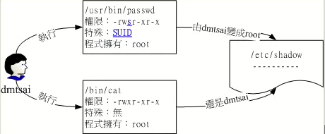

 ## 文件默认权限
- ### umask：获取当前权限掩码
  - 默认权限 - 权限掩码 = 新建文件（目录）的权限
    ```
    umask  [-S]  [权限掩码]
    选项或参数：
    -S  ：以符号的方式来表示权限掩码

    范例一：
    umask
    0022
    mkdir test1
    ls –d –l test1/   
    drwxr-xr-x  2  rootlocal  rootlocal  4096  2011-9-19  21:46  test1/
    权限为777-002=755

    范例二：
    umask -S
    u=rwx,g=rx,o=rx
    ```
  - 文件的默认权限为666，就是：-rw-rw-rw-
    - 使用者创建为“文件”则默认“没有可执行（ x ）权限”，亦即只有 rw 这两个项目，也就是最大为 666 分
  - 目录的默认权限为777，就是：drwxrwxrwx
    - 使用者创建为“目录”，则由于 x 与是否可以进入此目录有关，因此默认为所有权限均开放
---
## 文件隐藏属性
- ### chattr:设置文件隐藏属性
  ```
  chattr [+-=][ASacdistu] 文件或目录名称
  选项与参数：
  +   ：增加某一个特殊参数，其他原本存在参数则不动。
  -   ：移除某一个特殊参数，其他原本存在参数则不动。
  =   ：设置一定，且仅有后面接的参数

  A  ：若存取此文件（或目录）时，存取时间 atime 将不会被修改，可避免 I/O 较慢的机器过度的存取磁盘。
  （建议使用文件系统挂载参数处理这个项目）
  S  ：当你进行任何文件的修改，该更动会“同步”写入磁盘中。
  a  ：文件将只能增加数据，而不能删除也不能修改数据，只有root 才能设置这属性（常用）
  c  ：这个属性设置之后，将会自动的将此文件“压缩”，在读取的时候将会自动解压缩，但是在储存的时候，将会先进行压缩后再储存
  d  ：当 dump 程序被执行的时候，设置 d 属性将可使该文件（或目录）不会被 dump 备份
  i  ：让一个文件“不能被删除、改名、设置链接也无法写入或新增数据，只有 root 能设置此属性（常用）
  s  ：当文件设置了 s 属性时，如果这个文件被删除，他将会被完全的移除出这个硬盘空间
  u  ：如果该文件被删除了，则数据内容其实还存在磁盘中，可用来救援该文件
  ```
- ### lsattr：显示文件隐藏属性
  ```
  lsattr [-adR] 文件或目录
  选项与参数：
  -a ：显示隐藏文件
  -d ：如果接的是目录，仅列出目录本身的属性而非目录内的文件名
  -R ：连同子目录的数据也一并列出来
  ```
---
## 文件特殊权限
- ### Set UID（SUID）
  - s 在文件拥有者 x 权限上，如“-rwsr-xr-x”，对目录无效 
    - SUID权限仅对二进制程序有效
    - 执行者对于该程序需要具有x的可执行权限
    - 本权限仅在执行该程序的过程中有效（run-time）
    - 执行者将具有该程序拥有者（owner）权限
    - 
- ### Set GID（SGID）
  - s 在组群的 x 权限上，如“-rwxr-srx”，文件与目录都有效
    - 对文件时
      - SGID对二进制程序有用
      - 程序执行之对程序来说，需具备x的权限
      - 执行者在执行的过程中会获得该程序组群的支持
    - 对目录时
      - 使用者若对于此目录具有 r 与 x 的权限时，该使用者能够进入此目录；
      - 使用者在此目录下的有效群组（effective group）将会变成该目录的群组；
      - 用途：若使用者在此目录下具有 w 的权限（可以新建文件），则使用者所创建的新文件，该新文件的群组与此目录的群组相同。
- ### Sticky Bit(SBIT)
  - 只针对目录有效
    - 当使用者对于此目录具有 w, x 权限，亦即具有写入的权限时；
    - 当使用者在该目录下创建文件或目录时，仅有自己与 root 才有权力删除该文件
- ### SUID/SGID/SBIT权限设置
  - chomod的三个权限数字更改为四个权限数字就
    - 4 为 SUID
    - 2 为 SGID
    - 1 为 SBIT
---
## 观察文件类型
- ### file:查阅文件的数据类型
  ```
  范例一：
  file ~/.bashrc
  /root/.bashrc: ASCII text               ASCII 的纯文本文件

  范例二：
  file /var/lib/mlocate/mlocate.db
  /var/lib/mlocate/mlocate.db: data       这是 data 文件！
  ```
---
## 账号管理实例
- 我的用户 pro1， pro2， pro3 是同一个项目计划的开发人员，我想要让这三个用户在同一个目录底下工作， 但这三个用户还是拥有自己的家目录与基本的私有群组。 假设我要让这个项目计划在 /srv/projecta 目录下开发， 可以如何进行
```
[root@study ~]# groupadd projecta
[root@study ~]# useradd -G projecta -c "projecta user" pro1
[root@study ~]# useradd -G projecta -c "projecta user" pro2
[root@study ~]# useradd -G projecta -c "projecta user" pro3
[root@study ~]# echo "password" | passwd --stdin pro1
[root@study ~]# echo "password" | passwd --stdin pro2
[root@study ~]# echo "password" | passwd --stdin pro3

[root@study ~]# mkdir /srv/projecta
[root@study ~]# chgrp projecta /srv/projecta
[root@study ~]# chmod 2770 /srv/projecta
[root@study ~]# ll -d /srv/projecta
drwxrws---. 2 root projecta 6 Jul 20 23:32 /srv/projecta
#权限2770为SGID，
```