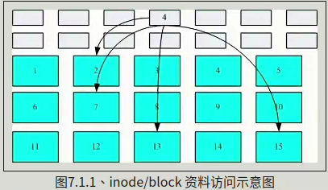
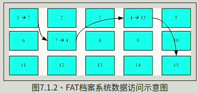
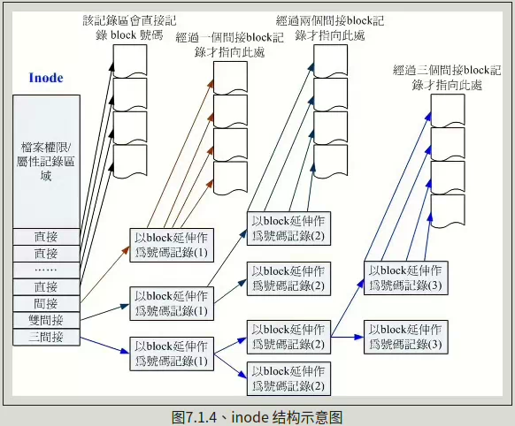
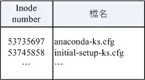

## 文件系统特性
- 磁盘分区完需要格式化（format），才能成为操作系统利用的“文件格式系统（filesystem）
- 一个可被挂载的数据为一个文件系统
- 文件系统分为两部分：
  - 权限与属性放到 inode中，实际数据放到data block区块中
  - 超级区块（superblock）记录整个文件系统的整体信息
- 
  - 索引式文件系统（indexed allocation）
- 
  - FAT 格式文件系统，一般U盘用
---
## EXT2文件系统（inode）
- 以inode为基础的文件系统，文件系统一开始就将inode与block规划好，除非格式化（或resize2fs指令）<br>
否则inode与block固定后不再变动
- Ext2文件系统在格式化的时候基本上是区分为多个区块组（block group）,每个区块组合都有独立的 <br>
inode/block/superblock 系统
  - 
-  ### data block （数据块）
   -  在 Ext2 文件系统中所支持的 block 大小有 1K， 2K 及 4K 三种而已
      -  
   -  每个block都有编号，以便inode记录
   -  EXT2文件系统block的限制
      - 原则上，block 的大小与数量在格式化完就不能够再改变了（除非重新格式化）;
      - 每个block内最多只能够放置一个文件的数据;
      - 如果文件大于block的大小，则一个文件会占用多个block数量;
      - 若文件小于 block ，则该 block 的剩余容量就不能够再被使用了（磁盘空间会浪费）
 - ### inode table（inode表格）
   - inode记录的文件资料
     - 该文件的访问模式（read/write/excute）;
     - 该文件的所有者与组（owner/group）;
     - 该文件的容量;
     - 该文件建立或状态改变的时间（ctime）;
     - 最近一次的读取时间（atime）;
     - 最近修改的时间（mtime）;
     - 定义文件特性的旗标（flag），如 SetUID...;
     - 该文件真正内容的指向（pointer）;
   - inode的特点
     - 每个 inode 大小均固定为 128 Bytes （新的 ext4 与 xfs 可设置到 256 Bytes）；
     - 每个文件都仅会占用一个 inode 而已；
     - 承上，因此文件系统能够创建的文件数量与 inode 的数量有关；
     - 系统读取文件时需要先找到 inode，并分析 inode 所记录的权限与使用者是否符合，若符合才能够开始实际读取 block 的内容。
   - inode结构
     - 记录一个block号码要4Byte
     - 
     - 12个直接：12*1K=12K（设block为1K）
       - 直接指向block号码的对照
     - 1个间接：256*1K=256K
       - 间接：拿一个block当作记录block号码的记录区
     - 一个双间接：256*256*1K=$256^2$K
       - 第一个block仅再指出下一个记录号码的block
     - 一个三间接：256*256*256*1K=$256^3$K =16G
 - ### Superblock超级区快
   - Superblock 是记录整个 filesystem 相关信息的地方，主要信息有：
     - block 与 inode 的总量;
     - 未使用与已使用的 inode / block 数量;
     - block 与 inode 的大小 （block 为 1， 2， 4K，inode 为 128bytes 或 256bytes）;
     - filesystem 的挂载时间、最近一次写入数据的时间、最近一次检验磁盘 （fsck） 的时间等文件系统的相关信息;
     - 一个 valid bit 数值，若此文件系统已被挂载，则 valid bit 为 0 ，若未被挂载，则 valid bit 为 1 。
   - 一般superblock大小为1024Byte
   - 除了第一个block group内会含有superblock之外，后续的block group不一定含有superblock
     - 若后续block group含有superblock，则是备份
 - ### Filesystem Description （文件系统描述说明）
   - 这个区段描述每个block group的开始与结束的block号码
   - 以及说明每个区段（superblock， bitmap， inodemap， data block）分别介于哪个block号码之间
 - ### block bitmap（区块对照表）
   - 记录空的block，以系统快速找到空block
   - 删除文件时，标记相应的block为空
 - ### inode bitmap（inode对照表）
   - 同上，记录空的inode
 - ### dumpe2fs：查询superblock信息
  ```
  dumpe2fs  [-bh]  装置档名
  选项与参数：
  -b ：列出保留为坏轨的部分
  -h ：仅列出 superblock 的资料，不会列出其他的区段内容！
  ```
---
## 与目录树的关系
- ### 目录
  - 新建目录是，文件系统会分配目录一个inode与至少一块block
    - inode记录该目录的相关权限与属性，并记录分配到block号码
    - block记录目录下的文件名与该档名占用的inode号码数据      
      - 
      - 当文档太多，一个block记不下时，会多给一个block继续记录
- ### 文件
  - 建立一般文件是，会分配一个inode和相对于该文件大小的block数量
- ### 目录树读取
  - 文件名是记录在目录的 block 当中，当要读取某个文件时，就务必会经过目录的 inode 与 block ，然后才能够找到那个待读取文件的 inode 号码，最终才会读到正确的文件的 block 内的数据
    - 所以“新增/删除/更名文件名与目录的 w 权限有关“
  ```
  [root@study ~]# ll  -di  /  /etc  /etc/passwd
  128  dr-xr-xr-x.  17 root  root  4096  May  4  17:56  /
  33595521  drwxr-xr-x. 131  root  root  8192  Jun  17  00:20  /etc
  36628004  -rw-r--r--.   1  root  root  2092  Jun  17  00:20  /etc/passwd
  ```
  - 该文件的读取流程为
    - 1./ 的 inode：
      - 通过挂载点的信息找到 inode 号码为 128 的根目录 inode，且 inode 规范的权限让我们可以读取该 block 的内容（有 r 与 x）;
    - 2./ 的 block：
      - 经过上个步骤取得 block 的号码，并找到该内容有 etc/ 目录的 inode 号码 （33595521）;
    - 3.etc/ 的 inode：
      - 读取 33595521 号 inode 得知 dmtsai 具有 r 与 x 的权限，因此可以读取 etc/ 的 block 内容;
    - 4.etc/ 的 block：
      - 经过上个步骤取得 block 号码，并找到该内容有 passwd 文件的 inode 号码 （36628004）;
    - 5.passwd 的 inode：
      - 读取 36628004 号 inode 得知 dmtsai 具有 r 的权限，因此可以读取 passwd 的 block 内容;
    - 6.passwd 的 block：
      - 最后将该 block 内容的数据读出来
---
## EXT2/EXT3/EXT4文件的访问与日志式文件访问
- 将 inode table 与 data block 称为**资料存放区域**，至于其他例如 superblock、 block bitmap 与 inode bitmap 等区段就被称为 **metadata （中介资料）**
  - 因为 superblock， inode bitmap 及 block bitmap 的数据是经常变动的，每次新增、移除、编辑时都可能会影响到这三个部分的数据，因此才被称为中介资料
- ### 新建文件的行为
  1. 先确定用户对于欲新增文件的目录是否具有 w 与 x 的权限，若有的话才能新增;
  2. 根据 inode bitmap 找到没有使用的 inode 号码，并将新文件的权限/属性写入;
  3. 根据block bitmap找到没有使用中的block号码，并将实际的数据写入block中，且更新inode的block 指向数据;
  4. 将刚刚写入的 inode 与 block 资料同步更新 inode bitmap 与 block bitmap，并更新 superblock 的内容。
- ### 资料的不一致（Inconsistent）状态
  - 不知名原因导致系统中断，入的资料仅有 inode table 及 data block，最后的同步工作没完成，<br>
    此时就会发生 metadata 的内容与实际数据存放区产生不一致 （Inconsistent） 的情况
  - 发生后会强制进行资料一致性的检查，费时间
- ### 日记文件系统
  - 1.&nbsp;预备：当系统要写入一个文件时，会先在日志记录区块中纪录某个文件准备要写入的信息;
  - 2.&nbsp;实际写入：开始写入文件的权限与资料; 开始更新 metadata 的数据;
  - 3.&nbsp;结束：完成资料与 metadata 的更新后，在日志记录区块当中完成该文件的纪录。
  - 避免了资料的不一致（Inconsistent）发生
- ### EXT的缺点
  - 采用的是预先规划出所有的 inode/block/meta data 等数据，未来系统可以直接取用，不需要再进行动态配置的作法
  - 但是文件越大，分配inode与block的时间更多
  - 格式化的时间也越久
---
## Linux 文件系统的运作
- ### 异步处理（asynchronously）
  - 当系统加载一个文件到内存后，如果该文件没有被更动过，则在内存区段的文件数据会被设定为干净（clean）的
  - 但如果内存中的文件数据被更改过了，此时该内存中的资料会被设定为脏的 (Dirty)。 此时所有的动作都还在内存中执行，并没有写入到磁盘中
  - 但如果内存中的文件数据被更改过了（例如你用 nano 去编辑过此文件），此时该内存中的资料会被设定为脏的 (Dirty)。 此时所有的动作都还在内存中执行，并没有写入到磁盘中
- ### 内存与Linux
  - 系统会将常用的文件数据放置到主内存的缓冲区，以加速文件系统的读/写;
  - 因此 Linux 的实体内存最后都会被用光！ 这是正常的情况！ 可加速系统效能;
  - 你以手动使用 sync 来强迫内存中设定为 Dirty 的文件回写到磁盘中;
  - 若正常关机时，关机指令会主动呼叫 sync 来将内存的数据回写入磁盘内;
  - 但若不正常关机（如跳电、当机或其他不明原因），由于数据尚未回写到磁盘内， 因此重新启动后可能会花很多时间在进行磁盘检验，甚至可能导致文件系统的损毁（非磁盘损毁）
---
## 挂载点的意义 （mount point）
- 将文件系统与目录树结合的动作我们称为'**挂载**'
- 挂载点一定是目录，该目录为进入该文件系统的入口
---
## 其他 Linux 支持的文件系统与 VFS
- ### Linux常见的文件系统
  - 传统文件系统：ext2 / minix / MS-DOS / FAT （用 vfat 模块） / iso9660 （光盘）等等;
  - 日志式文件系统： ext3 /ext4 / ReiserFS / Windows' NTFS / IBM's JFS / SGI's XFS / ZFS
  - 网络文件系统： NFS / SMBFS
  - 查看系统支持的文件系统
    ```
    [root@study ~]# ls  -l  /lib/modules/$(uname -r)/kernel/fs
    ```
  - 查看已装入到内存中支持的文件系统
    ```
    [root@study ~]# cat  /proc/filesystems
    ```
- ### Linux VFS (Virtual Filesystem Switch)
  - Linux 系统通过 VFS 的核心功能去读取 filesystem ，VFS进行filesystem的管理
    - 
---
## XFS文件系统
- ### XFS文件系统配置
  - #### 数据区（data section）
    - 跟EXT一样，包括inode/data block/superblock等
    - 都放在allocation groups储存区群组中，跟block group类似，包含了：
      - 整个文件系统的 superblock
      - 剩余空间的管理机制
      - inode的分配与追踪
    - inode与block都是系统需要时才动态分配，所以格式化快
    - block容量可由512Bytes～64K调配，inode容量可由256Bytes～2M
  - #### 文件系统活动登录区（log section）
    - 主要记录文件系统的变化，类似日志区
    - 可指定外部磁盘来作log section
  - #### 实时操作区（realtime section）
    - 当有文件要被建立时，xfs 会在这个区段里面找一个到数个的 extent 区块，将文件放置在这个区块内
    - 等到分配完毕后，再写入到 data section 的 inode 与 block 去
    - extent 区块的大小得要在格式化的时候就先指定，最小值是 4K 最大可到 1G
      - 建议extent设定为与 stripe 一样大
- ### XFS 文件系统的描述数据观察
  ```
  [root@study ~]# xfs_info  挂载点 ;设备文件名

  范例一：找出系统 /boot 这个挂载点下面的文件系统的 superblock 纪录
  [root@study ~]# df -T /boot
  Filesystem     Type 1K-blocks   Used Available Use% Mounted on
  /dev/vda2      xfs    1038336 133704    904632  13% /boot

  [root@study ~]# xfs_info /dev/vda2
  1  meta-data=/dev/vda2         isize=256    agcount=4, agsize=65536 blks
  2           =                  sectsz=512   attr=2, projid32bit=1
  3           =                  crc=0        finobt=0
  4  data     =                  bsize=4096   blocks=262144, imaxpct=25
  5           =                  sunit=0      swidth=0 blks
  6  naming   =version 2         bsize=4096   ascii-ci=0 ftype=0
  7  log      =internal          bsize=4096   blocks=2560, version=2
  8           =                  sectsz=512   sunit=0 blks, lazy-count=1
  9  realtime =none              extsz=4096   blocks=0, rtextents=0
  ```
  - 第 1 行：isize 为 inode 的容量，agcount 为储存区群组，agsize为每个存储区群的block个数
  - 第 2 行：sectsz 为逻辑扇区 （sector） 
  - 第 4 行：bsize 为 block 的容量，blocks为block个数
  - 第 5 行：sunit 与 swidth 与磁盘阵列的 stripe 相关性较高。
  - 第 7 行：internal 为登录区的位置在文件系统内
  - 第 9 行：realtime 区域