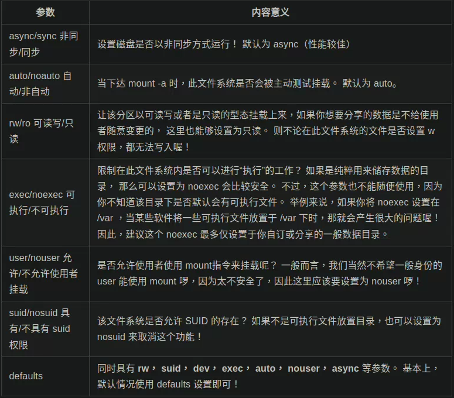

## 开机挂载 /etc/fstab 及 /etc/mtab
- 关机后，挂载会自动卸载掉，每次手动挂载十分麻烦
- /etc/fstab 是开机时的配置文件，在 /etc/fstab 中设置开机挂载的文件系统
- filesystem 的挂载是记录到 /etc/mtab 与 /proc/mounts
- ### 系统挂载限制
  - 根目录 / 是必须挂载的，而且一定要先于其它 mount point 被挂载进来
  - 其它 mount point 必须为已创建的目录，可任意指定，但一定要遵守必须的系统目录架构原则 （FHS）
  - 所有 mount point 在同一时间之内，只能挂载一次。
  - 所有 partition 在同一时间之内，只能挂载一次。
  - 如若进行卸载，必须先将工作目录移到 mount point（及其子目录） 之外
- ### /etc/fstab 文件
    ```
    [root@study ~]# cat /etc/fstab
    # [设备/UUID等]                        [挂载点]      [文件系统]  [文件系统参数]  [dump] [fsck]
    # Device                              Mount point  filesystem parameters    dump   fsck
    /dev/mapper/centos-root                   /       xfs     defaults            0     0
    UUID=94ac5f77-cb8a-495e-a65b-2ef7442b837c /boot   xfs     defaults            0     0
    /dev/mapper/centos-home                   /home   xfs     defaults            0     0
    /dev/mapper/centos-swap                   swap    swap    defaults            0     0

    ```
    - 第一栏：磁盘设备文件名/UUID/LABEL name
    - 第二栏：挂载点 （mount point）
      - 手动挂载时可以让系统自动测试挂载，但在这个文件当中必须要手动写入文件系统才行
    - 第三栏：磁盘分区的文件系统
    - 第四栏：文件系统参数
      - 
    - 第五栏：能否被 dump 备份指令作用
      - dump 是一个用来做为备份的指令，不过现在有太多的备份方案了,直接输入 0 就好
    - 第六栏：是否以 fsck 检验扇区
      - 早期开机的流程中，会有一段时间去检验本机的文件系统，看看文件系统是否完整 （clean）
      - xfs 会自己进行检验，直接填 0 就好
---
## 特殊设备 loop 挂载 
- ### 挂载光盘/DVD镜像文件
    ```
    [root@study ~]# mount -o loop /tmp/CentOS-7.0-1406-x86_64-DVD.iso /data/centos_dvd
    [root@study ~]# df /data/centos_dvd
    Filesystem     1K-blocks    Used Available Use% Mounted on
    /dev/loop0       4050860 4050860         0 100% /data/centos_dvd
    ```
    - 不需要将这个文件烧录成为光盘或者是 DVD 就能够读取内部的数据
- ### 大型文件制作loop设备文件
  - 可用来划分额外分区
  - 一部主机可以切割成数个独立的主机系统
    - #### 创建大型文件
        ```
        [root@study ~]# dd if=/dev/zero of=/srv/loopdev bs=1M count=512
        512+0 records in   <==读入 512 笔数据
        512+0 records out  <==输出 512 笔数据
        536870912 Bytes （537 MB） copied, 12.3484 seconds, 43.5 MB/s

        # 这个指令的简单意义如下：
        # if    是 input file ，输入文件。那个 /dev/zero 是会一直输出 0 的设备！
        # of    是 output file ，将一堆零写入到后面接的文件中。
        # bs    是每个 block 大小，就像文件系统那样的 block 意义；
        # count 则是总共几个 bs 的意思。所以 bs*count 就是这个文件的容量了！
        ```
    - #### 大型文件的格式化
      - 默认 xfs 不能够格式化文件的，所以要格式化文件得要加入特别的参数才行
        ```
        [root@study ~]# mkfs.xfs -f /srv/loopdev
        [root@study ~]# blkid /srv/loopdev
        /srv/loopdev: UUID="7dd97bd2-4446-48fd-9d23-a8b03ffdd5ee" TYPE="xfs"
        ```
    - #### 挂载
        ```
        [root@study ~]# mount -o loop UUID="7dd97bd2-4446-48fd-9d23-a8b03ffdd5ee" /mnt
        [root@study ~]# df /mnt
        Filesystem     1K-blocks  Used Available Use% Mounted on
        /dev/loop0        520876 26372    494504   6% /mnt
        ```
