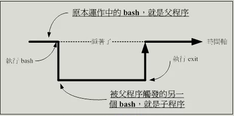
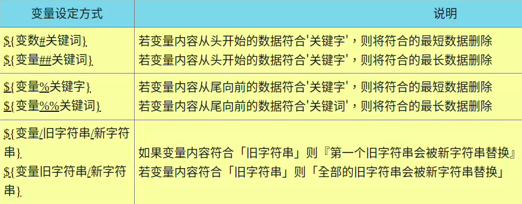
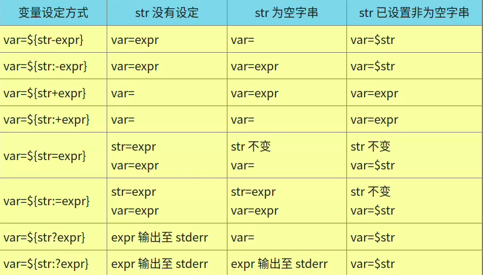

## 变量的取用与设置：echo
```
[[email protected] ~]$ echo $variable
[[email protected] ~]$ echo $PATH
/usr/local/bin:/usr/bin:/usr/local/sbin:/usr/sbin:/home/dmtsai/.local/bin:/home/dmtsai/bin
[[email protected] ~]$ echo ${PATH}     #比较推荐这个用法
```
## 变量的设定规则
- 变量与变量内容以一个等号'='来链接
    ```
    myname=VBird
    ```
- 等号两边不能直接接空白字符
- 变量名称只能是英文字母与数字，但是开头字符不能是数字
- 变量内容若有空白字符可使用双引号'“'或单引号'''将变量内容结合起来
  - 双引号内的特殊字符如 $ 等，可以保有原本的特性
    ```
    var=“lang is $LANG”
    则echo $var  可得  lang is zh_TW. UTF-8
    ```
  - 单引号内的特殊字符则仅为一般字符 （纯文字）
    ```
    var='lang is $LANG'
    则 echo $var  可得  lang is $LANG』
    ```
- 若该变量为扩增变量内容时，则可用 “$变量名称” 或 ${变量} 累加内容
    ```
    PATH=“$PATH”：/home/bin  或  PATH=${PATH}：/home/bin
    ```
- 若该变量需要在其他子程序执行，则需要以 export 来使变量变成环境变量
    ```
    export PATH
    ```
- 通常大写字符为系统预设变量，自行设定变量可以使用小写字符，方便判断（纯粹依照用户兴趣与嗜好）
- 取消变量的方法为使用 unset 
  - 'unset 变量名例如取消 myname 的设置
## 环境变量的功能
- ### env：列出目前的 shell 环境下的所有环境变量与其内容
  ```
  [root@www ~]# env
  HOSTNAME=www.vbird.tsai    <== 这部主机的主机名称
  TERM=xterm                 <== 这个终端机使用的环境是什么类型
  SHELL=/bin/bash            <== 目前这个环境下，使用的 Shell 是哪一个程式？
  HISTSIZE=1000              <== ‘记录指令的笔数’在 CentOS 预设可记录 1000 笔

  USER=root                  <== 使用者的名称啊！
  LS_COLORS=no=00:fi=00:di=00;34:ln=00;36:pi=40;33:so=00;35:bd=40;33;01:cd=40;33;01:
  or=01;05;37;41:mi=01;05;37;41:ex=00;32:*.cmd=00;32:*.exe=00;32:*.com=00;32:*.btm=0
  0;32:*.bat=00;32:*.sh=00;32:*.csh=00;32:*.tar=00;31:*.tgz=00;31:*.arj=00;31:*.taz=
  00;31:*.lzh=00;31:*.zip=00;31:*.z=00;31:*.Z=00;31:*.gz=00;31:*.bz2=00;31:*.bz=00;3
  1:*.tz=00;31:*.rpm=00;31:*.cpio=00;31:*.jpg=00;35:*.gif=00;35:*.bmp=00;35:*.xbm=00
  ;35:*.xpm=00;35:*.png=00;35:*.tif=00;35: <== 一些颜色显示
  MAIL=/var/spool/mail/root  <== 这个使用者所取用的 mailbox 位置
  PATH=/sbin:/usr/sbin:/bin:/usr/bin:/usr/X11R6/bin:/usr/local/bin:/usr/local/sbin:
  /root/bin                  <== 不再多讲啊！是执行档指令搜寻路径
  INPUTRC=/etc/inputrc       <== 与键盘按键功能有关。可以设定特殊按键！
  PWD=/root                  <== 目前使用者所在的工作目录 (利用 pwd 取出！)

  LANG=en_US                 <== 这个与语系有关，底下会再介绍！
  HOME=/root                 <== 这个使用者的家目录啊！
  _=/bin/env                 <== 上一次使用的指令的最后一个参数(或指令本身)
  ```
  - #### HOME
    - 使用者的家目录
  - #### SHELL
    - 目前这个环境使用的 SHELL 是哪支程式,Linux 预设使用 /bin/bash 的啦！
  - #### HISTSIZE
    - 这个与‘历史命令’有关，亦即是， 我们曾经下达过的指令可以被系统记录下来，而记录的‘笔数’则是由这个值来设定的。
  - #### MAIL
    - 当我们使用 mail 这个指令在收信时，系统会去读取的邮件信箱档案 (mailbox)。
  - #### PATH
    - 执行档搜寻的路径，目录与目录中间以冒号(:)分隔， 由于档案的搜寻是依序由 PATH 的变量内的目录来查询，所以，目录的顺序也很重要
  - #### LANG
    - 语系资料
  - #### RANDOM
    - ‘随机乱数’的变量，通过（$RANDOM）获取随机数，BASH下为0～32767之间
      ```
      #0~9之间的随即数
      [root@www ~]# declare -i number=$RANDOM*10/32768
      ```
- ### set：查看所有变量（含环境变量与自定义变量）
  ```
  [root@www ~]# set
  BASH=/bin/bash           <== bash 的主程式放置路径
  BASH_VERSINFO=([0]="3" [1]="2" [2]="25" [3]="1" [4]="release" 
  [5]="i686-redhat-linux-gnu")      <== bash 的版本
  BASH_VERSION='3.2.25(1)-release'  <== 也是 bash 的版本

  COLORS=/etc/DIR_COLORS.xterm      <== 使用的颜色纪录档案
  COLUMNS=115              <== 在目前的终端机环境下，使用的栏位有几个字元长度
  HISTFILE=/root/.bash_history      <== 历史命令记录的放置档案，隐藏档
  HISTFILESIZE=1000        <== 存起来(与上个变量有关)的档案之指令的最大纪录笔数。
  HISTSIZE=1000            <== 目前环境下，可记录的历史命令最大笔数。
  HOSTTYPE=i686            <== 主机安装的软体主要类型。我们用的是 i686 相容机器软体

  IFS=$' \t\n'             <== 预设的分隔符号
  LINES=35                 <== 目前的终端机下的最大行数
  MACHTYPE=i686-redhat-linux-gnu    <== 安装的机器类型
  MAILCHECK=60             <== 与邮件有关。每 60 秒去扫瞄一次信箱有无新信
  OLDPWD=/home             <== 上个工作目录,以用 cd - 来取用这个变量
  OSTYPE=linux-gnu         <== 作业系统的类型

  PPID=20025               <== 父程序的 PID (会在后续章节才介绍)
  PS1='[\u@\h \W]\$ '      <== 是命令提示字元，也就是我们常见的
  PS2='> '                 <== 如果你使用跳脱符号 (\) 第二行以后的提示符
  $                        <== 目前这个 shell 所使用的 PID
  ?                        <== 刚刚执行完指令的回传值。
  ```
  - 在 Linux 预设的情况中，使用{大写的字母}来设定的变量一般为系统内定需要的变量
  - #### PS1：（提示字符的设置）
     每次按下 [Enter] 按键去执行某个指令后，最后要再次出现提示字符时， 就会主动去读取这个变量值
    - \d ：可显示出“星期 月 日”的日期格式，如："Mon Feb 2"
    - \H ：完整的主机名称。如“study.centos.vbird”
    - \h ：仅取主机名称在第一个小数点之前的名字，如“study”后面省略
    - \t ：显示时间，为 24 小时格式的“HH:MM:SS”
    - \T ：显示时间，为 12 小时格式的“HH:MM:SS”
    - \A ：显示时间，为 24 小时格式的“HH:MM”
    - \@ ：显示时间，为 12 小时格式的“am/pm”样式
    - \u ：目前使用者的帐号名称，如“dmtsai”；
    - \v ：BASH 的版本信息，如 4.2.46（1）-release，仅取“4.2”显示
    - \w ：完整的工作目录名称，由根目录写起的目录名称。但主文件夹会以 ~ 取代；
    - \W ：利用 basename 函数取得工作目录名称，所以仅会列出最后一个目录名。
    -  \# ：下达的第几个指令。
    - $ ：提示字符，如果是 root 时，提示字符为 # ，否则就是 $
  - #### $:本 shell 的 PID
    - 目前这个 Shell 的执行绪代号,亦是所谓的PID（Process ID）
      ```
      #查看本shell的PID号码
      root@yxj-computer:~# echo $$
      5450
      ```
  - #### ？:（上个执行指令的回传值）
    - 当我们执行某些指令时，这些指令都会回传一个执行后的代码
    - 一般来说，如果成功的执行该指令， 则会回传一个 0 值
    - 如果执行过程发生错误，就会回传'错误代码'才对！一般是非0数
    ```
    [root@www ~]# echo $SHELL
    /bin/bash                                  <==可顺利显示！没有错误！
    [root@www ~]# echo $?
    0                                          <==因为没问题，所以回传值为 0
    [root@www ~]# 12name=VBird

    -bash: 12name=VBird: command not found     <==发生错误了！bash回报有问题
    [root@www ~]# echo $?
    127                                        <==因为有问题，回传错误代码(非为0)
    # 错误代码回传值依据软体而有不同，我们可以利用这个代码来搜寻错误的原因
    [root@www ~]# echo $?
    0          
    #只与‘上一个执行指令’有关,上一个指令是执行‘ echo $? ’，所以没有错误
    ```
  - #### OSTYPE, HOSTTYPE, MACHTYPE：(主机硬体与核心的等级)
- export：自订变量转换为环境变量
  - 
  - 子程序仅会继承父程序的环境变量， 子程序不会继承父程序的自订变量
  - 用来“分享自己的变量设置给后来调用的文件或其他程序“
  ```
  [[email protected] ~]$ export 变量名称

  #不加变量默认为显示所有“环境变量”
  [[email protected] ~]$ export
  declare -x HISTSIZE="1000"
  declare -x HOME="/home/dmtsai"
  declare -x HOSTNAME="study.centos.vbird"
  declare -x LANG="zh_TW.UTF-8"
  declare -x LC_ALL="en_US.utf8"
  ```
## 语系变量 （locale）
  ```
  [root@www ~]# locale  <==后面不加任何选项与参数即可！
  LANG=en_US                   <==主语言的环境
  LC_CTYPE="en_US"             <==字元(文字)辨识的编码
  LC_NUMERIC="en_US"           <==数字系统的显示讯息
  LC_TIME="en_US"              <==时间系统的显示资料
  LC_COLLATE="en_US"           <==字串的比较与排序等
  LC_MONETARY="en_US"          <==币值格式的显示等
  LC_MESSAGES="en_US"          <==讯息显示的内容，如功能表、错误讯息等
  LC_ALL=                      <==整体语系的环境
  ```
- 设定 LANG 或者是 LC_ALL 时，则其他的语系变量就会被这两个变量所取代
- 整体系统预设的语系定义在 /etc/locale.conf 
## 变量的有效范围
- 当启动一个 shell，操作系统会分配一记忆区块给 shell 使用，此内存内的变量可让子程序取用
- 若在父程序利用 export 功能，可以让自订变量的内容写到上述的记忆区块当中（环境变量）；
- 当载入另一个 shell 时 （亦即启动子程序，而离开原本的父程序了），子 shell 可以将父 shell 的环境变量所在的记忆区块导入自己的环境变量区块当中。
## 变量键盘读取、声明与数组： read, declare， array
- ### read：读入键盘输入的变量
```
[[email protected] ~]$ read [-pt] variable
选项与参数：
-p  ：后面可以接提示字符！
-t  ：后面可以接等待的“秒数"

#范例一
[root@www ~]# read atest
This is a test        <==此时光标会等待你输入
[root@www ~]# echo $atest
This is a test

#范例二
[root@www ~]# read -p "Please keyin your name: " -t 30 named
Please keyin your name: VBird Tsai 
```
- ### declare / typeset：声明变量类型
```
[[email protected] ~]$ declare [-aixr] variable
选项与参数：
-a  ：定义成为阵列 （array） 类型
-i  ：定义成为整数数字 （integer） 类型
-x  ：定义为环境变量；
-r  ：将变量设置成为 readonly 类型，该变量不可被更改内容，也不能 unset

#范例
[[email protected] ~]$ declare -i sum=100+300+50
[[email protected] ~]$ echo ${sum}
450
```
  - 变量类型默认为'字符串'，所以若不指定变量类型，则 1+2 为一个'字符串'而不是'计算式'。 
  - bash 环境中的数值运算，默认最多仅能到达整数形态，所以 1/3 结果是 0
- ### 数组（array）变量类型
```
[[email protected] ~]$ var[1]="small min"
[[email protected] ~]$ var[2]="big min"
[[email protected] ~]$ var[3]="nice min"
[[email protected] ~]$ echo "${var[1]}, ${var[2]}, ${var[3]}"
small min, big min, nice min
```
## 文件系统及程序的限制关系： ulimit
```
[[email protected] ~]$ ulimit [-SHacdfltu] [配额]
选项与参数：
-H  ：hard limit ，严格的设置，必定不能超过这个设置的数值；
-S  ：soft limit ，警告的设置，可以超过这个设置值，但是若超过则有警告讯息。
      在设置上，通常 soft 会比 hard 小，举例来说，soft 可设置为 80 而 hard
      设置为 100，那么你可以使用到 90 （因为没有超过 100），但介于 80~100 之间时，
      系统会有警告讯息通知你！
-a  ：后面不接任何选项与参数，可列出所有的限制额度；
-c  ：当某些程序发生错误时，系统可能会将该程序在内存中的信息写成文件（除错用），
      这种文件就被称为核心文件（core file）。此为限制每个核心文件的最大容量。
-f  ：此 shell 可以创建的最大文件大小（一般可能设置为 2GB）单位为 KBytes
-d  ：程序可使用的最大断裂内存（segment）容量；
-l  ：可用于锁定 （lock） 的内存量
-t  ：可使用的最大 CPU 时间 （单位为秒）
-u  ：单一使用者可以使用的最大程序（process）数量。
```
```
[root@www ~]# ulimit -a
core file size          (blocks, -c) 0          <==只要是 0 就代表没限制
data seg size           (kbytes, -d) unlimited
scheduling priority             (-e) 0

file size               (blocks, -f) unlimited  <==可建立的单一档案的大小
pending signals                 (-i) 11774
max locked memory       (kbytes, -l) 32
max memory size         (kbytes, -m) unlimited
open files                      (-n) 1024       <==同时可开启的档案数量
pipe size            (512 bytes, -p) 8
POSIX message queues     (bytes, -q) 819200
real-time priority              (-r) 0
stack size              (kbytes, -s) 10240
cpu time               (seconds, -t) unlimited
max user processes              (-u) 11774
virtual memory          (kbytes, -v) unlimited
file locks                      (-x) unlimited
```
## 变量内容的删除、替换和替换 （Optional）
- ### 变量内容的删除与取代
  - 
    ```
    [root@www ~]# echo $path
    /usr/kerberos/sbin:/usr/kerberos/bin:/usr/local/sbin:/usr/local/bin:/sbin:/bin:
    /usr/sbin:/usr/bin:/root/bin

    范例一：删除 kerberos
    [root@www ~]# echo ${path#/*kerberos/bin:}
    /usr/local/sbin:/usr/local/bin:/sbin:/bin:/usr/sbin:/usr/bin:/root/bin
    ```
- ### 变量的测试与内容替换
  - 


