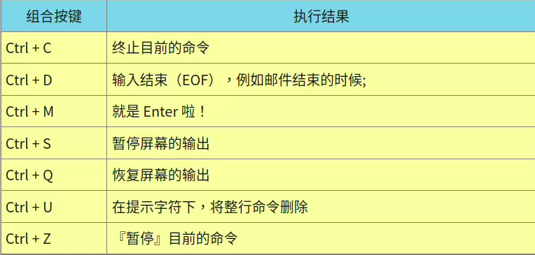
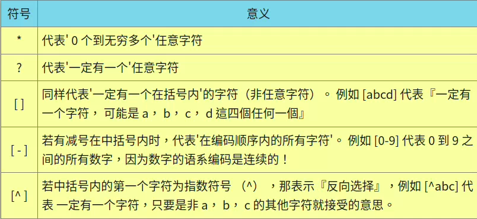
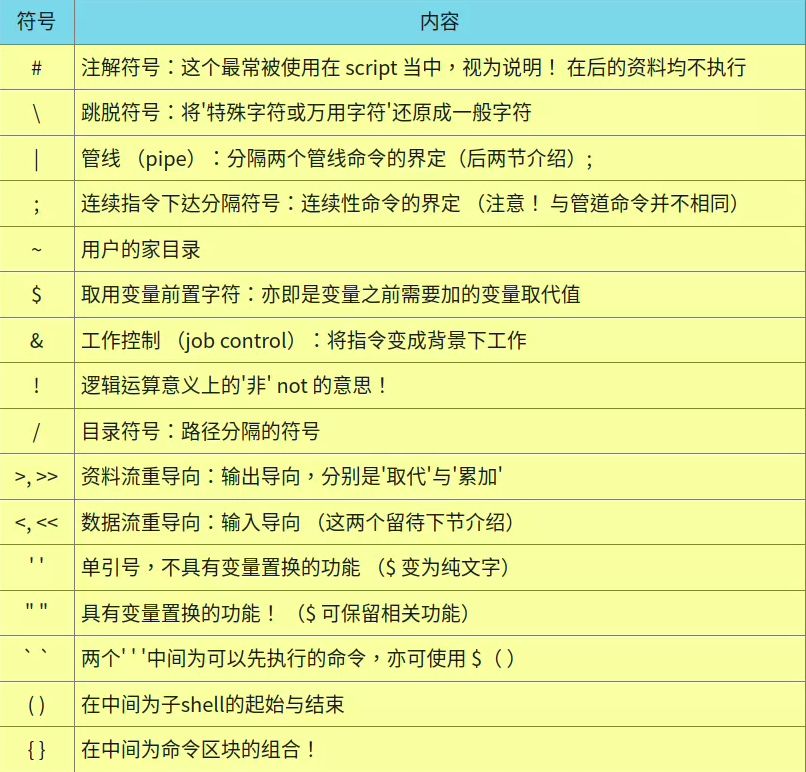

## 路径与指令搜索顺序
- ### 指令运作的顺序
1. 以相对/绝对路径执行指令，例如『 /bin/ls 』或『 ./ls 』;
2. 由 alias 找到该指令来执行;
3. 由 bash 内置的 （builtin） 命令来执行;
4. 透过$PATH这个变量的顺序搜寻到的第一个指令来执行
```
[dmtsai@study ~]$ alias echo='echo -n'
[dmtsai@study ~]$ type -a echo
echo is aliased to `echo -n'
echo is a shell builtin
echo is /usr/bin/echo
```
   - 先 alias 再 builtin 再由 $PATH 找到 /bin/echo
---
## bash 的进站与欢迎讯息： /etc/issue， /etc/motd
- 终端机接口（tty1 ~ tty6）登入时的欢迎信息在/etc/issue里
  - 
- 想要让用户登录后获取一些讯息，例如您想要让大家都知道的讯息， 那么可以将讯息加入 /etc/motd 里面去
## bash的环境设定文件
- ### login shell
  - 取得 bash 时需要完整的登入流程的，就称为 login shell
  - login shell读取的配置文件
    - #### /etc/profile
      - 系统整体的设定，最好不要修改这个档案
      - 每个用户登录取得 bash 时一定会读取的配置文件，主要设置变量有：
        - PATH：会依据 UID 决定 PATH 变量要不要含有 sbin 的系统指令目录;
        - MAIL：依据帐号设定好用户的 mailbox 到 /var/spool/mail/账号名;
        - USER：根据用户的帐号设定此一变量内容;
        - HOSTNAME：依据主机的 hostname 指令决定此一变量内容;
        - HISTSIZE：历史命令记录笔数。
        - umask：包括 root 默认为 022 而一般用户为 002 等！
      - /etc/profile 还会呼叫外部的设定资料
        - /etc/profile.d/*.sh
          - 用户具有r的权限，该档案就会被呼叫进来
          - 规范了bash操作界面的颜色、语系、ll 与 ls 指令的命令别名、vi 的命令别名、which 的命令别名等等
          - 如果要帮所有用户设定一些共享的命令别名时，可以在这个目录底下自行建立扩展名为 .sh的档案，并将所需要的资料写入即可
        - /etc/locale.conf
          - 由 /etc/profile.d/lang.sh 呼叫进来的
          - 决定 bash 默认使用何种语系的重要配置文件
        - /usr/share/bash-completion/completions/*
          - 命令补齐、文件名补齐、指令的选项/参数补齐功能
          - 由 /etc/profile.d/bash_completion.sh 这个文件加载
      - bash 的 login shell 情况下所读取的整体环境设定文件其实只有 /etc/profile
    - #### ~/.bash_profile
      - 用户的个人设定文件，所读取的个人偏好设定文件其实主要有三个，依序分别是：
        - ~/.bash_profile
        - ~/.bash_login
        - ~/.profile
      - bash 的 login shell 设定只会读取上面三个档案的其中一个， 而读取的顺序则是依照上面的顺序
      - 
    - #### source ：读入环境配置文件的命令
        ```
        [dmtsai@study ~]$ source 配置文件文件名
        ```
      - 利用source或小数点（.），将配置文件的内容读进来目前的 shell 环境中
- ### non-login shell
  - 取得 bash 接口的方法不需要重复登入的举动
  - 属于用户个人设定
  - 该 bash 设定文件仅会读取 ~/.bashrc 
  - #### ~/.bashrc 
    ```
    [root@www ~]# cat ~/.bashrc
    # .bashrc

    # User specific aliases and functions
    alias rm='rm -i'             <==使用者的个人设定
    alias cp='cp -i'
    alias mv='mv -i'

    # Source global definitions
    if [ -f /etc/bashrc ]; then  <==整体的环境设定
            . /etc/bashrc
    fi
    ```
    - ~/.bashrc 会呼叫 /etc/bashrc 及 /etc/profile.d/*.sh 
    - /etc/bashrc 
      - 依据不同的 UID 规范出 umask 的值；
      - 依据不同的 UID 规范出提示字元 (就是 PS1 变数)；
      - 呼叫 /etc/profile.d/*.sh 的设定
- ### 其他相关配置文件
  - #### /etc/man_db.conf
    - 这的文件的内容“规范了使用 man 的时候， man page 的路径到哪里去寻找
  - #### ~/.bash_history
    - 历史命令的记录文件
  - #### ~/.bash_logout
    - 登出 bash 后，系统执行完某些动作才离开（如清空暂存盘）
---
## 终端机的环境设置： stty， set
- stty（setting tty）
  - stty可以设置终端机的输入按键代表意义
    ```
    [dmtsai@study ~]$ stty [-a]
    选项与参数：
    -a  ：将目前所有的 stty 参数列出来；

    #范例：列出所有的按键与按键内容
    yxj@yxj-computer:~$ stty -a
    speed 38400 baud; rows 28; columns 89; line = 0;
    intr = ^C; quit = ^\; erase = ^?; kill = ^U; eof = ^D; eol = <undef>; eol2 = <undef>;
    swtch = <undef>; start = ^Q; stop = ^S; susp = ^Z; rprnt = ^R; werase = ^W; lnext = ^V;
    discard = ^O; min = 1; time = 0;
    ....（以下省略）....
    ```
    - intr : 送出一个 interrupt （中断） 的讯号给目前正在 run 的程序 （就是终止）；
    - quit : 送出一个 quit 的讯号给目前正在 run 的程序；
    - erase : 向后删除字符，
    - kill : 删除在目前命令行上的所有文字；
    - eof : End of file 的意思，代表“结束输入”。
    - start : 在某个程序停止后，重新启动他的 output
    - stop : 停止目前屏幕的输出；
    - susp : 送出一个 terminal stop 的讯号给正在 run 的程序
- set
    ```
    [dmtsai@study ~]$ set [-uvCHhmBx]
    选项与参数：
    -u  ：默认不启用。若启用后，当使用未设置变量时，会显示错误讯息；
    -v  ：默认不启用。若启用后，在讯息被输出前，会先显示讯息的原始内容；
    -x  ：默认不启用。若启用后，在指令被执行前，会显示指令内容（前面有 ++ 符号）
    -h  ：默认启用。与历史命令有关；
    -H  ：默认启用。与历史命令有关；
    -m  ：默认启用。与工作管理有关；
    -B  ：默认启用。与刮号 [] 的作用有关；
    -C  ：默认不启用。若使用 &gt; 等，则若文件存在时，该文件不会被覆盖。
    ```
    ```
    yxj@yxj-computer:~$ set -x
    yxj@yxj-computer:~$ echo ${HOME}
    + echo /home/yxj
    /home/yxj
    ```
- 
---
## 通配符与特殊符号
- 通配符
  - 
- 特殊符号
  - 