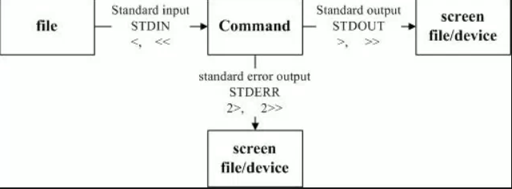

## 数据流重导向

- ### standard output ：标准输出 （stdout）
  - 指令执行所回传的正确的讯息
  - 代码为 1 ，使用 > 或 >>
    - 1> ：以覆盖的方法将‘正确的资料’输出到指定的档案或装置上；
    - 1>>：以累加的方法将‘正确的资料’输出到指定的档案或装置上；
    ```
    #范例：stdout的使用
    [root@www ~]# ll /  <==此时荧幕会显示出档名资讯
    [root@www ~]# ll / > ~/rootfile <==荧幕并无任何资讯
    [root@www ~]# ll  ~/rootfile <==有个新档被建立了！
    -rw-r--r-- 1 root root 1089 Feb  6 17:00 /root/rootfile
    ```
- ### standard error output：标准错误输出（stderr）
  - 指令执行失败后，所回传的错误讯息
  - 代码为 2 ，使用 2> 或 2>>
    - 2> ：以覆盖的方法将'错误的数据'输出到指定的文件或设备上;
    - 2>>：以累加的方法将'错误的数据'输出到指定的文件或设备上;
    ```
    #范例：stderr的使用
    yxj@yxj-computer:/tmp$ ll yxj.txt 2> test.txt
    yxj@yxj-computer:/tmp$ cat test.txt
    ls: 无法访问 'yxj.txt': 没有那个文件或目录
    ```
- ### standard input ：标准输入 （stdin）
  - 代码为 0，使用 < 或 <<
    - 0<：原本需要由键盘输入的资料，改由文件内容来取代
    ```
    #范例：< 的使用
    yxj@yxj-computer:/tmp$ cat test.txt
    This is test
    yxj@yxj-computer:/tmp$ cat test1.txt
    yxj@yxj-computer:/tmp$ cat > test1.txt <test.txt
    yxj@yxj-computer:/tmp$ cat test1.txt
    This is test
    ```
    - 0<<：结束输入字符（如eof）
    ```
    #范例：<<的使用
    yxj@yxj-computer:/tmp$ cat > test.txt << "eof"
    > 111111
    > 222222
    > eof
    yxj@yxj-computer:/tmp$ cat test.txt
    111111
    222222
    ```
- ### /dev/null 垃圾桶黑洞装置与特殊写法
  - ##### /dev/null
    - 可以吃掉任何导向这个设备的信息
    ```
    #范例：/dev/null的使用
    yxj@yxj-computer:/tmp$ ll test.txt test0.txt
    ls: 无法访问 'test0.txt': 没有那个文件或目录
    -rw-rw-r-- 1 yxj yxj 16  4月  8 17:14 test.txt
    yxj@yxj-computer:/tmp$ ll test.txt test0.txt 2> /dev/null
    -rw-rw-r-- 1 yxj yxj 16  4月  8 17:14 test.txt              <==错误输出被丢弃
    ```
  - #### &：特殊写法
    ```
    #范例：&的使用，标准输入和错误输入同时写到一个文件
    yxj@yxj-computer:/tmp$ ll test.txt test0.txt
    ls: 无法访问 'test0.txt': 没有那个文件或目录
    -rw-rw-r-- 1 yxj yxj 16  4月  8 17:14 test.txt

    yxj@yxj-computer:/tmp$ ll test.txt test0.txt >test.txt 2>&1
    yxj@yxj-computer:/tmp$ cat test.txt
    ls: 无法访问 'test0.txt': 没有那个文件或目录
    -rw-rw-r-- 1 yxj yxj 0  4月  8 17:24 test.txt
    ```
    - 两股数据同时写入一个档案，又没有使用特殊的语法，两股数据可能会交叉写入该档案内，造成次序的错乱
---
## 命令执行的判断依据： ; , &&, ||
- ### cmd ; cmd （不考虑指令相关性的连续指令下达）
    ```
    [root@study ~]# sync; sync; shutdown -h now
    ```
- ### $? （指令回传值） 与 && 或 ||
  - 
    ```
    #范例：ls 测试 /tmp/vbirding 是否存在，若存在则显示 "exist" ，若不存在，则显示 "not exist"！
    [root@study ~]# ls /tmp/vbirding && echo "exist" || echo "not exist"

    #范例：不清楚 /tmp/abc 是否存在，但就是要创建 /tmp/abc/hehe 文件
    [dmtsai@study ~]$ ls /tmp/abc || mkdir /tmp/abc && touch /tmp/abc/hehe
    ```