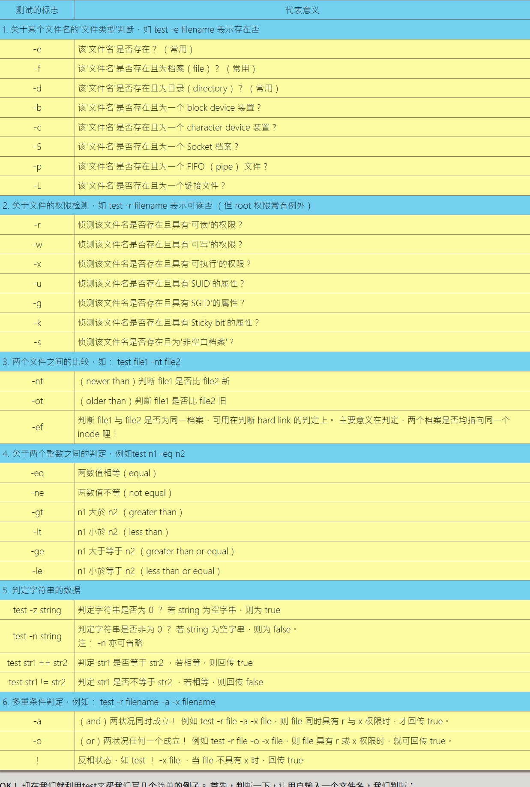

## test指令的测试功能
- 
```
yxj@yxj-computer:~/bin$ vim file_perm.sh

#!/bin/bash
# Progran:
#       test指令练习:   
#       1. 这个档案是否存在，若不存在则输出错误，并中断程序;
#       2. 若这个文件存在，则判断他是个档案或目录，输出结果
#       3. 判断执行者的身份对这个文件或目录所拥有的权限，并输出权限数据！
# History:
# 2023/4/15 VBired      First release
PATH=/bin:/sbin:/usr/bin:/usr/sbin:/usr/local/bin:/usr/local/sbin:~/bin
export PATH

# 1\. 让使用者输入文件名，并且判断使用者是否真的有输入字串
read -p "请输入文件名(路径):" input_fn
test -z ${input_fn} && echo "输入不能为空." && exit 0
# 2\. 判断文件是否存在？若不存在则显示讯息并结束脚本
test ! -e ${input_fn} && echo "文件（目录）不存在" && exit 0
# 3\. 开始判断文件类型与属性
test -f ${input_fn} && filef="文件"|| filef="目录"
test -r ${input_fn} && limit="r" || limit="-"
test -w ${input_fn} && limit="${limit}w" || limit="${limit}-"
test -x ${input_fn} && limit="${limit}x" || limit"=${limit}-"
# 4\. 开始输出信息
echo "${input_fn}是${filef},权限为：${limit}"

yxj@yxj-computer:~/bin$ sh file_perm.sh 
请输入文件名(路径):/home
/home是目录,权限为：r-x
```
## 判断符号 [ ]
- ### 注意事项
  - 括号的两端需要有空白字符来分隔
  - 在中括号 [] 内的每个组件都需要有空白键来分隔;
  - 在中括号内的变量，最好都以双引号括号起来;
  - 在中括号内的常数，最好都以单或双引号括号起来
    ```
    [  "$HOME"  ==  "$MAIL"  ]
    [□"$HOME"□==□"$MAIL"□]
    ↑       ↑  ↑       ↑
    ```
```
#范例：test练习
yxj@yxj-computer:~/bin$ vim as_yn.sh

#!/bin/bash
# Program:
#       判断符号 [] 的练习
#       1. 当执行一个程序的时候，这个程序会让用户选择 Y 或 N，
#       2. 如果用户输入 Y 或 y 时，就显示' OK， continue '
#       3. 如果用户输入 n 或 N 时，就显示' Oh， interrupt ！'
#       4. 如果不是 Y/y/N/n 之内的其他字符，就显示『 I don't know what your choice is 』
# History:
# 2023/4/15     yxj     First release
PATH=/bin:/sbin:/usr/bin:/usr/sbin:/usr/local/bin:/usr/local/sbin:~/bin
export PATH

read -p "请输入Y/N:" input
[ "${input}" == "Y" -o  "${input}" == "y" ] && echo "OK， continue" && exit 0
[ "${input}" == "N" -o  "${input}" == "n" ] && echo "Oh， interrupt ！" && exit 0
echo "I don't know what your choice is" && exit 0

yxj@yxj-computer:~/bin$ sh as_yn.sh 
请输入Y/N:y
OK， continue
```
## Shell script 的预设变量（$0， $1...）
```
/path/to/scriptname  opt1  opt2  opt3  opt4 
       $0             $1    $2    $3    $4
```
- $# ：代表后接的参数'个数'，以上表为例这里显示为' 4 ';
- “$@” ：代表『 “$1” “$2” “$3” “$4” 』之意，每个变量是独立的（用双引号括起来）;
- “$*” ：代表『 “$1c$2c$3c$4” 』，其中 c 为分隔字符，默认为空白键， 所以本例中代表『 “$1 $2 $3 $4” 』之意。
```
yxj@yxj-computer:~/bin$ sh how_paras.sh

#!/bin/bash
# Program:
#       Shell script 的预设变量:
#               程序的文件名为何？
#               共有几个参数？
#               若参数的个数小于2则告知用户参数数量太少
#               全部的参数内容为何？
#               第一个参数为何？
#               第二个参数为何
# History:
# 2023/4/15     yxj     First release
PATH=/bin:/sbin:/usr/bin:/usr/sbin:/usr/local/bin:/usr/local/sbin:~/bin
export PATH
echo "程序的文件名      ==> ${0}"
echo "共有几个参数      ==> $#"
[ "$#" -lt 2 ] && echo "参数小于2" && exit 0
echo "全部的参数为：    ==> '$@'"
echo "第一个参数为：    ==> ${1}"
echo "第二个参数为：    ==> ${2}"
exit 0

yxj@yxj-computer:~/bin$ sh how_paras.sh one two three
程序的文件名	==> how_paras.sh
共有几个参数	==> 3
全部的参数为：	==> 'one two three'
第一个参数为：	==> one
第二个参数为：	==> two
```
- ### shift：造成参数变量号码偏移
```
#!/bin/bash
# Program:
#       shift练习
# History:
# 2023/04/15    yxj
PATH=/bin:/sbin:/usr/bin:/usr/sbin:/usr/local/bin:/usr/local/sbin:~/bin
export PATH

echo "参数的个数 ==> $#"
echo "全部参数   ==> '$@'"
shift
echo "参数的个数 ==> $#"
echo "全部参数   ==> '$@'"
shift 3
echo "参数的个数 ==> $#"
echo "全部参数   ==> '$@'"

yxj@yxj-computer:~/bin$ sh shift_paras.sh one two three four five six
参数的个数 ==> 6
全部参数   ==> 'one two three four five six'
参数的个数 ==> 5
全部参数   ==> 'two three four five six'
参数的个数 ==> 2
全部参数   ==> 'five six'
```