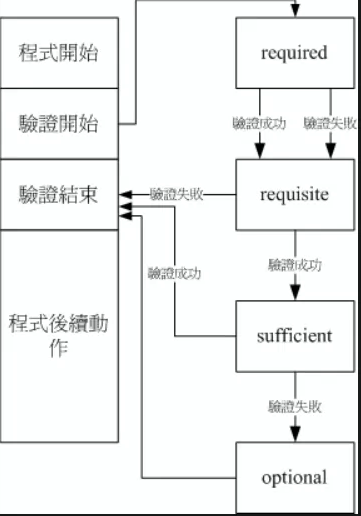

## 特殊的 shell， /sbin/nologin
- 不能登录的shell，/sbin/nologin
```
#登录时显示无法登录
This account is currently not available.
```
- /etc/nologin.txt 文档可以屏幕显示登录提示
## PAM模组设定语法
- ### 运行 passwd时PAM的流程
  - 1.用户执行 /usr/bin/passwd 程序，并输入密码;
  - 2.passwd 呼叫 PAM 模块进行验证;
  - 3.PAM 模块会到 /etc/pam.d/ 找寻与程序 （passwd） 同名的配置文件;
  - 4.依据 /etc/pam.d/passwd 内的设定，引用相关的 PAM 模块逐步进行验证分析;
  - 5.将验证结果（成功、失败以及其他信息）回传给passwd这支程序;
  - 6.passwd 根据 PAM 返回结果决定下一个动作
```
root@yxj-computer:~# cat /etc/pam.d/su-l
#%PAM-1.0   <<== PAM版本说明
auth		include		su
account		include		su
password	include		su
session		optional	pam_keyinit.so force revoke
session		include		su
```
- ### 第一列：验证类别（Type）
  - #### auth
    - authentication （认证） 的缩写，用来对用户的身份进行识别，如：提示用户输入密码，判断用户是否为root
  - #### account
    - account （账号）大部分是在进行 authorization （授权），检验用户是否具有正确的使用权限
  - #### session
    - session 是会议期间的意思，管理用户在这次登录 （或使用这个指令） 期间，PAM 所给予的环境设定，通常用在记录用户登录与注销时的信息
  - #### password
    - 提供验证的修订工作——修改/变更密码啦
  - #### 顺序
    - 1.先验证身份 （auth）
    - 2.系统才能够藉由使用者的身份给予适当的授权与权限设置 （account）
    - 3.登入与注销期间的环境才需要设定， 也才需要记录登入与注销的信息 （session）
    - 4.如果在运作期间需要密码修订时，才给予 （password）
- ### 第二列：控制标志（control flag）
  - #### required
    - 验证若成功则带有 success （成功） 的标志，若失败则带有 failure 的标志，但不论成功或失败都会继续后续的验证流程（最常用）
  - #### requisite
    - 若验证失败则立刻回报原程序 failure 的标志，并终止后续的验证流程
  - #### sufficient
    - 若验证成功则立刻回传 success 给原程序，并终止后续的验证流程; 若验证失败则带有 failure 标志并继续后续的验证流程,与requisits相反
  - #### optional
    - 大多是在显示信息，并不是用在验证方面
  - #### include
    - 验证过程中调用其他的PAM配置文件
  - 
- ### 第三列：模块路径（Module-path）
  - 调用模块的位置，一般保存在/lib64/security,如: pam_unix.so
- ### 第四列：模块参数（Module-arguments）
  - 即传递给模块的参数.参数可以有多个,之间用空格分隔开,如:password required pam_unix.so nullok obscure min=4 max=8 md5
## 常用模块简介
  - ### 模块情报
    - /etc/pam.d/*：每个程序个别的 PAM 设定文件;
    - /lib64/security/*: PAM 模块档案的实际放置目录;
    - /etc/security/*：其他 PAM 环境的设定文件;
    - /usr/share/doc/pam-*/：详细的 PAM 说明文件;
  - ### 常用模块
    - ### pam_securetty.so
      - 限制系统管理员 （root） 只能够从安全的 （secure） 终端机登录
      - 安全的终端机设定写在 /etc/securetty 这个档案中
    - ### pam_nologin.so
      - 限制一般用户是否能够登录主机
      - /etc/nologin 这个档案存在时，则所有一般用户均无法再登入系统了
      - 若 /etc/nologin 存在，则一般用户在登入时， 在他们的终端上会将该档案的内容显示出来
    - ### pam_selinux.so
      - 利用 PAM 模块，将 SELinux 暂时关闭，等到验证通过后， 再予以启动
    - ### pam_console.so
      - 可以帮助处理一些档案权限的问题，让使用者可以通过特殊终端接口（console）顺利的登录系统
    - ### pam_loginuid.so
      - 规范UID数值，如一般账号UID大于1000
    - ### pam_env.so
      - 设定环境变量的一个模块，如果你有需要额外的环境变量设定，可以参考 /etc/security/pam_env.conf 这个档案的详细说明
    - ### pam_unix.so
      - 可以用在验证阶段的认证功能，可以用在授权阶段的帐号授权管理， 可以用在会议阶段的登录文件记录等，甚至也可以用在密码更新阶段的检验
    - ### pam_pwquality.so
      - 可以用来检验密码的强度！ 包括密码是否在字典中，密码输入几次都失败就断掉此次连线等功能
    - ### pam_limits.so
      - ulimit使用的就是这个模块的功能
  - ### login的PAM验证流程
    - 1.验证阶段 （auth）
      - （1）会先经过 pam_securetty.so 判断，如果用户是 root 时，则会参考 /etc/securetty 的设定
      - （2）经过 pam_env.so 设定额外的环境变量;
      - （3）透过pam_unix.so检验密码，若通过则回报 login 程序; 若不通过则
      - （4）继续往下以pam_succeed_if.so判断UID是否大于1000，若小于1000则回报失败，否则再往下 
      - （5）以pam_deny.so 拒绝连线
    - 2.授权阶段 （account）
      - （1）先以 pam_nologin.so 判断 /etc/nologin 是否存在，若存在则不许一般用户登入
      - （2）接下来以pam_unix.so及pam_localuser.so进行账号管理
      - （3）pam_succeed_if.so判断UID是否小于1000，若小于1000 则不记录登录信息
      - （4）最后以 pam_permit.so 允许该账号登入。
    - 3.密码阶段 （password）
      - （1）先以 pam_pwquality.so 设置密码仅能尝试错误 3 次; 
      - （2）接下来以 pam_unix.so 透过 sha512， shadow 等功能进行密码检验，若通过则回报 login 程序，若不通过则
      - （3）以 pam_deny.so 拒绝登入
    - 4.会议阶段（session
      - （1）先以pam_selinux.so暂时关闭SELinux; 
      - （2）使用 pam_limits.so 设定好用户能够操作的系统资源; 
      - （3）登入成功后开始记录相关信息在登录文件中; 
      - （4）以 pam_loginuid.so 规范不同的 UID 权限; 
      - （5）开启 pam_selinux.so 的功能
---
## 其他相关档案
- ### limits.conf
```
范例一：vbird1 这个用户只能创建 100MB 的文件，且大于 90MB 会警告
[[email protected] ~]# vim /etc/security/limits.conf
vbird1    soft        fsize         90000
vbird1    hard        fsize        100000
#帐号     限制依据      限制项目       限制值
# 第一字段为帐号，或者是群组！若为群组则前面需要加上 @ ，例如 @projecta
# 第二字段为限制的依据，是严格（hard），还是仅为警告（soft）；
# 第三字段为相关限制，此例中限制文件大小，
# 第四字段为限制的值，在此例中单位为 KB。
# 若以 vbird1 登陆后，进行如下的操作则会有相关的限制出现！
```
  - 因修改完成的数据，对于已登陆系统中的使用者是没有效果的，再次登陆时才会生效
- ### /var/log/secure, /var/log/messages
  - PAM模块将资料记载在 /var/log/secure 当中，发生了问题到该目录查询