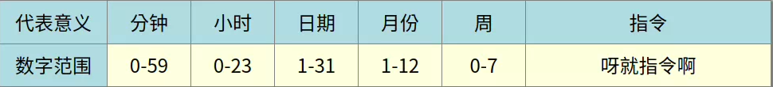
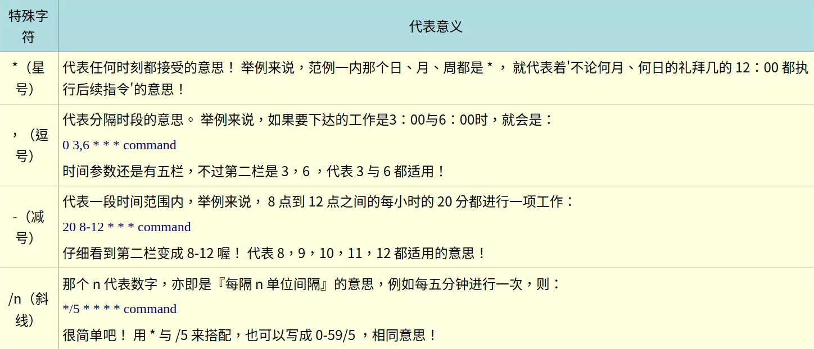

# 例行性作业计划：crontab
## 运作方式
- crontab由cron（crond）服务控制
- 用户执行crontab后，会被记录到 /var/spool/cron/用户名 中
  - 不可使用vim编辑该文件，可能由于语法错误无法执行cron
## 用户限定
- /etc/cron.allow：与at同理
- /etc/cron.deny：与at同理
## 使用
```
[root@study ~]# crontab [-u username] [-l|-e|-r]
选项与参数：
-u  ：只有 root 才能进行该任务，即帮其他使用者创建/移除 crontab 工作调度；
-e  ：编辑 crontab 的作业内容
-l  ：查阅 crontab 的作业内容
-r  ：移除所有的 crontab 的工作内容，若仅要移除一项，请用 -e 去编辑
```
```
root@yxj-computer:~# crontab -e
0   12  *  *  * mail -s "at 12:00" yxj < /home/yxj/.bashrc
#分 时 日 月 周 |<==============指令串========================>|
```
- 每项工作（每行）的格式具有六个字段，意义为
  - 
  - 周的数字为0或7时，为星期天
  - 
## 系统的设定文件
- ### /etc/crontab
  - cron服务最低侦测限制为“分钟”，会每分钟去读取一次 /etc/crontab 与 /var/spool/cron的内容
  ```sh
  root@yxj-computer:~# cat /etc/crontab
  SHELL=/bin/sh
  MAILTO=root 
  #PATH=/usr/local/sbin:/usr/local/bin:/sbin:/bin:/usr/sbin:/usr/bin
  # Example of job definition:
  # .---------------- minute (0 - 59)
  # |  .------------- hour (0 - 23)
  # |  |  .---------- day of month (1 - 31)
  # |  |  |  .------- month (1 - 12) OR jan,feb,mar,apr ...
  # |  |  |  |  .---- day of week (0 - 6) (Sunday=0 or 7) OR sun,mon,tue,wed,thu,fri,sat
  # |  |  |  |  |
  # *  *  *  *  * user-name command to be executed
  17 *	* * *	root    cd / && run-parts --report /etc/cron.hourly
  25 6	* * *	root	test -x /usr/sbin/anacron || ( cd / && run-parts --report /etc/cron.daily )
  47 6	* * 7	root	test -x /usr/sbin/anacron || ( cd / && run-parts --report /etc/cron.weekly )
  52 6	1 * *	root	test -x /usr/sbin/anacron || ( cd / && run-parts --report /etc/cron.monthly )
  ```
    - MAILTO=root
      - 若有额外的stdout，以email将资料发送给指定用户
    - “分 时 日 月 周 身份 指令”七个字段的设置
      - 第六个字段为，执行指令的身份
- ### /etc/cron.d/*
  - 开发的新软件拥有crontab指令，可将配置文件放到该目录下
  - 此目录下的文件为“crontab的设定脚本文件”
## 总结
- 个性化的行为用：crontab -e
- 系统管理维护使用：vim /etc/crontab 
- 开发软件使用：/etc/cron.d/
- 固定每小时、每日、每周、每天执行的特别工作：/etc/crontab 