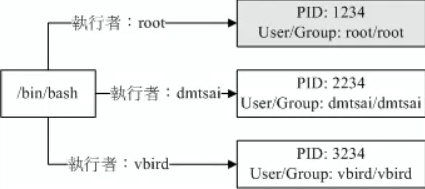
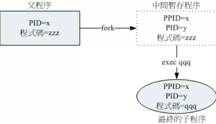

# 程序与进程
## 定义
- 程序（program）：通常为binary program，存放在存储媒体的实体文件
- 进程（process）：程序被触发后，执行者的权限、属性、程序代码被调度到内存中，并给予这个内存单元一个识别码（PID）
  - 系统通过PID判断进程是否有权限进行工作
  - 衍生的进程，沿用该进程的相关权限
- 
## 父进程与子进程
- 通过PPID判断父进程，子进程的PPID与父进程的PID相同
```
yxj@yxj-computer:~$ bash
yxj@yxj-computer:~$ ps -l
F S   UID     PID    PPID  C PRI  NI ADDR SZ WCHAN  TTY          TIME CMD
0 S  1000   11761   11735  0  80   0 -  5014 do_wai pts/0    00:00:00 bash
0 S  1000   12152   11761  0  80   0 -  5015 do_wai pts/0    00:00:00 bash
4 R  1000   12158   12152  0  80   0 -  5335 -      pts/0    00:00:00 ps
# 第一个bash的PID为第二个bash的PPID，第一个是父进程
```
## fork and exec：进程调用的流程
- fork：创建一个新的子进程，该进程几乎是当前进程的一个完全拷贝
- exec：启动另外的进程以取代当前运行的进程
- ### 流程：
  - 
  - 1.父进程以复制（fork）的方式，创建一个相同的副本 子程序
  - 2.子程序以exec的方式，执行新的程序
## 系统或网络服务
- 服务（daemon）：常驻在内存，在后台不断运行的进程
  - 系统服务：crond，atd，rsyslogd等
  - 网络服务：httpd，named，postfix，vstfp
---
# Linux的多用户多任务环境
## 特点
- 多用户环境
- 多任务行为：可在各个作业切换
- 多登录环境：一个图形界面，六个命令终端 
- 特殊的程序管理行为：不会宕机，可切换终端解决错误
- 作业管理：单一bash可进行多个作业