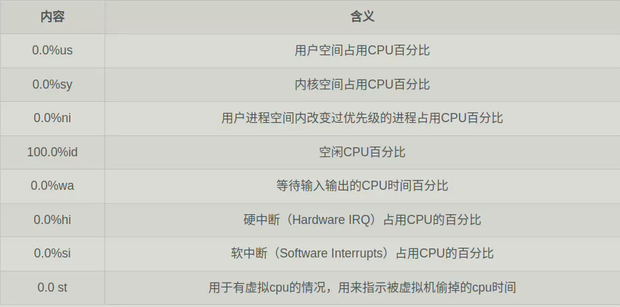
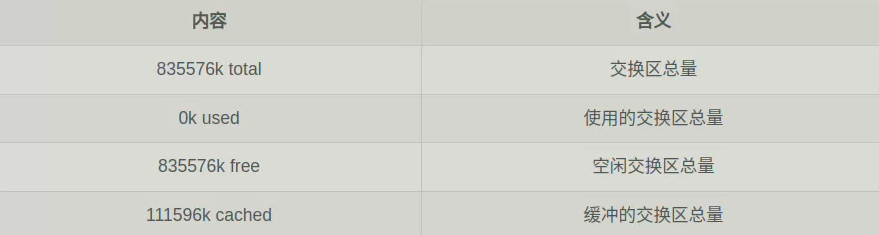
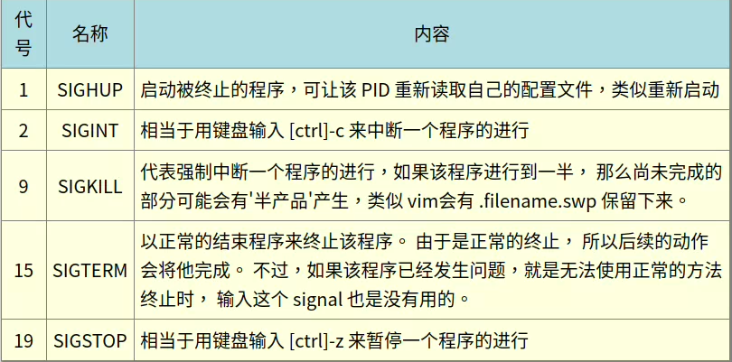

#  程序的观察
## ps：撷取某个时间点的进程运作情况
```
[root@study ~]# ps aux  <==观察系统所有的程序数据
[root@study ~]# ps -lA  <==也是能够观察所有系统的数据
[root@study ~]# ps axjf <==连同部分程序树状态
选项与参数：
-A  ：所有的 process 均显示出来，与 -e 具有同样的效用；
-a  ：不与 terminal 有关的所有 process ；
-u  ：有效使用者 （effective user） 相关的 process ；
x   ：通常与 a 这个参数一起使用，可列出较完整信息。
输出格式规划：
l   ：较长、较详细的将该 PID 的的信息列出；
j   ：工作的格式 （jobs format）
-f  ：做一个更为完整的输出。
```
- ### ps -l
    ```
    root@yxj-computer:~# ps -l
    F S   UID     PID    PPID  C PRI  NI ADDR SZ WCHAN  TTY          TIME CMD
    4 S     0   25640   25628  0  80   0 -  5530 do_wai pts/0    00:00:00 su
    4 S     0   25642   25640  0  80   0 -  5215 do_wai pts/0    00:00:00 bash
    4 R     0   26584   25642  0  80   0 -  5335 -      pts/0    00:00:00 ps
    ```
    - F : 表示进程的进程标志（process flags），说明进程的总结权限
      - 4：此进程权限为 root
      - 1：次子进程仅进行fork，而没有进行exec
    - S ：表示进程的状态（STAT）
      - R（Running）：进程运行中
      - S（Sleep）：进程正在睡眠状态（idle），但可被唤醒（signal）
      - D：不可被唤醒状态，通常在等待I/O（如打印）
      - T（stop）：停止状态，后台暂停或者除错（traced）状态
      - Z（Zombie）:僵尸状态，进程已终止但无法从内存移除
    - C ：CPU使用率，为百分比
    - PRI/NI（Priority/Nice）：进程优先级
    - ADDR ：为kernel function，指出该进程在内存的哪个部分，如果状态为running，则显示“ - ”
    - SZ ：用掉多少内存
    - WCHAN ：目前程序是否运行中，是为 “ - ”
    - TTY ：登陆者的终端机位置
    - TIME ：花费CPU的时间
    - CMD（command）：触发进程的指令名称
- ### ps aux
    ```
    USER         PID %CPU %MEM    VSZ   RSS TTY      STAT START   TIME COMMAND
    root       25642  0.0  0.0  20860  6556 pts/0    S    14:54   0:00 -bash
    root       26990  0.0  0.0  21340  3504 pts/0    R+   15:29   0:00 ps aux
    ......省略......
    ```
    - %CPU：使用掉的 CPU 资源百分比;
    - %MEM：所占用的物理内存百分比;
    - VSZ ：使用掉的虚拟内存量 （Kbytes）
    - RSS ：占用的固定的内存量 （Kbytes）
    - TTY ：是在哪个终端机上运作，若与终端机无关则显示 ？
    - STAT：该过程目前的状态，与ps -l中的 S标志同理
    - START：启动的时间
- ### 僵尸进程
  - 该进程已经执行完毕，或因故终止，但父进程无法完整的将该进程结束，从而造成此进程一直存在于内存中
    ```
    apache  8683  0.0  0.9 83384 9992 ?   Z  14:33   0:00 /usr/sbin/httpd <defunct>
    ```
  - CMD后接< defunct>，为僵尸进程
## top：动态观察进程的变化
```
[root@study ~]# top [-d 数字] | top [-bnp]
选项与参数：
-d  ：秒数，进程画面更新的秒数。默认为 5 秒；
-b  ：以批次的方式执行 top ，还有更多的参数可以使用！
      通常会搭配数据流重导向来将批次的结果输出成为文件。
-n  ：与 -b 搭配，意义是，需要进行几次 top 的输出结果。
-p  ：指定某些个 PID 来进行观察监测而已。
在 top 执行过程当中可以使用的按键指令：
    ? ：显示在 top 当中可以输入的按键指令；
    P ：以 CPU 的使用资源排序显示；
    M ：以 Memory 的使用资源排序显示；
    N ：以 PID 来排序喔！
    T ：由该 Process 使用的 CPU 时间累积 （TIME+） 排序。
    k ：给予某个 PID 一个讯号  （signal）
    r ：给予某个 PID 重新制订一个 nice 值。
    q ：离开 top 软件的按键。
```
```mark
#范例：每两秒更新一次top
root@yxj-computer:~# top -d 2

top - 16:32:24 up  8:44,  1 user,  load average: 0.66, 0.38, 0.23
任务: 431 total,   1 running, 430 sleeping,   0 stopped,   0 zombie
%Cpu(s):  1.1 us,  0.4 sy,  0.0 ni, 98.5 id,  0.1 wa,  0.0 hi,  0.0 si,  0.0 st
MiB Mem :  15684.1 total,   4895.9 free,   3152.8 used,   7635.4 buff/cache
MiB Swap:   7813.0 total,   7813.0 free,      0.0 used.  11400.7 avail Mem 

 进程号 USER      PR  NI    VIRT    RES    SHR    %CPU  %MEM     TIME+ COMMAND                            
   2288 yxj       20   0 8564044 384892 163004 S  12.4   2.4  22:38.80 gnome-shell                        
  25591 yxj       20   0  726188  77044  55944 S   7.5   0.5   0:40.40 gnome-terminal-                    
  25047 yxj       20   0 2905484 150776 120008 S   6.0   0.9   3:27.28 qmmp                               
   2144 yxj        9 -11 2850000  28988  22004 S   1.5   0.2   4:01.01 pulseaudio                         
   4334 yxj       20   0   32.8g 348060 245532 S   1.0   2.2  12:50.16 msedge                             
    808 systemd+  20   0   14828   6204   5408 S   0.5   0.0   1:12.24 systemd-oomd                       
   2696 yxj       20   0  428916  35516  26188 S   0.5   0.2   0:23.39 fcitx                              
   3057 yxj       20   0    8692   3788   3168 S   0.5   0.0   0:08.33 dbus-daemon                        
   3676 yxj       20   0 1121.8g  81172  58240 S   0.5   0.5   0:20.62 code                               
   4377 yxj       20   0   32.9g 176120 103240 S   0.5   1.1   9:07.77 msedge                             
   4743 yxj       20   0 1131.1g 253016 123384 S   0.5   1.6   5:30.93 msedge                             
   6052 root      20   0  103336  87812   1992 S   0.5   0.5   0:10.04 mount.ntfs                         
  21531 root       0 -20       0      0      0 I   0.5   0.0   0:22.97 kworker/u41:0-hci0                 
  23921 yxj       20   0  801920  69244  51932 S   0.5   0.4   0:48.19 psensor                            
  24532 root       0 -20       0      0      0 D   0.5   0.0   0:19.38 kworker/u41:1+i915_flip            
  27804 root      20   0       0      0      0 I   0.5   0.0   0:00.90 kworker/u40:2-events_power_effici+ 
      1 root      20   0  168372  13756   8264 S   0.0   0.1   0:03.32 systemd
```
- 第一行（top...）：
  - 目前的时间
  - 开机到现在的时间
  - 以登录的用户数
  - 系统在1，5，15分钟的平均负载
- 第二行（Tasks...）：
  - 目前的总进程数，running进程，sleeping进程，stopped进程，zombie进程
- 第三行（Cpu(s)...）
  - 
- 第四行（Mem）：
  - 
- 第五行（Swap）：
  - 
- top 默认使用 CPU 使用率 （%CPU） 作为排序
## pstree：树状图显示进程
```
[root@study ~]# pstree [-A|U] [-up]
选项与参数：
-A  ：各程序树之间的连接以 ASCII 字符来连接；
-U  ：各程序树之间的连接以万国码的字符来连接。在某些终端接口下可能会有错误；
-p  ：并同时列出每个 process 的 PID；
-u  ：并同时列出每个 process 的所属帐号名称
```
----
# 进程管理
进程通过使用信号（signal）进行相互管理

## kill -signal PID
```
#范例：使用PID的方式重新启动rsyslogd进程
oot@yxj-computer:~# ps aux | grep 'rsyslogd'| grep -v 'grep' | awk '{print $2}'
876
#使用grep查找rsyslogd，并过滤grep产生的同名进程，再使用awk取得第二行的PID

oot@yxj-computer:~# kill -SIGHUP $(ps aux | grep 'rsyslogd' | grep -v 'grep'| awk '{print $2}')
```
## killall -signal 指令名称
```
[root@study ~]# killall [-iIe] [command name]
选项与参数：
-i  ：interactive 的意思，互动式的，若需要删除时，会出现提示字符给使用者；
-e  ：exact 的意思，表示“后面接的 command name 要一致”，但整个完整的指令
      不能超过 15 个字符。
-I  ：指令名称（可能含参数）忽略大小写。
```
```
#重新启动rsyslogd进程
[root@study ~]# killall -1 rsyslogd
```
---
# 进程的执行顺序
## Priority(PRI) 与 Nice(NI) 值
- PRI：越低越优先，由核心动态调整，用户无法更改
  - PRI(new) = PRI(old) + NI
- NI：用户可更改，越低越优先
  - 可调整的范围为 -20 ~ 19
  - root 可随意调整自己或他人进程的 Nice 值，且范围为 -20 ~ 19
  - 一般用户仅可调整自己进程的 Nice 值，且范围仅为 0 ~ 19 （避免一般用户抢占系统资源）
  - 一般用户仅可将 nice 值调高
  - 子进程可继承父进程的NI值
## nice：新执行的指令给予新的 nice 值
```
[root@study ~]# nice [-n 数字] command
选项与参数：
-n  ：接数值，让原本的nice加上该数值，最终数值范围为 -20 ~ 19。
```
```
#范例：让vim的NI优先级提高5
root@yxj-computer:~# nice -n -5 vim &
[1] 13593
root@yxj-computer:~# ps -l
F S   UID     PID    PPID  C PRI  NI ADDR SZ WCHAN  TTY          TIME CMD
4 S     0    6143    6131  0  80   0 -  5529 do_wai pts/0    00:00:00 su
4 S     0    6152    6143  0  80   0 -  5011 do_wai pts/0    00:00:00 bash
4 T     0   13593    6152  0  75  -5 -  8182 do_sig pts/0    00:00:00 vim
4 R     0   13595    6152  0  80   0 -  5335 -      pts/0    00:00:00 ps

```
## renice ：已存在进程的 nice 重新调整
```
[root@study ~]# renice [number] PID
```
```
#范例
root@yxj-computer:~# ps -l
F S   UID     PID    PPID  C PRI  NI ADDR SZ WCHAN  TTY          TIME CMD
4 S     0    6143    6131  0  80   0 -  5529 do_wai pts/0    00:00:00 su
4 S     0    6152    6143  0  80   0 -  5215 do_wai pts/0    00:00:00 bash
4 R     0   13810    6152  0  80   0 -  5335 -      pts/0    00:00:00 ps
root@yxj-computer:~# renice -5 6152
6152 (process ID) 旧优先级为 0，新优先级为 -5
root@yxj-computer:~# ps -l
F S   UID     PID    PPID  C PRI  NI ADDR SZ WCHAN  TTY          TIME CMD
4 S     0    6143    6131  0  80   0 -  5529 do_wai pts/0    00:00:00 su
4 S     0    6152    6143  0  75  -5 -  5215 do_wai pts/0    00:00:00 bash
4 R     0   13837    6152  0  75  -5 -  5335 -      pts/0    00:00:00 ps
#子进程继承父进程NI值
```
---
# 系统资源的观察
## free：观察内存使用情况
```
[root@study ~]# free [-b|-k|-m|-g|-h] [-t] [-s N -c N]
选项与参数：
-b  ：直接输入 free 时，显示的单位是 KBytes，可使用 b（Bytes）, m（MBytes）
      k（KBytes）, 及 g（GBytes） 显示单位,也可以让系统自己指定单位 （-h）
-t  ：在输出的最终结果，显示实体内存与 swap 的总量。
-s  ：可以让系统每几秒钟输出一次
-c  ：与 -s 同时处理，让 free 列出几次结束
```
## uptime：观察系统启动时间与工作负载
- 同top指令的第一行一样
## netstat ：追踪网络或插槽档
```
[root@study ~]# netstat -[atunlp]
选项与参数：
-a  ：将目前系统上所有的连线、监听、Socket 数据都列出来
-t  ：列出 tcp 网络封包的数据
-u  ：列出 udp 网络封包的数据
-n  ：不以程序的服务名称，以端口号 （port number） 来显示；
-l  ：列出目前正在网络监听 （listen） 的服务；
-p  ：列出该网络服务的程序 PID
```
```
#范例
root@yxj-computer:~# netstat
激活Internet连接 (w/o 服务器)
Proto Recv-Q Send-Q Local Address           Foreign Address         State      
tcp        0      0 yxj-computer:46640      server-99-84-140-:https ESTABLISHED
......省略......
活跃的UNIX域套接字 (w/o 服务器)
Proto RefCnt Flags       Type       State         I-Node   路径
unix  3      [ ]         SEQPACKET  已连接     69106    @0d9df
......省略......
```
- Internet连接：
  - Proto ：网络协议，主要分为 TCP 与 UDP ，
  - Recv-Q：非由用户程序链接到此 socket 的复制的总 bytes 数;
  - Send-Q：非由远程主机传送过来的 acknowledged 总 bytes 数;
  - Local Address ：本地端的 IP：port 情况
  - Foreign Address：远程主机的 IP：port 情况
  - State ：连接状态，主要有建立（ESTABLISED）及监听（LISTEN）;
- Linux的插槽文件
  - Proto ：一般就是 unix 啦;
  - RefCnt：连接到此 socket 的程序数量;
  - Flags ：连线的旗标;
  - Type ：socket 访问的类型。 主要有确认连线的 STREAM 与不需确认的 DGRAM 两种;
  - State ：若为 CONNECTED 表示多个程序之间已经连接建立。
  - Path ：连接到此 socket 的相关程序的路径！ 或者是相关数据输出的路径。
## dmesg ：分析核心产生的讯息
## vmstat ：侦测系统资源变化
```
[root@study ~]# vmstat [-a] [延迟 [总计侦测次数]] <==CPU/内存等信息
[root@study ~]# vmstat [-fs]                      <==内存相关
[root@study ~]# vmstat [-S 单位]                  <==设置显示数据的单位
[root@study ~]# vmstat [-d]                       <==与磁盘有关
[root@study ~]# vmstat [-p 分区]                <==与磁盘有关
选项与参数：
-a  ：使用 inactive/active（活跃与否） 取代 buffer/cache 的内存输出信息；
-f  ：开机到目前为止，系统复制 （fork） 的程序数；
-s  ：将一些事件 （开机至目前为止） 导致的内存变化情况列表说明；
-S  ：后面可以接单位，让显示的数据有单位。例如 K/M 取代 Bytes 的容量；
-d  ：列出磁盘的读写总量统计表
-p  ：后面列出分区，可显示该分区的读写总量统计表
```
```
#范例：侦测内存
root@yxj-computer:~# vmstat 1 3
procs -----------memory---------- ---swap-- -----io---- -system-- ------cpu-----
 r  b 交换 空闲 缓冲 缓存   si   so    bi    bo   in   cs us sy id wa st
 1  0      0 7142412 798336 5069864    0    0    10     8   56   84  1  0 98  0  0
 0  0      0 7142052 798472 5067284    0    0   128    36  956 1677  1  0 99  0  0
 0  0      0 7141908 798728 5067292    0    0   256   816  650 1541  1  0 99  0  0
```
- 各字段可查看 man vmstat
