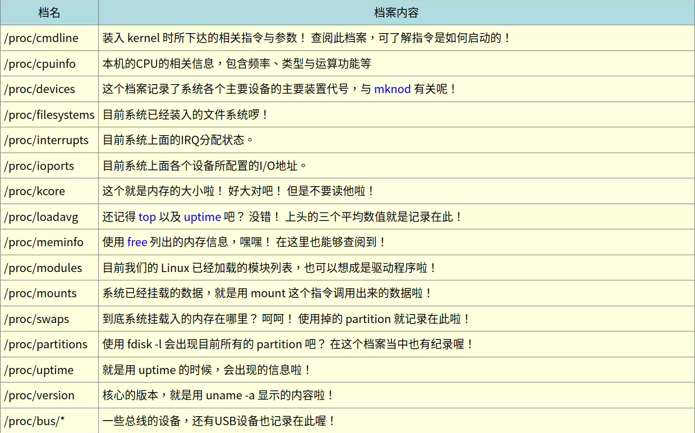

# /proc/*文件
- /proc 为内存存储数据的目录
    ```
    root@yxj-computer:~# ll /proc
    ......省略......
    -r--r--r--   1 root             root                           0  6月  6  2023 version
    -r--r--r--   1 root             root                           0  6月  6  2023 version_signature
    -r--------   1 root             root                           0  6月  6  2023 vmallocinfo
    ......省略......
    ```
- 各个进程的PID以目录的形态存放在/proc中
    ```
    # 查看PID为1的数据
    root@yxj-computer:~# ll /proc/1
    ......省略......
    -r--r--r--   1 root root 0  6月  6  2023 cmdline    <==就是指令串
    ......省略......
    -r--------   1 root root 0  6月  6  2023 environ    <==一些环境变量
    ......省略......
    ```
  - cmdline：进程被启动的指令串;
  - environ：进程的环境变量内容。
  - 
---
# 查看已打开文件或已执行进程的文件
## user：通过文件（或文件系统）找出正在使用该文件的程序
```
[root@study ~]# fuser [-umv] [-k [i] [-signal]] file/dir
选项与参数：
-u  ：除了程序的 PID 之外，同时列出该进程的拥有者；
-m  ：后面接的那个文件名会主动的上提到该文件系统的最顶层，对 umount 不成功很有效！
-v  ：可以列出每个文件与进程还有指令的完整相关性！
-k  ：找出使用该文件/目录的 PID ，并试图以 SIGKILL 这个讯号给予该 PID；
-i  ：必须与 -k 配合，在删除 PID 之前会先询问使用者意愿！
-signal：例如 -1 -15 等等，若不加的话，默认是 SIGKILL （-9）
```
```
#范例
root@yxj-computer:~# fuser -uv .
                     用户     进程号   权限     命令
/root:               root     9345   ..c..   (root)bash
```
- ACCESS
  - c ：此进程在当前的目录下（非次目录）;
  - e ：可被触发为执行状态;
  - f ：是一个被开启的文件;
  - r ：代表顶层目录 （root directory）;
  - F ：该文件被开启了，不过在等待回应中;
  - m ：可能为分享的动态函式库;
## lsof ：列出被进程所打开的文件文件名
```
[root@study ~]# lsof [-aUu] [+d]
选项与参数：
-a  ：多项数据需要“同时成立”才显示出结果时！
-U  ：仅列出 Unix like 系统的 socket 文件类型；
-u  ：后面接 username，列出该使用者相关程序所打开的文件；
+d  ：后面接目录，亦即找出某个目录下面已经被打开的文件！
```
## pidof ：找出某支正在执行的进程的 PID
```
[root@study ~]# pidof [-sx] program_name
选项与参数：
-s  ：仅列出一个 PID 而不列出所有的 PID
-x  ：同时列出该 program name 可能的 PPID ,那个进程的 PID
```
```
#范例
root@yxj-computer:~# pidof systemd
2280
```