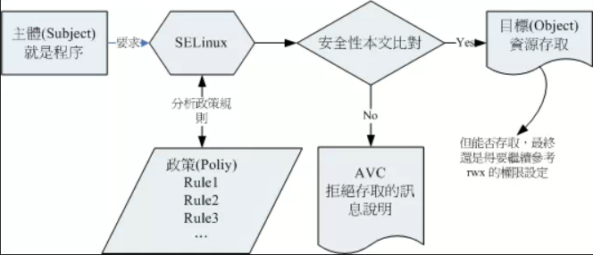

# 概念
## 定义 
 - SELinux，安全增强型 Linux（Security Enhanced Linux ），是在进行进程、文件等细部权限设定依据的一个核心模块
## 传统的文件权限与账号关系：DAC（自主控制访问控制）
 - 依据进程的所有者与文件资源的 rwx 权限来决定有无访问的能力
 - 缺点
   - root具有最高权限：可以会被黑客获取
   - 用户可以取得进程来变更文件资源的访问权限
## 以策略规则订定特定进程读取特定文件：MAC（强制访问控制）
 - 针对特定的进程与特定的文件资源来进行权限的控管
   - 即使是root，也要看进程的设定
---
# SELinux的运作模式
## 定义
- ## 主体（Subject）
  - SELinux主要管理进程，因此可以 主体 = 进程
- ## 对象（Object）
  - 一般为文件系统
- ## 策略（Policy）
  - SELinux会依据某些服务来制订基本的存取安全性策略
    - targeted：针对网络服务限制较多，针对本机限制较少，是预设的政策;
    - minimum：由 target 修订而来，仅针对选择的程序来保护！
    - mls：完整的SELinux限制，限制方面较为严格。
- ## 安全性文本（security context）
  - 主体与对象的安全性本文必须一致才能够顺利存取，类似文件系统的 rwx 
- 
## 安全性文本